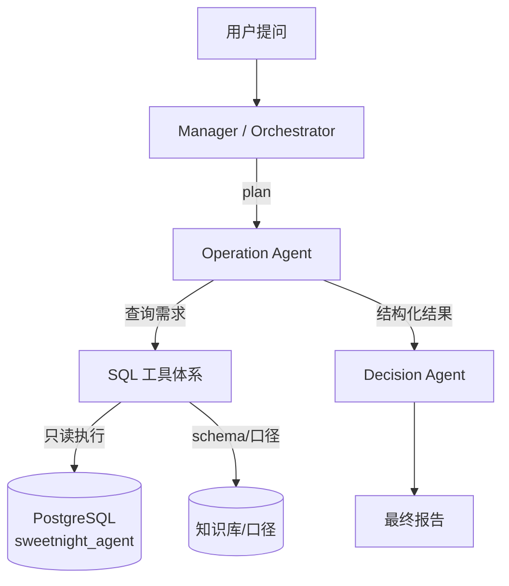
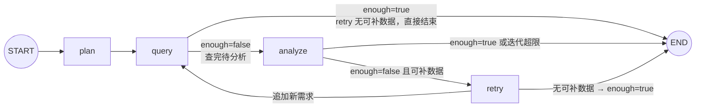

# 甜秘密跨境电商 AI Multi-Agent 系统

面向甜秘密（SweetNight、Novilla、Avenco 等品牌）的企业级跨境电商运营智能决策系统。


* 核心技术：Python + LangGraph + LangChain + DeepSeek / OpenAI + PostgreSQL + PGVector + Docker

* 核心架构：Manager/Orchestrator Agent + 4 个部门 Agent（Operation / Logistics / Finance / Product）+ 1 个汇总分析决策 Agent + Tool 层 + 企业知识库 + 持久化 State + 长短期 Memory + Web UI

* 详细设计见 [sweetnight\_cross\_border\_multi\_agent\_development.md](./sweetnight_cross_border_multi_agent_development.md)

## 目录结构


```
sweetAgent/

├── app/                    # 应用主代码

│   ├── main.py             # FastAPI 入口

│   ├── api/                # API 路由（chat / threads / reports / health）

│   ├── graph/              # LangGraph 主图（main\_graph / planner / router / state）

│   ├── agents/             # 六个 Agent：manager / operation / logistics / finance / product / decision

│   ├── tools/              # Tool 层：sql（生成/校验/执行/schema）、rag、python、analytics

│   ├── memory/             # checkpoint（短期）、semantic（语义长期）、profile（用户画像）

│   ├── knowledge/          # 知识库：ingest / chunker / embedder / retriever

│   ├── observability/      # structlog 日志、tracing、metrics

│   └── config/             # pydantic-settings 配置

├── db/                     # SQL 迁移（00-roles / 01-extensions / 02-schema / 03-grants，含表/字段注释）

├── scripts/                # init\_database.py（一键初始化）、seed\_data.py（种子数据）、verify\_operation.py（调试）

├── logs/                   # 运行日志输出目录

├── frontend/               # Web UI（MVP: Streamlit；企业版: Next.js）

├── tests/                  # unit / integration / evaluation / security

├── docker-compose.yml      # 开发环境编排（postgres+pgvector / redis）

├── requirements.txt

└── .env.example
```

## 快速开始


```
\# 1. 创建虚拟环境并安装依赖

python -m venv .venv

.venv\Scripts\pip install -r requirements.txt

\# 2. 配置环境变量

copy .env.example .env        # 填入 DEEPSEEK\_API\_KEY（未配置启动即报错，仅支持 LLM 模式）

\# 3. 启动 PostgreSQL（需要 Docker）

docker compose up -d postgres

\# 4. 一键初始化数据库：角色 -> 建库 -> 扩展 -> 建表 -> 授权（幂等可重跑）

.venv\Scripts\python scripts\init\_database.py

\# 5. 初始化 + 灌入 90 天种子数据（可选，幂等）

.venv\Scripts\python scripts\init\_database.py --seed

\# 6. 运行 Operation Agent 调试（问题可自由传入，见下节）

.venv\Scripts\python scripts\verify\_operation.py "你的分析问题"
```

> 开发库运行在 Docker 容器 
>
> `langgraph-postgres`
>
> （postgres:16 + pgvector 0.8.6，端口 5432），
> 库名 
>
> `sweetnight_agent`
>
> ，角色 
>
> `app_user`
>
> （写）/ 
>
> `agent_reader`
>
> （只读，SQL Tool 专用）。
> SQL 脚本统一放在项目根目录 
>
> `db/`
>
> ，共 67 张表，
>
> **全部带表 / 字段注释**
>
> （COMMENT ON，已同步入库）。

## 系统架构

### 整体结构（设计文档 58 节 Phase 1 最小闭环）





* **Manager**：按 `depends_on` DAG 调度部门 Agent，禁止部门 Agent 自由互调

* **4 个部门 Agent**：Operation / Logistics / Finance / Product（当前已实现 Operation）

* **Decision Agent**：汇总各部门证据，输出最终结论（尚未开始）

* **SQL 工具体系**：list\_tables → schema\_search → get\_schema → relationship → metric\_definition → validator → read-only executor

### Operation Agent：双入口

Operation Agent 是**同一种逻辑的两种调用形态**，共享同一套实现（`_query_one` / `_analyze`）：


| 入口                    | 形态                   | 状态管理                | 用途                     |
| --------------------- | -------------------- | ------------------- | ---------------------- |
| `agent.run(task)`     | 命令式 for 循环           | 本地变量                | 独立运行 / 调试              |
| `run_operation(task)` | LangGraph StateGraph | OperationState dict | 嵌入主 Graph 供 Manager 调度 |

#### SubGraph 状态图（app/agents/operation/graph.py）




**节点职责**（每个节点是一个接收 state、返回 state 更新的函数）：


| 节点        | 函数         | 作用                                                                        | 写回 state 的字段                                                |
| --------- | ---------- | ------------------------------------------------------------------------- | ----------------------------------------------------------- |
| `plan`    | `_plan`    | 规划数据需求列表（LLM 规划或模板关键词推断）                                                  | `plan`, `iteration+1`                                       |
| `query`   | `_query`   | 批量执行所有未查询需求（`_query_one`：生成 SQL→校验→只读执行→失败 / 空自动 repair；每个需求只查一次） | `observations`, `sql_history`, `queried`                    |
| `analyze` | `_analyze` | 分析观测结果，产出结论与 "是否足够 / 缺什么"                                                 | `analysis`, `evidence`, `final_result`, `enough`, `missing` |
| `retry`   | `_retry`   | **补数据重试**：把 `missing` 中 "已知且未查询过" 的需求追加进 `plan`；无可补数据则标记 `enough=True` 结束 | `plan`, `iteration+1`, `enough`                             |

**边（连接关系）**：


| 边                 | 类型                    | 路由条件                                                      |
| ----------------- | --------------------- | --------------------------------------------------------- |
| `START → plan`    | 普通边                   | 固定                                                        |
| `plan → query`    | 普通边                   | 固定                                                        |
| `query → analyze` | 条件边（`_route_query`）   | `enough=false` → 待分析                                        |
| `query → END`     | 条件边                   | `enough=true`（retry 无可补数据）→ 直接结束（防 analyze 空转）           |
| `analyze → END`   | 条件边（`_decide`）        | `enough=true` 或迭代次数超限                                     |
| `analyze → retry` | 条件边                   | `enough=false` 且迭代未超限 → 补数据重试                             |
| `retry → query`   | 普通边                   | 追加需求后重新查询                                                 |
| `retry → END`     | 条件边（经 `_route_query`） | 无可补数据时 `enough=true`，query 后直通 END                        |

**状态流转示例**（一次典型运行）：


```
START
 → plan:     plan=["sales_sku"], iteration=1
 → query:    批量查 sales_sku → observations=[8行], queried={sales_sku}（每个需求只查一次）
 → analyze:  enough=false, missing=["ad"]   ← LLM 认为还需广告数据
 → retry:    plan=["sales_sku","ad"], iteration=2
 → query:    批量查 ad（跳过已查的 sales_sku）→ observations=[8行, 20行], queried={sales_sku,ad}
 → analyze:  enough=true
 → END:      final_result 已产出
```

**关键设计点**：


1. `retry` 是 "分析不足→补数据→重新分析" 的闭环，让 Agent 能自我补全证据（设计文档 11 节内部循环 / 40 节 Retry）

2. `retry` 只追加**已知且未查询过**的需求（白名单 `_REQ_TASKS`/`_KEYWORDS`），防止 LLM 编造数据域

3. 无可补数据时标记 `enough=True` 直接结束 ——**避免 analyze→retry 空转死循环**（曾出现 analyze 被调用 8 次的 bug，已修复为 2 次）
4. `query` 节点**批量**执行所有未查询需求（与主循环 `agent.run()` 行为一致），减少 LangGraph 图调度轮数；`queried` 记忆保证每个需求只查一次，retry 追加的新需求在下一轮 query 才被查

## Operation Agent 使用与调试

### 运行（问题不写死，三种方式传入）


```
\# 方式 1：命令行参数

.venv\Scripts\python scripts\verify\_operation.py "分析美国市场过去90天 SweetNight 床垫 GMV 变化，找出异常 SKU"

\# 方式 2：环境变量

set VERIFY\_TASK=你的问题 && .venv\Scripts\python scripts\verify\_operation.py

\# 方式 3：交互输入（直接运行后按提示粘贴）

.venv\Scripts\python scripts\verify\_operation.py
```

### 调试开关（scripts/verify_operation.py 顶部常量）

```
RUN_SUBGRAPH = True     # True=同时跑 SubGraph 入口对比；False=只跑主循环（当前仅 LLM 模式）
```

在 VSCode / PyCharm 中直接打断点按 Debug 即可，无需传命令行参数。

推荐断点位置：`agent.py` 的 `run()`（内部循环）、`_query_one()`（SQL 生成 / 执行 / 修复）、`_analyze()`（LLM 分析）。

### 日志


* structlog 结构化日志（`app/observability/logging.py`），开发环境可读格式输出到 stdout

* `LOG_LEVEL` 在 `.env`（`INFO` 日常 / `DEBUG` 细粒度：显示 LLM 生成的 SQL、数据字典、分析原始 JSON）

* 关键事件：`operation.run.start` / `operation.query.ok` / `operation.query.repair` / `operation.analyze.llm` / `operation.run.done`

* 输出到文件示例：`.venv\Scripts\python scripts\verify_operation.py > logs\operation.log 2>&1`

### 模式说明（仅 LLM 模式）

| 项   | 说明 |
| --- | ------------------------------------------------------------------ |
| 触发 | 配置 DEEPSEEK_API_KEY（未配置启动即报错，不再降级模板） |
| 能力 | 任意问题：LLM 规划 / 生成 SQL / 分析（schema + 数据字典注入防编造） |
| 白名单 | `_KNOWN_REQS`（sales_sku / brand_summary / ad / review / inventory）约束 LLM 可查数据域 |

## 数据库


| 项    | 值                                                             |
| ---- | ------------------------------------------------------------- |
| 容器   | `langgraph-postgres`（postgres:16 + pgvector 0.8.6）            |
| 数据库  | `sweetnight_agent`（67 表，全部带注释）                                |
| 写角色  | `app_user` / `app_password`（表属主，schema/checkpoint 写入）         |
| 只读角色 | `agent_reader` / `agent_password`（仅 SELECT，SQL Tool 统一使用）     |
| 超级用户 | `langgraph_user` / `123456`（仅初始化 / 授权用）                       |
| 种子数据 | 90 天（2026-06-18 \~ 09-15），4 品牌 / 12 SKU/8 店铺 / 6124 订单等约 2 万行 |

种子数据埋点故事线（验证 Agent 能力用）：`SN-Q12-US` 末 21 天日均销量 -26.4%（异常 SKU），

`SN-K12-US` +15%、`NV-Q10-US` +9%（对照组），campaign 1 末 21 天 spend +44%，

该 SKU 存在 2 星负面评论，warehouse 2 库存天数跌破 12 天高风险线。

## 开发推进日志（Progress Log）

> **约定**
>
> ：每次推进新功能 / 修复 / 重构后，在下方追加一条记录（日期 + 内容 + 关键文件 + 验证方式）。
> 涉及架构、Graph 结构、数据模型变化时，同步更新上文对应章节。

### 2026-09-17・Operation Agent 完成并通过 LLM 模式验证


* **内容**：实现 Operation Agent（双模式：确定性模板 + DeepSeek LLM）、SQL 工具体系（schema 5 件套 + 生成器 + validator + 只读执行器）、SubGraph（StateGraph：plan→query⇄analyze→decide→END）

* **关键文件**：`app/agents/operation/*`、`app/tools/sql/*`、`app/llm.py`、`scripts/verify_operation.py`

* **修复**：LLM 凭记忆编表名 → schema 优先表清单 + 数据字典注入；总量对比陷阱 → 强制日均口径；SubGraph retry 空转（analyze 8 次→2 次）→ `_retry` 去重 + `_route_query` enough 直通 END

* **验证**：`verify_operation.py` LLM 模式命中埋点 SN-Q12-US（-26.35%），对照组 +15%/+9%

### 2026-09-17・数据库注释与调试入口


* **内容**：`db/02-schema.sql` 全部 67 表 + 关键字段补充 COMMENT（已同步入库）；`verify_operation.py` 重写为干净调试入口（去掉 4 个干扰方法，问题改为命令行参数 / 环境变量 / 交互输入三种方式传入）

* **验证**：`init_database.py` 重跑幂等，`pg_description` 确认 67 条表注释 + 字段注释生效

### 2026-09-17・任意问题适配与 repair 修复


* **内容**：


  * `repair_sql` 剥离 LLM 包裹的 markdown 代码块（\`\`\`sql），prompt 明令禁止代码块 → 修复"SQL 解析失败 Line 1 Col 3" 问题

  * `ANALYSIS_PROMPT` 泛化：结果含 prev/last21 分段才做日均对比；单窗口汇总则做描述性分析（日均 / AOV / 件单比 / 退款率基线），并诚实标注 "缺少对比段"

  * 实测：`Novilla 品牌美国市场最近30天` → 命中 NV-Q10-US（GMV \$88,195.80 / 420 件 / 375 单 / 退款率 2.57%）；`SweetNight 美国市场90天` → 命中埋点 SN-Q12-US（-26.35%）

* **验证**：`verify_operation.py` 传任意问题均可运行并产出结构化结果
### 2026-09-18·SubGraph query 节点批量查询优化

* **内容**：`_query` 从"每轮只查 1 个需求"改为"批量执行所有未查询需求"（与主循环 `agent.run()` 行为一致）；移除 `next_req` 死字段与 query 自循环分支，`_route_query` 简化为 enough 二路路由；新增 `operation_graph.query.batch_done` 汇总日志（成功/失败数）
* **动机**：原实现 plan 有 N 个需求需 N+1 次图调度（每次都有 LangGraph 调度开销），且与主循环行为不一致；批量后图跳数固定为 2
* **关键文件**：`app/agents/operation/graph.py`、`app/agents/operation/state.py`
* **验证**：`verify_operation.py` LLM 模式命中埋点 SN-Q12-US（-26.35%）、SN-K12-US（+15.19%），两形态结论一致；日志出现 `batch_done ok=1`
### 2026-09-18·移除模板模式，仅保留 LLM 模式

* **内容**：删除全部模板降级代码——`_template_sql` 6 类预置 SQL、`_analyze_rule` 规则分析、`_plan_from_task` 关键词规划、`_REQ_TASKS`/`_KEYWORDS` 双职责 dict（改为 `_KNOWN_REQS` 纯白名单）；`OperationAgent` 未配置 Key 直接报错；`verify_operation.py` 移除 FORCE_LLM_MODE 开关
* **动机**：用户实际使用 LLM 模式（已配 DeepSeek Key），模板降级路径冗余且写死 SweetNight/US 示例造成困惑
* **关键文件**：`app/agents/operation/agent.py`、`app/tools/sql/generator.py`、`app/agents/operation/graph.py`、`scripts/verify_operation.py`
* **验证**：grep 模板引用清零；编译通过；`verify_operation.py` 埋点命中 SN-Q12-US（-26.35%）、SN-K12-US（+15.19%），mode=llm
