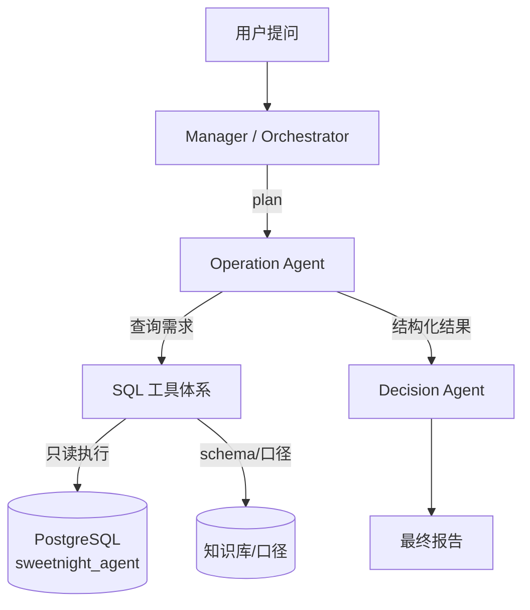
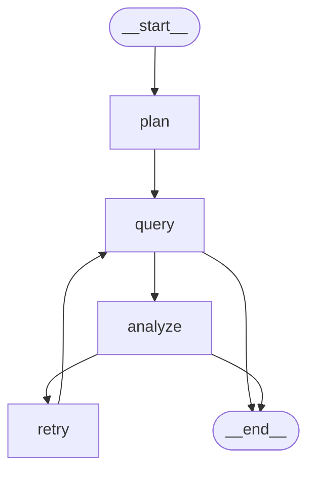
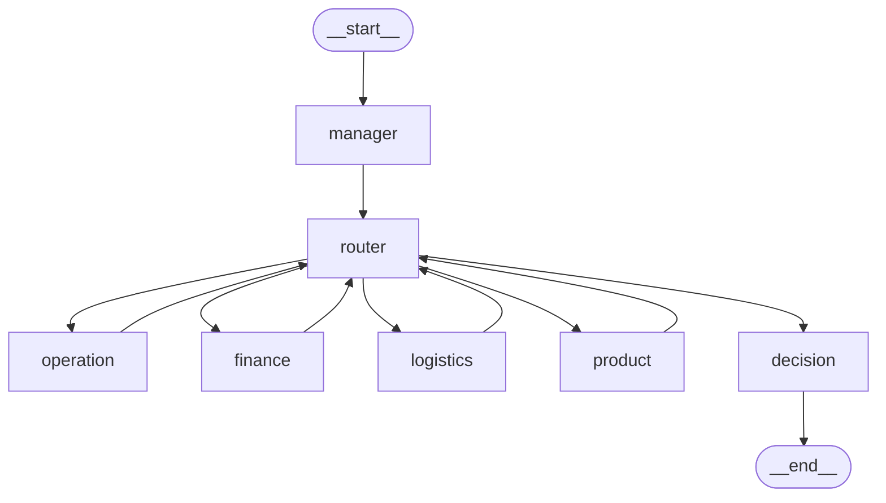

# 甜秘密跨境电商 AI Multi-Agent 系统

面向甜秘密（SweetNight、Novilla、Avenco 等品牌）的企业级跨境电商运营智能决策系统。

# 任务：
corn 定时任务，， 项目上线怎么部署，docker沙箱隔离，利用skill节省token 


* 核心技术：Python + LangGraph + LangChain + DeepSeek / OpenAI + PostgreSQL + PGVector + Docker

* 核心架构：Manager/Orchestrator Agent + 4 个部门 Agent（Operation / Logistics / Finance / Product）+ 1 个汇总分析决策 Agent + Tool 层 + 企业知识库 + 持久化 State + 长短期 Memory + Web UI

* 详细设计见 [sweetnight\_cross\_border\_multi\_agent\_development.md](./sweetnight_cross_border_multi_agent_development.md)

## 目录结构


```
sweetAgent/

├── app/                    # 应用主代码

│   ├── main.py             # FastAPI 入口

│   ├── api/                # API 路由（chat / threads / reports / health）

│   ├── graph/              # LangGraph 主图（main\_graph / planner / router / state）

│   ├── agents/             # 六个 Agent：manager / operation / logistics / finance / product / decision

│   ├── tools/              # Tool 层：sql（生成/校验/执行/schema）、rag、python、analytics

│   ├── memory/             # checkpoint（短期）、semantic（语义长期）、profile（用户画像）

│   ├── knowledge/          # 知识库：ingest / chunker / embedder / retriever

│   ├── observability/      # structlog 日志、tracing、metrics

│   └── config/             # pydantic-settings 配置

├── db/                     # SQL 迁移（00-roles / 01-extensions / 02-schema / 03-grants，含表/字段注释）

├── scripts/                # init\_database.py（一键初始化）、seed\_data.py（种子数据）、verify\_pipeline.py（全链路 Manager→Operation→Decision 调试）

├── logs/                   # 运行日志输出目录

├── frontend/               # Web UI（MVP: Streamlit；企业版: Next.js）

├── tests/                  # unit / integration / evaluation / security

├── docker-compose.yml      # 开发环境编排（postgres+pgvector / redis）

├── requirements.txt

└── .env.example
```

## 快速开始


```
\# 1. 创建虚拟环境并安装依赖

python -m venv .venv

.venv\Scripts\pip install -r requirements.txt

\# 2. 配置环境变量

copy .env.example .env        # 填入 DEEPSEEK\_API\_KEY（未配置启动即报错，仅支持 LLM 模式）

\# 3. 启动 PostgreSQL（需要 Docker）

docker compose up -d postgres

\# 4. 一键初始化数据库：角色 -> 建库 -> 扩展 -> 建表 -> 授权（幂等可重跑）

.venv\Scripts\python scripts\init\_database.py

\# 5. 初始化 + 灌入 90 天种子数据（可选，幂等）

.venv\Scripts\python scripts\init\_database.py --seed

\# 6. 运行全链路调试（Manager → Operation → Decision，问题可自由传入）

.venv\Scripts\python scripts\verify\_pipeline.py "你的分析问题"
```

> 开发库运行在 Docker 容器 
>
> `langgraph-postgres`
>
> （postgres:16 + pgvector 0.8.6，端口 5432），
> 库名 
>
> `sweetnight_agent`
>
> ，角色 
>
> `app_user`
>
> （写）/ 
>
> `agent_reader`
>
> （只读，SQL Tool 专用）。
> SQL 脚本统一放在项目根目录 
>
> `db/`
>
> ，共 67 张表，
>
> **全部带表 / 字段注释**
>
> （COMMENT ON，已同步入库）。

## 系统架构

### 整体结构（设计文档 58 节 Phase 1 最小闭环）





* **Manager**：按 `depends_on` DAG 调度部门 Agent，禁止部门 Agent 自由互调

* **4 个部门 Agent**：Operation / Logistics / Finance / Product（已全部实现，共享 `BaseDepartmentAgent` 基类；Product 自动依赖 O/F/L 并注入跨部门上下文）

* **Decision Agent**：汇总各部门证据，交叉验证、归因分析、输出结构化最终报告（summary / findings / root_causes / recommendations / risks / confidence）

* **SQL 工具体系**：list\_tables → schema\_search → get\_schema → relationship → metric\_definition → validator → read-only executor

### Operation Agent：SubGraph

Operation Agent 以 LangGraph StateGraph 形式运行，内部方法（`_plan` / `_query_one` / `_analyze` / `_build_result`）被 SubGraph 节点调用。编译后的 SubGraph 嵌入主 Graph，由 Manager 调度。

便捷入口：`run_operation(task)` → 构造初始 State → `build_operation_agent().invoke(state)` → 返回 `final_result`。

#### SubGraph 状态图（app/agents/operation/graph.py）



**节点职责**（每个节点是一个接收 state、返回 state 更新的函数）：


| 节点        | 函数         | 作用                                                                        | 写回 state 的字段                                                |
| --------- | ---------- | ------------------------------------------------------------------------- | ----------------------------------------------------------- |
| `plan`    | `_plan`    | 规划数据需求列表（LLM 规划，白名单过滤）                                                  | `plan`, `iteration+1`                                       |
| `query`   | `_query`   | 批量执行所有未查询需求（`_query_one`：生成 SQL→校验→只读执行→失败 / 空自动 repair；每个需求只查一次） | `observations`, `sql_history`, `queried`                    |
| `analyze` | `_analyze` | 分析观测结果，产出结论与 "是否足够 / 缺什么"                                                 | `analysis`, `evidence`, `final_result`, `enough`, `missing` |
| `retry`   | `_retry`   | **补数据重试**：把 `missing` 中 "已知且未查询过" 的需求追加进 `plan`；无可补数据则标记 `enough=True` 结束 | `plan`, `iteration+1`, `enough`                             |

**边（连接关系）**：


| 边                 | 类型                    | 路由条件                                                      |
| ----------------- | --------------------- | --------------------------------------------------------- |
| `START → plan`    | 普通边                   | 固定                                                        |
| `plan → query`    | 普通边                   | 固定                                                        |
| `query → analyze` | 条件边（`_route_query`）   | `enough=false` → 待分析                                        |
| `query → END`     | 条件边                   | `enough=true`（retry 无可补数据）→ 直接结束（防 analyze 空转）           |
| `analyze → END`   | 条件边（`_decide`）        | `enough=true` 或迭代次数超限                                     |
| `analyze → retry` | 条件边                   | `enough=false` 且迭代未超限 → 补数据重试                             |
| `retry → query`   | 普通边                   | 追加需求后重新查询                                                 |
| `retry → END`     | 条件边（经 `_route_query`） | 无可补数据时 `enough=true`，query 后直通 END                        |

**状态流转示例**（一次典型运行）：


```
START
 → plan:     plan=["sales_sku"], iteration=1
 → query:    批量查 sales_sku → observations=[8行], queried={sales_sku}（每个需求只查一次）
 → analyze:  enough=false, missing=["ad"]   ← LLM 认为还需广告数据
 → retry:    plan=["sales_sku","ad"], iteration=2
 → query:    批量查 ad（跳过已查的 sales_sku）→ observations=[8行, 20行], queried={sales_sku,ad}
 → analyze:  enough=true
 → END:      final_result 已产出
```

**关键设计点**：


1. `retry` 是 "分析不足→补数据→重新分析" 的闭环，让 Agent 能自我补全证据（设计文档 11 节内部循环 / 40 节 Retry）

2. `retry` 只追加**已知且未查询过**的需求（白名单 `_KNOWN_REQS`），防止 LLM 编造数据域

3. 无可补数据时标记 `enough=True` 直接结束 ——**避免 analyze→retry 空转死循环**（曾出现 analyze 被调用 8 次的 bug，已修复为 2 次）
4. `query` 节点**批量**执行所有未查询需求，减少 LangGraph 图调度轮数；`queried` 记忆保证每个需求只查一次，retry 追加的新需求在下一轮 query 才被查

## 调试与日志

### 运行全链路（问题不写死，三种方式传入）

```
\# 方式 1：命令行参数

.venv\Scripts\python scripts\verify\_pipeline.py "分析美国市场过去90天 SweetNight 床垫 GMV 变化，找出异常 SKU"

\# 方式 2：环境变量

set VERIFY\_TASK=你的问题 && .venv\Scripts\python scripts\verify\_pipeline.py

\# 方式 3：交互输入（直接运行后按提示粘贴）

.venv\Scripts\python scripts\verify\_pipeline.py
```

### 推荐断点位置

在 VSCode / PyCharm 中直接打断点按 Debug 即可：

- `app/graph/main_graph.py` 的 `run_question()`（主入口）
- `app/agents/manager/agent.py` 的 `ManagerAgent.run()`（任务规划）
- `app/graph/router.py` 的 `router_node()`（调度路由）
- `app/agents/operation/agent.py` 的 `_query_one()`（SQL 生成/执行/修复）、`_analyze()`（LLM 分析）
- `app/agents/decision/agent.py` 的 `DecisionAgent.run()`（综合决策）

### 日志

* structlog 结构化日志（`app/observability/logging.py`），开发环境可读格式输出到 stdout

* `LOG_LEVEL` 在 `.env`（`INFO` 日常 / `DEBUG` 细粒度：显示 LLM 生成的 SQL、数据字典、分析原始 JSON）

* 关键事件：`manager.plan.llm` / `router.dispatch` / `operation.query.sql` / `operation.analyze.llm` / `decision.synthesize.llm`

* 输出到文件示例：`.venv\Scripts\python scripts\verify_pipeline.py > logs\pipeline.log 2>&1`

## 主 Graph 与全链路（Manager → 部门 Agent → Decision）

Phase 1 最小闭环 + Phase 3 四部门已完整跑通：用户问题 → Manager 规划 DAG → Router 调度部门 Agent → Operation/Finance/Logistics/Product 分析 → Decision 汇总决策 → 结构化报告。

### 主 Graph 结构（app/graph/main_graph.py）

采用**并行循环路由**模式（2026-09-19 优化）：



`router` 条件边返回**就绪 agent 列表**：Operation/Finance/Logistics 无依赖 → 并行 fan-out 同时执行；各部门完成后 fan-in 回 router（等待本批全部完成）；Product 依赖 O/F/L，只在三者全部完成后的批次执行（串行阶段，由 DAG 依赖天然保证）；全部完成/跳过后路由 decision。

| 节点 | 职责 | 关键文件 |
|---|---|---|
| `manager` | LLM 理解问题 → 输出 task_plan（tasks + depends_on DAG）→ 校验环检测 → 确保 decision 任务存在；product 自动依赖所有 O/F/L | `app/agents/manager/agent.py` |
| `router` | 跳过未实现 Agent（记 skipped）；条件边返回就绪 agent 列表（并行 fan-out / fan-in 聚合） | `app/graph/router.py` |
| `operation` | 调用 Operation SubGraph，结果写入 department_results | `app/agents/operation/graph.py` |
| `finance` | 调用 Finance SubGraph（利润/成本/收入/退款/平台费） | `app/agents/finance/graph.py` |
| `logistics` | 调用 Logistics SubGraph（库存风险/在途/物流成本/时效） | `app/agents/logistics/graph.py` |
| `product` | 调用 Product SubGraph；执行前由节点注入 O/F/L 结论作为跨部门上下文（设计文档 6 节） | `app/agents/product/graph.py` |
| `decision` | 汇总 department_results → 交叉验证 → 归因 → 建议 → 结构化 DecisionOutput | `app/agents/decision/agent.py` |

### Manager 规划输出（task_plan）

```json
{
  "intent": "分析 SweetNight 美国市场 SKU 表现并识别异常",
  "required_agents": ["operation"],
  "tasks": [
    {"id": "operation_analysis", "agent": "operation", "depends_on": [], "description": "..."},
    {"id": "decision_analysis", "agent": "decision", "depends_on": ["operation_analysis"], "description": "..."}
  ]
}
```

- product 任务自动依赖所有已选 operation/finance/logistics（设计文档 6 节）
- decision 任务始终依赖所有部门任务
- DAG 环检测：有环则打破非 decision 依赖降级执行

### Decision Agent 输出标准（设计文档 16 节）

```json
{
  "summary": "一句话核心结论",
  "findings": [{"category": "operation", "finding": "..."}],
  "root_causes": [{"cause": "...", "evidence": "..."}],
  "recommendations": [{"priority": "P0", "action": "..."}],
  "risks": [{"risk": "...", "severity": "high"}],
  "confidence": 0.55
}
```

### 全链路验证

```
# 销售异常（O/F/L/D，或按问题动态裁剪）
.venv\Scripts\python scripts\verify_pipeline.py "分析 SweetNight 品牌美国市场过去90天各SKU的GMV、订单、销量变化，并找出异常SKU"

# 产品策略（O/F/L/P/D 五部门，Product 注入跨部门上下文）
.venv\Scripts\python scripts\verify_pipeline.py "下一季度美国市场应该开发什么样的床垫？"

# 轻量知识问答（product + decision）
.venv\Scripts\python scripts\verify_pipeline.py "公司新品开发流程是什么？"
```

输出：Manager 规划 → 部门结果摘要 → Decision 结构化报告（含执行耗时、完成/跳过任务）。

### API 端点

| 端点 | 方法 | 说明 |
|---|---|---|
| `/health` | GET | 健康检查 |
| `/chat` | POST | 提交问题，执行完整 Multi-Agent 流程，返回结构化结果 |

`POST /chat` 请求体：`{"question": "...", "thread_id": "可选", "user_id": "可选"}`

## 数据库


| 项    | 值                                                             |
| ---- | ------------------------------------------------------------- |
| 容器   | `langgraph-postgres`（postgres:16 + pgvector 0.8.6）            |
| 数据库  | `sweetnight_agent`（67 表，全部带注释）                                |
| 写角色  | `app_user` / `app_password`（表属主，schema/checkpoint 写入）         |
| 只读角色 | `agent_reader` / `agent_password`（仅 SELECT，SQL Tool 统一使用）     |
| 超级用户 | `langgraph_user` / `123456`（仅初始化 / 授权用）                       |
| 种子数据 | 90 天（2026-06-18 \~ 09-15），4 品牌 / 12 SKU/8 店铺 / 6124 订单等约 2 万行 |

种子数据埋点故事线（验证 Agent 能力用）：`SN-Q12-US` 末 21 天日均销量 -26.4%（异常 SKU），

`SN-K12-US` +15%、`NV-Q10-US` +9%（对照组），campaign 1 末 21 天 spend +44%，

该 SKU 存在 2 星负面评论，warehouse 2 库存天数跌破 12 天高风险线。

## 开发推进日志（Progress Log）

> **约定**
>
> ：每次推进新功能 / 修复 / 重构后，在下方追加一条记录（日期 + 内容 + 关键文件 + 验证方式）。
> 涉及架构、Graph 结构、数据模型变化时，同步更新上文对应章节。

### 2026-09-17・Operation Agent 完成并通过 LLM 模式验证


* **内容**：实现 Operation Agent（双模式：确定性模板 + DeepSeek LLM）、SQL 工具体系（schema 5 件套 + 生成器 + validator + 只读执行器）、SubGraph（StateGraph：plan→query⇄analyze→decide→END）

* **关键文件**：`app/agents/operation/*`、`app/tools/sql/*`、`app/llm.py`、`scripts/verify_operation.py`

* **修复**：LLM 凭记忆编表名 → schema 优先表清单 + 数据字典注入；总量对比陷阱 → 强制日均口径；SubGraph retry 空转（analyze 8 次→2 次）→ `_retry` 去重 + `_route_query` enough 直通 END

* **验证**：`verify_operation.py` LLM 模式命中埋点 SN-Q12-US（-26.35%），对照组 +15%/+9%

### 2026-09-17・数据库注释与调试入口


* **内容**：`db/02-schema.sql` 全部 67 表 + 关键字段补充 COMMENT（已同步入库）；`verify_operation.py` 重写为干净调试入口（去掉 4 个干扰方法，问题改为命令行参数 / 环境变量 / 交互输入三种方式传入）

* **验证**：`init_database.py` 重跑幂等，`pg_description` 确认 67 条表注释 + 字段注释生效

### 2026-09-17・任意问题适配与 repair 修复


* **内容**：


  * `repair_sql` 剥离 LLM 包裹的 markdown 代码块（\`\`\`sql），prompt 明令禁止代码块 → 修复"SQL 解析失败 Line 1 Col 3" 问题

  * `ANALYSIS_PROMPT` 泛化：结果含 prev/last21 分段才做日均对比；单窗口汇总则做描述性分析（日均 / AOV / 件单比 / 退款率基线），并诚实标注 "缺少对比段"

  * 实测：`Novilla 品牌美国市场最近30天` → 命中 NV-Q10-US（GMV \$88,195.80 / 420 件 / 375 单 / 退款率 2.57%）；`SweetNight 美国市场90天` → 命中埋点 SN-Q12-US（-26.35%）

* **验证**：`verify_operation.py` 传任意问题均可运行并产出结构化结果
### 2026-09-18·SubGraph query 节点批量查询优化

* **内容**：`_query` 从"每轮只查 1 个需求"改为"批量执行所有未查询需求"（与主循环 `agent.run()` 行为一致）；移除 `next_req` 死字段与 query 自循环分支，`_route_query` 简化为 enough 二路路由；新增 `operation_graph.query.batch_done` 汇总日志（成功/失败数）
* **动机**：原实现 plan 有 N 个需求需 N+1 次图调度（每次都有 LangGraph 调度开销），且与主循环行为不一致；批量后图跳数固定为 2
* **关键文件**：`app/agents/operation/graph.py`、`app/agents/operation/state.py`
* **验证**：`verify_operation.py` LLM 模式命中埋点 SN-Q12-US（-26.35%）、SN-K12-US（+15.19%），两形态结论一致；日志出现 `batch_done ok=1`
### 2026-09-18·移除模板模式，仅保留 LLM 模式

* **内容**：删除全部模板降级代码——`_template_sql` 6 类预置 SQL、`_analyze_rule` 规则分析、`_plan_from_task` 关键词规划、`_REQ_TASKS`/`_KEYWORDS` 双职责 dict（改为 `_KNOWN_REQS` 纯白名单）；`OperationAgent` 未配置 Key 直接报错；`verify_operation.py` 移除 FORCE_LLM_MODE 开关
* **动机**：用户实际使用 LLM 模式（已配 DeepSeek Key），模板降级路径冗余且写死 SweetNight/US 示例造成困惑
* **关键文件**：`app/agents/operation/agent.py`、`app/tools/sql/generator.py`、`app/agents/operation/graph.py`、`scripts/verify_operation.py`
* **验证**：grep 模板引用清零；编译通过；`verify_operation.py` 埋点命中 SN-Q12-US（-26.35%）、SN-K12-US（+15.19%），mode=llm

### 2026-09-18·Phase 1 最小闭环完成：Manager + Decision + 主 Graph + API

* **内容**：
  * **Decision Agent**：纯 LLM 综合分析（强推理模型），接收 department_results → 事实整合 → 交叉验证 → 冲突检测 → 归因 → 建议（P0/P1/P2）→ 结构化 DecisionOutput；含 JSON 解析容错（markdown 代码块）、字段校验补全、降级报告
  * **Manager Agent**：LLM 任务规划，输出 task_plan（tasks + depends_on DAG）；校验：已知部门过滤、依赖合法性、product 自动依赖 O/F/L、decision 始终追加、DAG 环检测（有环则降级打破）
  * **Router + 主 Graph**：循环路由模式（manager → router → [department] → router → ... → decision → END）；未实现 Agent 自动标记 skipped；部门节点工厂 `make_department_node()`，新增部门只需注册 AVAILABLE_AGENTS + 添加条件边映射
  * **API `/chat`**：FastAPI POST 端点，Pydantic 请求/响应模型，调用 run_question 返回完整结构化结果（含 decision_result / department_results / 执行轨迹）
  * **verify_pipeline.py**：全链路调试脚本，输出 Manager 规划、部门结果摘要、Decision 结构化报告

* **关键文件**：`app/agents/decision/*`、`app/agents/manager/*`、`app/graph/main_graph.py`、`app/graph/planner.py`、`app/graph/router.py`、`app/graph/state.py`、`app/api/chat.py`、`app/main.py`、`scripts/verify_pipeline.py`

* **验证**：`verify_pipeline.py` 端到端 19.5s 完成，Manager 正确规划 operation→decision DAG，Operation 命中埋点 SN-Q12-US（-26.35%），Decision 输出 5 项发现 / 3 条根因 / 6 条建议 / 5 项风险 / 置信度 0.55（单部门数据合理降低）；FastAPI `/chat` 路由注册成功

### 2026-09-18·代码清理：移除命令式循环与单独调试脚本

* **内容**：
  * 删除 `OperationAgent.run()` 命令式 for 循环方法（仅保留 SubGraph 入口 `run_operation()`）
  * 删除 `scripts/verify_operation.py` 单独调试脚本（统一使用 `verify_pipeline.py` 全链路调试）
  * 更新 `graph.py` 注释：移除"与主循环 agent.run() 行为一致"等过时引用
  * README 重构：Operation Agent 章节从"双入口"改为"SubGraph"单入口；状态图统一为 LangGraph 标准风格（`__start__` → node → `__end__`）；调试章节更新断点位置和关键事件
* **动机**：降低阅读复杂度，统一运行路径，避免两种调用形态造成理解困惑
* **关键文件**：`app/agents/operation/agent.py`、`app/agents/operation/graph.py`、`README.md`
* **验证**：`verify_pipeline.py` 端到端正常运行，主图编译通过，`OperationAgent` 不再有 `run()` 方法

### 2026-09-19·Product Agent 完成（Phase 3 四部门闭环）

* **内容**：
  * **ProductAgent**（`app/agents/product/*`）：继承 `BaseDepartmentAgent`，数据域白名单 `product/lifecycle/development/consumer/market`（映射 products/product_skus/product_lifecycle/product_development_projects/reviews/review_aspects/customer_feedback/return_reasons/knowledge_documents/knowledge_chunks 等真实表）；数据字典注入品牌/商品与SKU（含毛利率）/生命周期/在研项目/知识库文档清单
  * **跨部门上下文注入**（设计文档 6 节）：`make_department_node` 支持 `context_builder`，Product 节点执行前从 `department_results` 提取 O/F/L 结论摘要（summary/metrics/anomalies/confidence）注入；基类 `_plan`/`_analyze` 支持 `{context}` 占位（无占位的 prompt 不受影响）；Product 不重复查询销售/利润/库存
  * **知识库检索**：`market` 数据域查知识库文档清单（knowledge_documents.title）；`knowledge` 数据域走 **RAG 向量检索**（department 过滤 + PGVector 余弦距离 top-k + 关键词兜底），SOP/行业报告/竞品/规格直接进分析（2026-09-20 升级为真 RAG，见下方 RAG 闭环条目）
  * **主图集成**：router 注册 `product` runner，条件边 `"product"→product`，`product→router` 回边
  * **修复基类循环导入**：`base.py` 顶部直接导入 `operation.tools` 在 Product 先触发 base 时构成循环（base→operation.tools→operation/__init__→operation.agent→base），改为延迟导入 `_get_tool_map()`
  * **嵌套 JSON 防御**：LLM 偶尔把整个 JSON 塞进 `summary` 字段，基类 `_analyze` 二次提取（dict/JSON 字符串 → summary 文本）
* **关键文件**：`app/agents/product/*`、`app/agents/base.py`、`app/graph/router.py`、`app/graph/main_graph.py`
* **验证**：
  * `verify_pipeline.py "下一季度美国市场应该开发什么样的床垫？"` → 五部门链路（O/F/L/P/D），Product 命中知识库（Queen 尺寸+记忆棉主流、$150-$350 竞争最激烈）与在研项目（2026 Q4 混合记忆棉、target 毛利率≥55%），Decision 交叉验证发现"物流 SKU-1 未标注编码 vs 爆款集中"冲突，置信度 0.82
  * 回归 `"分析 SweetNight 品牌美国市场过去90天各SKU的GMV、订单、销量变化"` → 埋点 SN-Q12-US -26.35% 命中，Decision 正常
  * `"公司新品开发流程是什么？"` → product+decision 场景，Product 正确提取七阶段 SOP

### 2026-09-19·主 Graph 并行化：O/F/L fan-out + Product 串行依赖

* **内容**：
  * **并行 fan-out**：`route_fn` 从"返回单个 agent"改为"返回就绪 agent 列表"，LangGraph 条件边多目标 → Operation/Finance/Logistics 无依赖并行执行；部门完成后 fan-in 回 router（等待本批全部完成），Product 依赖 O/F/L 只在后续批次执行（串行由 DAG 天然保证）
  * **节点自定位**：废弃 `current_task` 单任务字段的调度作用，部门节点改为"找属于本部门、未完成未跳过的第一个任务"（agent 匹配），无任务返回 `{}`（幂等保护）
  * **并行写安全**：`GlobalState` 的 `completed_tasks`/`skipped_tasks` 加 `_add_unique` reducer、`department_results` 加 `_merge_dict` reducer（Annotated），并行节点写不同 key/id 去重合并，不再 last-write-wins 互相覆盖；部门节点改为返回增量更新
  * **router_node 简化**：只负责"就绪但未实现的 Agent 全部标记 skipped"副作用（while 循环直到稳定），调度决策全交给 route_fn
* **关键文件**：`app/graph/router.py`、`app/graph/state.py`、`app/graph/main_graph.py`
* **验证**：产品问题五部门链路，日志显示 `department.node.start` 三个节点同秒并行启动（finance 24s / logistics 14s / operation 7s 各自完成），product 在全部完成后的 fan-in 批次才启动（串行依赖生效）；decision 收到四部门结果齐全（reducer 合并正确）；回归销售问题单部门调度正常、埋点命中；串行估算约 77s → 并行实测 56.9s（LLM 波动下仍明显提速）

### 2026-09-19·Checkpoint / PostgresSaver 持久化（设计文档 33 节）

* **内容**：
  * `app/memory/checkpoint.py`：实现 `get_checkpointer()`——psycopg_pool.ConnectionPool 单例（max_size=10，延迟打开，`kwargs={"autocommit": True}`）+ PostgresSaver + `setup()` 幂等建表（checkpoints / checkpoint_writes / checkpoint_migrations）；atexit 注册 `_close_pool()` 消除解释器退出时 ConnectionPool 清理噪音
  * `app/graph/main_graph.py`：`build_main_graph(checkpointer=None)` 传入 `compile(checkpointer=...)`；`run_question()` 默认自动获取 checkpointer，`invoke` 时传 `config={"configurable": {"thread_id": thread_id}}`
  * `app/config/settings.py`：新增 `CHECKPOINTER_TABLE` / `STORE_TABLE_PREFIX` 字段（.env 已有值；langgraph-checkpoint-postgres 表名硬编码为 checkpoints）
  * API 层零改动：`app/api/chat.py` 本就传 thread_id（不传则 uuid4），自动获得持久化
* **修复的坑**：`PostgresSaver.setup()` 抛 `ActiveSqlTransaction: CREATE INDEX CONCURRENTLY cannot run inside a transaction block`——MIGRATIONS 含 CONCURRENTLY 索引，PG 禁止事务块内执行；psycopg 默认隐式事务开启事务块。修复：连接池加 `autocommit=True`（与官方 `from_conn_string(autocommit=True)` 同构）；另 atexit 关池消除 `ConnectionPool.__del__` 的 `PythonFinalizationError` 退出噪音
* **关键文件**：`app/memory/checkpoint.py`、`app/graph/main_graph.py`、`app/config/settings.py`
* **验证**：
  * `verify_pipeline.py "公司新品开发流程是什么？"` 端到端通过（EXIT=0），checkpoints 表 33 行 / checkpoint_writes 183 行落库（主图 loop + 子图 checkpoint_ns 隔离）
  * `app.get_state({"configurable": {"thread_id": "verify-pipeline"}})` 读回完整状态（12 个 key，stage=done，department_results 齐全）——中断恢复 / time travel 基础成立
  * 回归多部门问题（O/F/L/P/D 五部门）11.8s 并行完成，checkpointer 不影响并行调度与上下文注入

### 2026-09-19·长期记忆：结构化三表 + user_memories + 分层注入（设计文档 34-35 节）

* **内容**：
  * **结构化**（`app/memory/profile.py`）：user_profiles（画像）/ user_preferences（偏好）/ business_preferences（业务规则，scope=global/部门）三表读写，latest-wins upsert
  * **非结构化**（`app/memory/semantic.py`）：新增 `user_memories` 表（memory_type/content/metadata/confidence/evidence/embedding/superseded_at），diff 式写入（同主题 max(余弦, n-gram Jaccard)≥0.7 更新旧条不新增）、部门粗筛 + 向量 top-k 检索、软删
  * **模拟向量**（`app/memory/embeddings.py`）：确定性哈希伪向量（字符 3-gram+词双特征 → L2 归一化），相同文本向量相同、重叠文本向量接近；`reindex_knowledge_embeddings.py` 重灌 knowledge_chunks
  * **提取触发**（`app/memory/extractor.py`）：两级——规则预筛（"我负责/以后都用…"命中才调 LLM）+ 历史 token>16K 兜底；会话关闭走 `POST /memory/extract` 强制提取；profiles 需 confidence≥0.8 且 evidence 引用原话，preferences latest-wins，memories 去重写入
  * **分层注入**（`app/memory/injection.py`）：Manager 只注入用户级（画像+偏好+通用记忆）；部门节点注入部门级（business_preferences scope 匹配 + user_memories department 匹配），O/F/L prompt 补 {context} 占位
  * **API**（`app/api/memory.py`）：GET /memory（查看）、DELETE /memory/{id}（软删）、POST /memory/extract（会话关闭提取）
  * **修复**：verify_pipeline 每次用唯一 thread_id——带 checkpointer 后同 thread 状态跨轮次延续（reducer 合并旧结果），固定 thread_id 会污染验证
* **关键文件**：`app/memory/*`、`app/graph/main_graph.py`、`app/agents/manager/*`、`app/agents/{operation,finance,logistics}/prompts.py`、`app/api/memory.py`、`db/02-schema.sql`、`scripts/verify_pipeline.py`、`scripts/reindex_knowledge_embeddings.py`
* **验证**：
  * 自测：模拟向量相同文本相似度 1.0；同主题去重更新（sim 0.76）；部门粗筛只返回本部门+通用记忆；意图预判正常
  * 端到端（"我负责美国市场运营，帮我看看…"）：规则命中触发提取 → user_profiles 写入 market_scope=美国市场、user_memories 写入 fact（dept=operation、evidence=原话）；二次运行时 Manager 注入 profiles=1、operation 注入 rules=3+memories=1；低置信画像（0.75<0.8）被正确拦截
  * API：GET/DELETE /memory、POST /memory/extract 全部 200/404 符合预期
  * 结构化字段优化（2026-09-20）：user_profiles + confidence/evidence/created_at、user_preferences + evidence/created_at（均不存 superseded_at，历史走变更日志待办）；GET /memory 返回结构化详情
  * user_memories 拆 department 独立列（2026-09-20）：从 metadata JSONB 提升为列（检索第一道闸门），注入记忆带类型标注（（偏好）/（事实）/（历史结论）/（规则））
  * 记忆写入改 LLM 裁判（2026-09-20）：相似度只召回 top-5，LLM 判 ADD/NONE/UPDATE/MERGE，UPDATE/MERGE 走 superseded 版本链（metadata.superseded_by_id）不覆盖；规则前置（完全相同→NONE 刷新）+ 召回门槛 0.25 + 无 LLM 降级（综合相似度 0.7 版本化）

### 2026-09-20·企业知识库 RAG 真闭环（设计文档 35-38 节）
把私域文档切成块 → 向量化入库 → 提问时按语义召回相关块 → 注入 LLM 生成答案。
* **内容**：
  * **chunker**（`app/knowledge/chunker.py`）：两级切分——段落优先（空行分隔，天然语义单元），超长段落按固定窗口（500 字）+ 重叠（50 字），避免知识点被拦腰截断导致召回上下文残缺
  * **embedder**（`app/knowledge/embedder.py`）：统一向量化接口——Key 有效用真实 embedding 模型（text-embedding-3-small，1536 维，与表结构一致）；占位/无效 Key 或真实调用失败自动降级 mock_embedding（进程内缓存降级，失败一次后零成本）；模型名/维度写库可追溯
  * **retriever**（`app/knowledge/retriever.py`）：PGVector 余弦距离（`embedding <=> %s::vector`，相似度=1-距离）+ metadata 过滤（department/brand/market/document_type，JOIN documents 权威字段，SQL 层压缩 top-k）+ 混合检索——向量最高分 < min_score(0.20) 触发关键词兜底（英文连续词 + 中文 2-gram 提取，按命中词数降序）
  * **证据置信度分级**（2026-09-20 增量，retriever._evidence_confidence/_stamp_confidence + base._query_knowledge/_analyze）：每条命中打 high/medium/low（vector 按相似度 ≥0.60/0.30，keyword 按命中词数 ≥3/2）；**双通道都不可信（向量 top1<0.20 且关键词 0 命中）→ 显式返回空**（log knowledge.retrieve.none），_query_knowledge 透传整体 confidence（空=none），_analyze 在 confidence=none 时自动追加「知识库未收录相关内容，必须如实说明，禁止编造」系统规则——把"无合适检索/弃权"做成系统级信号，防幻觉最后一道闸；关键词提取加固：含虚词 2-gram 过滤（货与/与预等跨界垃圾不占名额）+ 名额 5→8
  * **ingest**（`app/knowledge/ingest.py` + `scripts/ingest_knowledge.py`）：文档 → 切分 → 向量化 → 写 documents/chunks/embeddings，**按 title + content_hash 幂等**（documents 表新增 content_hash=SHA-256 全文指纹：同 title 同哈希 → 跳过重建零成本；同 title 不同哈希 → 先删后建 CASCADE 清旧 chunk；实测重跑 0 重建 / 11 跳过）；种子 11 篇 33 chunks（O/F/L/P/company 五域：广告 SOP/平台规则/财务口径/退款规则/物流 SLA/库存预警/行业报告/开发 SOP/规格书/竞品洞察/经营红线），关键数字与数据埋点对齐
  * **部门接入**：基类新增 `KNOWLEDGE_DEPARTMENT` + `_query_knowledge()`，四部门数据域白名单加 `knowledge`（O/F/L/P），plan 阶段 LLM 自主决定是否查知识库，knowledge 域走 RAG 而非 SQL 生成；Product 的 market 域（文档清单）与 knowledge 域（内容检索）职责分离
* **修复的坑**：
  * `\w` 在 Python 匹配中文 → 整句中文被当做一个词做 ILIKE 必然落空 → 中文按 2-gram 提取检索关键词
  * 关键词兜底 `ORDER BY c.id` 不按相关度 → 部分匹配旧文档排前 → 改为 `ORDER BY 命中词数 DESC, id`
  * 部门 `self.executor` 是 SQL 生成工具函数（输入 sql 字符串，非执行器实例）→ RAG 检索器自建只读执行器（agent_reader）
  * 真实 embedding 调用 401（.env 占位 key）→ 启发式判定无效 Key 直接走 mock + 失败降级缓存
* **关键文件**：`app/knowledge/*`、`app/agents/base.py`、`app/agents/{operation,finance,logistics,product}/{agent,prompts}.py`、`scripts/ingest_knowledge.py`、`scripts/verify_rag.py`
* **验证**：
  * `scripts/verify_rag.py` 8/8 通过：跨部门检索命中（市场趋势/开发 SOP/ROAS 红线/毛利口径/退款预警/库存阈值/履约 SLA/经营红线）、部门过滤无泄漏、关键词兜底生效
  * 全链路回归 3 次通过：`"公司新品开发流程是什么？"`（四部门 46.4s，conf 0.82）、`"广告投放的ROAS红线是多少？"`（29.4s，conf 0.82）、`"公司规定的库存补货与预警规则是什么？"`——logistics 引用知识库规则（安全库存 15 天 / 库存天数<12 天预警 / <7 天缺货需 24h 锁方案）并与 mart_inventory_risk 实际数据交叉，发现"中风险记录库存 5.2 天却标 medium"的规则执行不一致；原有 SQL 链路与埋点全部未退化

**agent  失败或者返回错误的结论 json，怎么处理的**
  *我们可以把问题拆除参数校验失败，结构化输出失败，LLM失败（失败后把错误信息给LLM，让他自我反思），工具调用失败，sql生成失败，执行失败等多个角度分析，
    防止死循环（子agent没有生成子agent的能力，主agent生成子agent，会去校验是否有循环），有的失败后可以降级*
  *绝不能只说重试几次记录日志*
