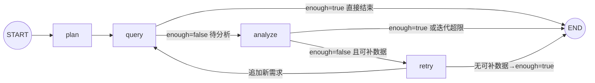

# 开发日志与问题总结（2026-09-17 / 09-18 会话）

> 本文档记录本次开发会话的进展、核心概念、遇到的问题与解决方案，以及明日待办。
> 供下次继续开发时快速恢复上下文。进度总览另见 `README.md`「开发推进日志」。

---

## 一、今日进展概览

| 阶段 | 状态 |
|---|---|
| 项目框架 + 依赖（.venv，langgraph 1.2.11 / langchain 1.4.1） | ✅ 完成 |
| 数据库：67 表 + 约 2 万行种子数据 + 表/字段注释 | ✅ 完成 |
| 一键初始化 `db/` + `scripts/init_database.py --seed` | ✅ 完成 |
| SQL 工具体系（schema 5 件套 + 生成器 + validator + 只读执行器） | ✅ 完成 |
| Operation Agent（双模式 → **纯 LLM 模式**）| ✅ 完成 |
| SubGraph（LangGraph：plan→query→analyze→retry）| ✅ 完成 + 批量查询优化 |
| 调试入口 `verify_operation.py`（问题不写死、双入口）| ✅ 完成 |
| **Decision Agent**（LLM 综合分析 + 结构化 DecisionOutput） | ✅ 完成（2026-09-18） |
| **Manager / Planner**（LLM 任务规划 + depends_on DAG + 环检测） | ✅ 完成（2026-09-18） |
| **主 Graph 组装**（循环路由：Manager→Operation→Decision 最小闭环） | ✅ 完成（2026-09-18） |
| **API `/chat`**（FastAPI 端点 + Pydantic 模型） | ✅ 完成（2026-09-18） |
| **全链路验证** `verify_pipeline.py`（19.5s 端到端，埋点命中） | ✅ 完成（2026-09-18） |
| README（架构图 + 状态图 + 推进日志）| ✅ 完成 + 主 Graph 章节 |
| **Finance Agent** | ✅ 完成（2026-09-18，继承 BaseDepartmentAgent） |
| **Logistics Agent** | ✅ 完成（2026-09-18，继承 BaseDepartmentAgent） |
| **Product Agent** | ⏳ 未开始（Phase 3） |
| **BaseDepartmentAgent 重构**（三部门共享基类） | ✅ 完成（2026-09-18） |
| **代码清理**（删除 Operation 单跑入口 + 命令式 for 循环） | ✅ 完成（2026-09-18） |
| **Schema 注释内联化**（02-schema.sql 行内注释，删除 COMMENT ON 语句） | ✅ 完成（2026-09-18） |
| **Memory / Checkpoint / Interrupt** | ⏳ 未开始（Phase 6-7） |
| **Web UI（Streamlit / Next.js）** | ⏳ 未开始（Phase 9） |

---

## 二、今日重点理解（核心概念）

### 1. 双模式 → 单 LLM 模式（今日重构）

- **原设计**：LLM 模式（有 Key）+ 模板模式（无 Key 降级，预置 SQL + 规则分析）
- **问题**：模板模式写死 SweetNight/US 示例，造成"代码里有写死的例子"的困惑；用户实际只用 LLM 模式
- **决策**：删除全部模板代码，仅保留 LLM 模式；未配置 Key 启动即报错
- **保留**：`_KNOWN_REQS` 白名单（安全边界，防 LLM 编造数据域）

### 2. 主循环 `agent.run()` vs SubGraph `run_operation()`

- **同一套逻辑的两种容器**（共享 `_query_one`/`_analyze`，防逻辑漂移）
- 主循环 = 命令式 for 循环 → **调试形态**（IDE 打断点、本地变量直观）
- SubGraph = LangGraph StateGraph → **投产形态**（能被 Manager 主 Graph 当子图嵌入；附带 checkpoint、状态流转、条件路由）
- 主循环在生产主链路不出现，作为日常调试入口长期保留

### 3. LangGraph 状态图（4 节点 + 2 条件路由）



- `plan`：LLM 规划数据需求（白名单过滤 + sales_sku 兜底）
- `query`：**批量**执行所有未查需求（每个需求只查一次，`queried` 记忆）
- `analyze`：LLM 分析 → enough/missing
- `retry`：白名单过滤 missing → 追加 plan；无可补则 enough=True 结束

### 4. retry 为什么独立成节点（不合并进 analyze）

1. **安全边界不能交给 LLM**：analyze 是 LLM 节点（会编造），retry 是确定性代码（白名单强制裁决）
2. **单一职责**：analyze 只判断、retry 只补数
3. **可观测性**：日志清晰分离 `operation.analyze.llm`（缺什么）与 retry（补了什么）
4. **可测试性**：retry 是纯函数，3 个分支可单测
5. **图可读性**：控制流显式可见（分析不足→补数→重查闭环）

### 5. 数据需求白名单机制

- `_KNOWN_REQS = {sales_sku, brand_summary, ad, review, inventory}`（对应真实表）
- `plan` 一定在白名单内：LLM 输出过滤 + retry 校验
- 未来新增数据域：同步扩展 `_KNOWN_REQS` 与 `_REQ_PRIORITY_TABLES`

---

## 三、遇到的问题与解决方案（难点记录）

### 难点 1：LLM 凭记忆编造表名/字段

- **现象**：LLM 生成 SQL 引用不存在的表/字段
- **解决**：schema 工具注入（`_build_schema_context`）——优先表清单 `_REQ_PRIORITY_TABLES` 强制进上下文 + `schema_search` 定位真实表 + 业务数据字典注入（品牌映射/市场取值/SKU 样例/时间窗口）
- **涉及**：`app/agents/operation/agent.py`

### 难点 2：总量对比陷阱（错误结论"全线暴跌 65-78%"）

- **现象**：prev 段 69 天 vs last21 段 21 天，直接比总量得出错误结论
- **解决**：数据字典 + 分析 prompt 强制**日均口径**（`SUM(x)/COUNT(DISTINCT date)`）；空聚合结果触发 repair
- **涉及**：`agent.py` `_load_dictionary`、`prompts.py` ANALYSIS_PROMPT

### 难点 3：SubGraph retry 空转（analyze 被重复调用 8 次）

- **现象**：LLM 每轮真实耗 API，analyze→retry→analyze 死循环
- **解决**：`_retry` 只追加"已知且未查询过"的缺失需求（白名单 `_KNOWN_REQS`）；无可补数据标记 `enough=True`；`_route_query` 在 enough 时直通 END
- **修复后**：analyze 8 次 → 2 次
- **涉及**：`graph.py` `_retry` / `_route_query`

### 难点 4：repair_sql 返回被 LLM 包上 ```sql 代码块

- **现象**：validator 报"Line 1 Col 3 解析失败"
- **解决**：repair prompt 明令禁止代码块 + 返回前剥离 markdown（`_parse_analysis_json` 同样容忍代码块）
- **涉及**：`app/tools/sql/generator.py` `repair_sql`

### 难点 5：ANALYSIS_PROMPT 写死 prev/last21 对比，与任意问题冲突

- **现象**：用户问"最近30天"→ LLM 只查单窗口 → 分析报"缺少分段"
- **解决**：prompt 泛化——有分段才做日均对比；单窗口做描述性分析（日均/AOV/件单比/退款率），诚实标注"缺少对比段"
- **验证**：Novilla US 30 天 → NV-Q10-US 基线分析正常

### 难点 6：模板模式代码冗余（今日移除）

- **现象**：模板降级路径写死示例、与真实 LLM 场景无关、造成理解困惑
- **解决**：删除全部模板代码（详见 README 推进日志 2026-09-18）
- **验证**：grep 模板引用清零、编译通过、埋点命中

### 难点 7：verify_operation.py 被误撤销（版本保护缺失）

- **现象**：用户在 IDE 撤销操作把重写后的调试入口还原成旧版（4 个干扰方法回来了）
- **解决**：重写恢复；**建议立即初始化 git**（项目当前 NOT_GIT_REPO）
- **教训**：无版本控制 = 误操作不可恢复；明日第一件事初始化 git

### 难点 8：开发环境工具坑（记录备用）

| 坑 | 解决 |
|---|---|
| `Edit` 工具对 UTF-8 中文文件反复报 "File has not been read yet" | 改用 Python 补丁脚本（`io.open` UTF-8 + str.replace + 断言） |
| PowerShell GBK 读 UTF-8 中文 SQL 乱码 | 显式 UTF8 读写 |
| PowerShell 命令 >15s 自动转后台 | 用 TaskOutput block=true 收结果 |
| 用户撤销导致文件被还原 | git 版本保护（已初始化） |

---

## 三点五、2026-09-18 第二次会话：Phase 1 最小闭环核心概念

### 1. Decision Agent 设计要点

- **纯 LLM 综合节点，不查数据**：接收 department_results，做事实整合→交叉验证→冲突检测→归因→建议
- **使用强推理模型**（`tier="strong"`）：Decision 需要跨领域因果推理
- **结构化输出 DecisionOutput**：summary / findings / root_causes / recommendations / risks / confidence，与设计文档 16 节一致
- **_slim_department_results**：丢弃 observations/sql_history 等大体积字段，只传 summary/metrics/anomalies/analysis/confidence，避免上下文爆炸
- **JSON 解析容错**：与 Operation 的 `_parse_analysis_json` 一致，容忍 markdown 代码块包裹
- **字段校验补全**：`_ensure_list_of_dicts` 确保各字段是字典列表，缺失键补空；`_clamp_confidence` 限制 0-1
- **降级报告**：LLM 输出无法解析时返回结构化错误报告（不编造结论），confidence=0
- **单部门数据时置信度合理降低**：实测仅 operation 数据时 Decision 输出 confidence=0.55，并在 findings 中标注 cross 部门数据缺失

### 2. Manager / Planner 设计要点

- **LLM 输出 task_plan**：intent / required_agents / tasks（每个含 id/agent/depends_on/description）
- **已知部门白名单**：`_KNOWN_DEPARTMENTS = {operation, finance, logistics, product}`，LLM 输出的未知 agent 被过滤
- **product 自动依赖**：若 product 在任务中，自动把所有已选 operation/finance/logistics 加入其 depends_on（设计文档 6 节）
- **decision 强制追加**：无论 LLM 是否输出，最终一定有 decision 任务且依赖所有部门任务
- **DAG 环检测**：DFS 三色标记；有环则打破所有非 decision 的依赖降级执行（保证可运行）
- **依赖合法性校验**：depends_on 必须指向存在的任务 id，不存在的移除
- **降级计划**：LLM 输出无法解析时，回退为单 operation + decision 的最小计划

### 3. 主 Graph 循环路由模式

- **为什么不用固定图**：部门组合由 Manager 动态决定（问题 A 只需 operation，问题 B 需要 O+F+L），固定图无法适配
- **循环路由结构**：`manager → router → [department] → router → ... → decision → END`
- **router 节点职责**：
  1. 找出所有就绪任务（依赖全部完成）
  2. 跳过未实现的 Agent（记入 skipped_tasks，其下游可继续）
  3. 找到第一个可用任务设为 current_task
  4. 全部部门完成/跳过则 current_task 为空（路由到 decision）
- **条件边 `route_fn`**：读 current_task，返回对应 agent 名（"operation"/"finance"/...）或 "decision"
- **部门节点工厂 `make_department_node(agent_name)`**：统一封装"取任务描述→调用子图→写入 department_results→标记完成"，新增部门只需一行注册
- **AVAILABLE_AGENTS 注册表**：`{"operation": run_operation}`，新增部门 Agent 后在此注册即可被 Router 调度
- **未实现 Agent 自动跳过**：Manager 可能规划 finance，但 finance 未实现 → router 标记 skipped → Decision 在报告中注明数据缺失

### 4. GlobalState 执行追踪字段

新增三个字段支撑循环路由：
- `completed_tasks: list[str]`：已完成任务 id
- `skipped_tasks: list[str]`：因 Agent 未实现而跳过的任务 id
- `current_task: str`：当前正在执行的任务 id（router 设置，部门节点消费后清空）

---

## 三点六、重点待开发：Agent 评估体系（决定能否上线）

> **为什么这是重点**：我们开发完的 Agent 能不能在线上用、用户评价如何，必须靠可度量的评估体系说话。不能靠人肉跑一次 verify_pipeline.py 看感觉。
> 这是 Agent 从"能跑"到"敢上线"的关键一跃。

### 已有基础设施（DB 层已建好，等接入代码）

数据库已预留 4 张表，业务查询不碰，由系统自身写入：

| 表 | 作用 | 当前状态 |
|---|---|---|
| `prompt_versions` | Prompt 版本管理：每次部署落库，记录 agent_name / version / content_hash / is_active | 空表，未接入 |
| `evaluation_cases` | 评估用例库：固定问题集 + 期望路由 Agent + 期望 SQL 模式 + 期望答案关键词 | 空表，未接入 |
| `evaluation_runs` | 评估批次：每跑一轮是一条记录（run_id / started_at / finished_at / status） | 空表，未接入 |
| `evaluation_scores` | 得分明细：每个 case × 每个 metric 的 score + detail JSONB | 空表，未接入 |

### 要做的事（开发时按这个顺序）

**Phase A：建立离线回归测试集**
1. 整理 50-100 个真实业务问题（覆盖销售异常/广告效率/库存风险/利润下滑/退款暴增等典型场景）
2. 每条用例人工标注：
   - `question`：用户原始问题
   - `expected_agents`：期望调度哪些部门 Agent（JSONB 数组）
   - `expected_sql_pattern`：期望 SQL 必须命中的表/字段关键词
   - `expected_answer_key`：期望答案必须包含的要点（如 "SN-Q12-US"、"-26%"、"库存"）
3. 写入 `evaluation_cases` 表

**Phase B：评估运行脚本**
4. 新建 `scripts/run_evaluation.py`：
   - 从 `evaluation_cases` 读全部用例
   - 逐条调用 `run_question()` 跑主图
   - 对每条用例自动打分：
     - `routing_accuracy`：Manager 规划的 agent 集合 vs expected_agents（精确匹配）
     - `sql_accuracy`：Operation 生成的 SQL 是否命中 expected_sql_pattern 关键词
     - `answer_accuracy`：Decision 输出是否包含 expected_answer_key 要点（可 LLM judge）
     - `latency_ms`：端到端耗时
     - `cost_usd`：token 消耗折算
   - 每条结果写入 `evaluation_scores`，批次信息写入 `evaluation_runs`

**Phase C：版本对比与回归报告**
5. 每次改 prompt / 改代码 / 换模型后跑一遍评估
6. 对比本次 run 与上次 run 的平均分（按 metric 汇总），生成回归报告：
   - 整体通过率变化
   - 哪些 case 退化了（上次过这次没过）
   - 哪些 case 改善了
   - 平均耗时/成本变化
7. 退化超阈值（如任一 metric 下降 >5%）则阻止上线

**Phase D：Prompt 版本管理接入**
8. 部署时对比代码里的 prompt 哈希 vs `prompt_versions` 最新记录
9. 不一致则插入新版本记录；`is_active` 标记当前生效版本
10. 评估时记录当时用的 prompt_version_id，便于"哪个 prompt 版本效果最好"的归因

**Phase E：线上反馈闭环（远期）**
11. 用户在 Web UI 上对 Agent 回复点"有用/没用"或打分
12. 线上 bad case 自动回流到 `evaluation_cases`（人工审核后加入回归集）
13. 形成"线上发现 bad case → 加入回归集 → 修复后跑回归 → 上线"的闭环

### 关键设计原则

- **评估要自动化**：不能靠人看结果，必须有可执行的打分脚本
- **回归先行**：任何改动上线前必须过回归测试，退化即阻断
- **小步迭代**：先用 20 条用例跑通流程，再逐步扩充到 50-100 条
- **离线为主，线上为辅**：Phase A-C 都是离线评估，Phase E 才接线上反馈
- **可归因**：每次评估记录 prompt 版本 + 代码版本 + 模型版本，能回答"为什么这次效果变了"

---

## 四、当前系统状态

- **数据库**：`sweetnight_agent`，67 表 + 注释；角色 app_user（写）/ agent_reader（只读）；种子数据 90 天（2026-06-18 ~ 09-15）；Docker 容器 `langgraph-postgres`（端口 5432）
- **埋点**（验证 Agent 用）：异常 SKU = `SN-Q12-US`（日均销量 -26.4%，GMV -26.35%）；对照组 `SN-K12-US` +15.19%、`NV-Q10-US` +8.98%
- **部门 Agent**：Operation / Finance / Logistics 三个均已实现，共享 `BaseDepartmentAgent` 基类（`app/agents/base.py`），子类只声明配置（白名单/表映射/关键词/prompt）+ 实现 `_load_dictionary()`
- **Decision Agent**：纯 LLM 综合分析（强模型），结构化 DecisionOutput（summary/findings/root_causes/recommendations/risks/confidence），JSON 解析容错
- **Manager Agent**：LLM 任务规划，输出 task_plan（tasks + depends_on DAG），含已知部门过滤、product 自动依赖、decision 强制追加、DAG 环检测
- **主 Graph**：`__start__→manager→router→operation/finance/logistics→router→...→decision→END`，循环路由模式，未实现 Agent 自动 skipped
- **API**：FastAPI `/health` + `/chat`（POST，Pydantic 模型，返回完整结构化结果）
- **验证命令**（统一入口，不再用 verify_operation.py）：
  ```
  .venv\Scripts\python scripts\verify_pipeline.py "分析 SweetNight 品牌美国市场过去90天的销售和利润状况"
  ```
- **全链路验证结果**：25.7s 完成（operation+finance→decision），Decision 输出 7 发现/4 根因/6 建议/5 风险/置信度 0.60；三部门串行正常，Decision 跨部门交叉验证生效
- **日志**：`LOG_LEVEL=DEBUG`（.env 当前值，日常可回 INFO）；关键事件见 README
- **git**：仓库已初始化（commit f093219 "init"），**工作区有大量未提交改动**（Finance/Logistics Agent + BaseDepartmentAgent 重构 + schema 注释内联 + development_log 更新），用户要求不自动 commit

---

## 五、明日待办（按优先级）

- [x] ~~1. 初始化 git 并首次提交~~（已存在，commit f093219）
- [x] ~~2. Decision Agent~~（2026-09-18 完成）
- [x] ~~3. Manager / Planner~~（2026-09-18 完成）
- [x] ~~4. 主 Graph 组装~~（2026-09-18 完成，循环路由模式）
- [x] ~~5. API `/chat`~~（2026-09-18 完成）
- [x] ~~6. Finance Agent~~（2026-09-18 完成，继承 BaseDepartmentAgent）
- [x] ~~7. Logistics Agent~~（2026-09-18 完成，继承 BaseDepartmentAgent）
- [x] ~~9. 主 Graph 扩展：接入 Finance/Logistics 后验证多部门 + Decision 交叉验证~~（2026-09-18 完成，三部门串行+跨部门交叉验证生效）
- [ ] **8. Product Agent**（Phase 3：需跨部门上下文注入，依赖 O/F/L 结果；新建 `app/agents/product/` 并注册到 AVAILABLE_AGENTS 和主图）
- [ ] 10. Checkpoint / PostgresSaver 持久化（Phase 6，支持中断恢复）
- [ ] 11. Interrupt / Human-in-the-loop（Phase 7，参数不明确时暂停询问）
- [ ] 12. Web UI（Phase 9，Streamlit MVP 或 Next.js）
- [ ] **13. Agent 评估体系（重点！决定能否上线）** —— 详见上方「三点六」小节

---

*下次继续：先读 `README.md`（推进日志 + 架构）恢复上下文，再按「明日待办」推进。*
