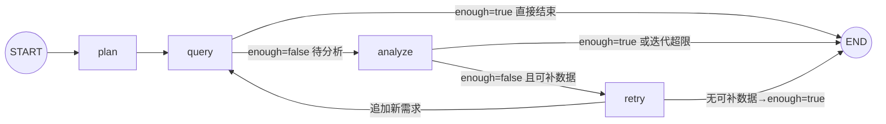

# 开发日志与问题总结（2026-09-17 / 09-18 / 09-19 会话）

> 本文档记录本次开发会话的进展、核心概念、遇到的问题与解决方案，以及明日待办。
> 供下次继续开发时快速恢复上下文。进度总览另见 `README.md`「开发推进日志」。

---

## 一、今日进展概览

| 阶段 | 状态 |
|---|---|
| 项目框架 + 依赖（.venv，langgraph 1.2.11 / langchain 1.4.1） | ✅ 完成 |
| 数据库：67 表 + 约 2 万行种子数据 + 表/字段注释 | ✅ 完成 |
| 一键初始化 `db/` + `scripts/init_database.py --seed` | ✅ 完成 |
| SQL 工具体系（schema 5 件套 + 生成器 + validator + 只读执行器） | ✅ 完成 |
| Operation Agent（双模式 → **纯 LLM 模式**）| ✅ 完成 |
| SubGraph（LangGraph：plan→query→analyze→retry）| ✅ 完成 + 批量查询优化 |
| 调试入口 `verify_operation.py`（问题不写死、双入口）| ✅ 完成 |
| **Decision Agent**（LLM 综合分析 + 结构化 DecisionOutput） | ✅ 完成（2026-09-18） |
| **Manager / Planner**（LLM 任务规划 + depends_on DAG + 环检测） | ✅ 完成（2026-09-18） |
| **主 Graph 组装**（循环路由：Manager→Operation→Decision 最小闭环） | ✅ 完成（2026-09-18） |
| **API `/chat`**（FastAPI 端点 + Pydantic 模型） | ✅ 完成（2026-09-18） |
| **全链路验证** `verify_pipeline.py`（19.5s 端到端，埋点命中） | ✅ 完成（2026-09-18） |
| README（架构图 + 状态图 + 推进日志）| ✅ 完成 + 主 Graph 章节 |
| **Finance Agent** | ✅ 完成（2026-09-18，继承 BaseDepartmentAgent） |
| **Logistics Agent** | ✅ 完成（2026-09-18，继承 BaseDepartmentAgent） |
| **Product Agent** | ✅ 完成（2026-09-19，跨部门上下文注入 + 知识库检索） |
| **BaseDepartmentAgent 重构**（三部门共享基类） | ✅ 完成（2026-09-18） |
| **代码清理**（删除 Operation 单跑入口 + 命令式 for 循环） | ✅ 完成（2026-09-18） |
| **Schema 注释内联化**（02-schema.sql 行内注释，删除 COMMENT ON 语句） | ✅ 完成（2026-09-18） |
| **Memory / Checkpoint / Interrupt** | ⏳ 未开始（Phase 6-7） |
| **Web UI（Streamlit / Next.js）** | ⏳ 未开始（Phase 9） |

---

## 二、今日重点理解（核心概念）

### 1. 双模式 → 单 LLM 模式（今日重构）

- **原设计**：LLM 模式（有 Key）+ 模板模式（无 Key 降级，预置 SQL + 规则分析）
- **问题**：模板模式写死 SweetNight/US 示例，造成"代码里有写死的例子"的困惑；用户实际只用 LLM 模式
- **决策**：删除全部模板代码，仅保留 LLM 模式；未配置 Key 启动即报错
- **保留**：`_KNOWN_REQS` 白名单（安全边界，防 LLM 编造数据域）

### 2. 主循环 `agent.run()` vs SubGraph `run_operation()`

- **同一套逻辑的两种容器**（共享 `_query_one`/`_analyze`，防逻辑漂移）
- 主循环 = 命令式 for 循环 → **调试形态**（IDE 打断点、本地变量直观）
- SubGraph = LangGraph StateGraph → **投产形态**（能被 Manager 主 Graph 当子图嵌入；附带 checkpoint、状态流转、条件路由）
- 主循环在生产主链路不出现，作为日常调试入口长期保留

### 3. LangGraph 状态图（4 节点 + 2 条件路由）



- `plan`：LLM 规划数据需求（白名单过滤 + sales_sku 兜底）
- `query`：**批量**执行所有未查需求（每个需求只查一次，`queried` 记忆）
- `analyze`：LLM 分析 → enough/missing
- `retry`：白名单过滤 missing → 追加 plan；无可补则 enough=True 结束

### 4. retry 为什么独立成节点（不合并进 analyze）

1. **安全边界不能交给 LLM**：analyze 是 LLM 节点（会编造），retry 是确定性代码（白名单强制裁决）
2. **单一职责**：analyze 只判断、retry 只补数
3. **可观测性**：日志清晰分离 `operation.analyze.llm`（缺什么）与 retry（补了什么）
4. **可测试性**：retry 是纯函数，3 个分支可单测
5. **图可读性**：控制流显式可见（分析不足→补数→重查闭环）

### 5. 数据需求白名单机制

- `_KNOWN_REQS = {sales_sku, brand_summary, ad, review, inventory}`（对应真实表）
- `plan` 一定在白名单内：LLM 输出过滤 + retry 校验
- 未来新增数据域：同步扩展 `_KNOWN_REQS` 与 `_REQ_PRIORITY_TABLES`

---

## 三、遇到的问题与解决方案（难点记录）

### 难点 1：LLM 凭记忆编造表名/字段

- **现象**：LLM 生成 SQL 引用不存在的表/字段
- **解决**：schema 工具注入（`_build_schema_context`）——优先表清单 `_REQ_PRIORITY_TABLES` 强制进上下文 + `schema_search` 定位真实表 + 业务数据字典注入（品牌映射/市场取值/SKU 样例/时间窗口）
- **涉及**：`app/agents/operation/agent.py`

### 难点 2：总量对比陷阱（错误结论"全线暴跌 65-78%"）

- **现象**：prev 段 69 天 vs last21 段 21 天，直接比总量得出错误结论
- **解决**：数据字典 + 分析 prompt 强制**日均口径**（`SUM(x)/COUNT(DISTINCT date)`）；空聚合结果触发 repair
- **涉及**：`agent.py` `_load_dictionary`、`prompts.py` ANALYSIS_PROMPT

### 难点 3：SubGraph retry 空转（analyze 被重复调用 8 次）

- **现象**：LLM 每轮真实耗 API，analyze→retry→analyze 死循环
- **解决**：`_retry` 只追加"已知且未查询过"的缺失需求（白名单 `_KNOWN_REQS`）；无可补数据标记 `enough=True`；`_route_query` 在 enough 时直通 END
- **修复后**：analyze 8 次 → 2 次
- **涉及**：`graph.py` `_retry` / `_route_query`

### 难点 4：repair_sql 返回被 LLM 包上 ```sql 代码块

- **现象**：validator 报"Line 1 Col 3 解析失败"
- **解决**：repair prompt 明令禁止代码块 + 返回前剥离 markdown（`_parse_analysis_json` 同样容忍代码块）
- **涉及**：`app/tools/sql/generator.py` `repair_sql`

### 难点 5：ANALYSIS_PROMPT 写死 prev/last21 对比，与任意问题冲突

- **现象**：用户问"最近30天"→ LLM 只查单窗口 → 分析报"缺少分段"
- **解决**：prompt 泛化——有分段才做日均对比；单窗口做描述性分析（日均/AOV/件单比/退款率），诚实标注"缺少对比段"
- **验证**：Novilla US 30 天 → NV-Q10-US 基线分析正常

### 难点 6：模板模式代码冗余（今日移除）

- **现象**：模板降级路径写死示例、与真实 LLM 场景无关、造成理解困惑
- **解决**：删除全部模板代码（详见 README 推进日志 2026-09-18）
- **验证**：grep 模板引用清零、编译通过、埋点命中

### 难点 7：verify_operation.py 被误撤销（版本保护缺失）

- **现象**：用户在 IDE 撤销操作把重写后的调试入口还原成旧版（4 个干扰方法回来了）
- **解决**：重写恢复；**建议立即初始化 git**（项目当前 NOT_GIT_REPO）
- **教训**：无版本控制 = 误操作不可恢复；明日第一件事初始化 git

### 难点 8：开发环境工具坑（记录备用）

| 坑 | 解决 |
|---|---|
| `Edit` 工具对 UTF-8 中文文件反复报 "File has not been read yet" | 改用 Python 补丁脚本（`io.open` UTF-8 + str.replace + 断言） |
| PowerShell GBK 读 UTF-8 中文 SQL 乱码 | 显式 UTF8 读写 |
| PowerShell 命令 >15s 自动转后台 | 用 TaskOutput block=true 收结果 |
| 用户撤销导致文件被还原 | git 版本保护（已初始化） |

---

## 三点五、2026-09-18 第二次会话：Phase 1 最小闭环核心概念

### 0. 2026-09-19 第三次会话补充（Product Agent 完成）

- Product Agent（`app/agents/product/*`）完成：数据域白名单 `{product, lifecycle, development, consumer, market}`，映射 products/product_skus/product_lifecycle/product_development_projects/reviews/knowledge_chunks 等真实表
- **跨部门上下文注入**：`make_department_node` 新增 `context_builder` 参数，Product 节点执行前把 O/F/L 结论摘要注入 `cross_context`；基类 `_plan`/`_analyze` 支持 `{context}` 占位（str.format 忽略多余参数，O/F/L 零影响）
- **知识库检索**：market 数据域用确定性过滤查 knowledge_chunks（种子向量随机，勿用相似度）
- **主图集成**：router 注册 product，条件边 product→product，回边 product→router；四部门闭环验证通过（产品问题五部门链路 + 回归销售问题 + 轻量 SOP 问答）
- **修复**：base.py 循环导入（延迟导入 `_get_tool_map()`）；LLM 嵌套 JSON 防御（summary 二次提取）；**plan 解析容错**（`_extract_plan` 剥离 markdown 列表符/序号/多分隔符/句号，见考点十七）
- **主 Graph 并行化**（2026-09-19）：route_fn 返回就绪 agent 列表 → O/F/L 并行 fan-out、部门完成后 fan-in 回 router、Product 依赖 O/F/L 串行（DAG 天然保证）；废弃 current_task 单任务调度，部门节点自定位任务；GlobalState 加 Annotated reducer（_add_unique/_merge_dict）防并行写覆盖；实测串行估算 77s → 并行 56.9s
- 详细面试点见下方「三点七」考点十四/十五/十六/十七/十八

### 1. Decision Agent 设计要点

- **纯 LLM 综合节点，不查数据**：接收 department_results，做事实整合→交叉验证→冲突检测→归因→建议
- **使用强推理模型**（`tier="strong"`）：Decision 需要跨领域因果推理
- **结构化输出 DecisionOutput**：summary / findings / root_causes / recommendations / risks / confidence，与设计文档 16 节一致
- **_slim_department_results**：丢弃 observations/sql_history 等大体积字段，只传 summary/metrics/anomalies/analysis/confidence，避免上下文爆炸
- **JSON 解析容错**：与 Operation 的 `_parse_analysis_json` 一致，容忍 markdown 代码块包裹
- **字段校验补全**：`_ensure_list_of_dicts` 确保各字段是字典列表，缺失键补空；`_clamp_confidence` 限制 0-1
- **降级报告**：LLM 输出无法解析时返回结构化错误报告（不编造结论），confidence=0
- **单部门数据时置信度合理降低**：实测仅 operation 数据时 Decision 输出 confidence=0.55，并在 findings 中标注 cross 部门数据缺失

### 2. Manager / Planner 设计要点

- **LLM 输出 task_plan**：intent / required_agents / tasks（每个含 id/agent/depends_on/description）
- **已知部门白名单**：`_KNOWN_DEPARTMENTS = {operation, finance, logistics, product}`，LLM 输出的未知 agent 被过滤
- **product 自动依赖**：若 product 在任务中，自动把所有已选 operation/finance/logistics 加入其 depends_on（设计文档 6 节）
- **decision 强制追加**：无论 LLM 是否输出，最终一定有 decision 任务且依赖所有部门任务
- **DAG 环检测**：DFS 三色标记；有环则打破所有非 decision 的依赖降级执行（保证可运行）
- **依赖合法性校验**：depends_on 必须指向存在的任务 id，不存在的移除
- **降级计划**：LLM 输出无法解析时，回退为单 operation + decision 的最小计划

### 3. 主 Graph 循环路由模式

- **为什么不用固定图**：部门组合由 Manager 动态决定（问题 A 只需 operation，问题 B 需要 O+F+L），固定图无法适配
- **循环路由结构**：`manager → router → [department] → router → ... → decision → END`
- **router 节点职责**：
  1. 找出所有就绪任务（依赖全部完成）
  2. 跳过未实现的 Agent（记入 skipped_tasks，其下游可继续）
  3. 找到第一个可用任务设为 current_task
  4. 全部部门完成/跳过则 current_task 为空（路由到 decision）
- **条件边 `route_fn`**：读 current_task，返回对应 agent 名（"operation"/"finance"/...）或 "decision"
- **部门节点工厂 `make_department_node(agent_name)`**：统一封装"取任务描述→调用子图→写入 department_results→标记完成"，新增部门只需一行注册
- **AVAILABLE_AGENTS 注册表**：`{"operation": run_operation}`，新增部门 Agent 后在此注册即可被 Router 调度
- **未实现 Agent 自动跳过**：Manager 可能规划 finance，但 finance 未实现 → router 标记 skipped → Decision 在报告中注明数据缺失

### 4. GlobalState 执行追踪字段

新增三个字段支撑循环路由：
- `completed_tasks: list[str]`：已完成任务 id
- `skipped_tasks: list[str]`：因 Agent 未实现而跳过的任务 id
- `current_task: str`：当前正在执行的任务 id（router 设置，部门节点消费后清空）

---

## 三点六、重点待开发：Agent 评估体系（决定能否上线）

> **为什么这是重点**：我们开发完的 Agent 能不能在线上用、用户评价如何，必须靠可度量的评估体系说话。不能靠人肉跑一次 verify_pipeline.py 看感觉。
> 这是 Agent 从"能跑"到"敢上线"的关键一跃。

### 已有基础设施（DB 层已建好，等接入代码）

数据库已预留 4 张表，业务查询不碰，由系统自身写入：

| 表 | 作用 | 当前状态 |
|---|---|---|
| `prompt_versions` | Prompt 版本管理：每次部署落库，记录 agent_name / version / content_hash / is_active | 空表，未接入 |
| `evaluation_cases` | 评估用例库：固定问题集 + 期望路由 Agent + 期望 SQL 模式 + 期望答案关键词 | 空表，未接入 |
| `evaluation_runs` | 评估批次：每跑一轮是一条记录（run_id / started_at / finished_at / status） | 空表，未接入 |
| `evaluation_scores` | 得分明细：每个 case × 每个 metric 的 score + detail JSONB | 空表，未接入 |

### 要做的事（开发时按这个顺序）

**Phase A：建立离线回归测试集**
1. 整理 50-100 个真实业务问题（覆盖销售异常/广告效率/库存风险/利润下滑/退款暴增等典型场景）
2. 每条用例人工标注：
   - `question`：用户原始问题
   - `expected_agents`：期望调度哪些部门 Agent（JSONB 数组）
   - `expected_sql_pattern`：期望 SQL 必须命中的表/字段关键词
   - `expected_answer_key`：期望答案必须包含的要点（如 "SN-Q12-US"、"-26%"、"库存"）
3. 写入 `evaluation_cases` 表

**Phase B：评估运行脚本**
4. 新建 `scripts/run_evaluation.py`：
   - 从 `evaluation_cases` 读全部用例
   - 逐条调用 `run_question()` 跑主图
   - 对每条用例自动打分：
     - `routing_accuracy`：Manager 规划的 agent 集合 vs expected_agents（精确匹配）
     - `sql_accuracy`：Operation 生成的 SQL 是否命中 expected_sql_pattern 关键词
     - `answer_accuracy`：Decision 输出是否包含 expected_answer_key 要点（可 LLM judge）
     - `latency_ms`：端到端耗时
     - `cost_usd`：token 消耗折算
   - 每条结果写入 `evaluation_scores`，批次信息写入 `evaluation_runs`

**Phase C：版本对比与回归报告**
5. 每次改 prompt / 改代码 / 换模型后跑一遍评估
6. 对比本次 run 与上次 run 的平均分（按 metric 汇总），生成回归报告：
   - 整体通过率变化
   - 哪些 case 退化了（上次过这次没过）
   - 哪些 case 改善了
   - 平均耗时/成本变化
7. 退化超阈值（如任一 metric 下降 >5%）则阻止上线

**Phase D：Prompt 版本管理接入**
8. 部署时对比代码里的 prompt 哈希 vs `prompt_versions` 最新记录
9. 不一致则插入新版本记录；`is_active` 标记当前生效版本
10. 评估时记录当时用的 prompt_version_id，便于"哪个 prompt 版本效果最好"的归因

**Phase E：线上反馈闭环（远期）**
11. 用户在 Web UI 上对 Agent 回复点"有用/没用"或打分
12. 线上 bad case 自动回流到 `evaluation_cases`（人工审核后加入回归集）
13. 形成"线上发现 bad case → 加入回归集 → 修复后跑回归 → 上线"的闭环

### 关键设计原则

- **评估要自动化**：不能靠人看结果，必须有可执行的打分脚本
- **回归先行**：任何改动上线前必须过回归测试，退化即阻断
- **小步迭代**：先用 20 条用例跑通流程，再逐步扩充到 50-100 条
- **离线为主，线上为辅**：Phase A-C 都是离线评估，Phase E 才接线上反馈
- **可归因**：每次评估记录 prompt 版本 + 代码版本 + 模型版本，能回答"为什么这次效果变了"

---

## 四、当前系统状态

- **数据库**：`sweetnight_agent`，67 表 + 注释；角色 app_user（写）/ agent_reader（只读）；种子数据 90 天（2026-06-18 ~ 09-15）；Docker 容器 `langgraph-postgres`（端口 5432）
- **埋点**（验证 Agent 用）：异常 SKU = `SN-Q12-US`（日均销量 -26.4%，GMV -26.35%）；对照组 `SN-K12-US` +15.19%、`NV-Q10-US` +8.98%
- **部门 Agent**：Operation / Finance / Logistics / Product 四个均已实现，共享 `BaseDepartmentAgent` 基类（`app/agents/base.py`），子类只声明配置（白名单/表映射/关键词/prompt）+ 实现 `_load_dictionary()`；Product 额外支持跨部门上下文注入（`cross_context`）
- **Decision Agent**：纯 LLM 综合分析（强模型），结构化 DecisionOutput（summary/findings/root_causes/recommendations/risks/confidence），JSON 解析容错
- **Manager Agent**：LLM 任务规划，输出 task_plan（tasks + depends_on DAG），含已知部门过滤、product 自动依赖、decision 强制追加、DAG 环检测
- **主 Graph**：`__start__→manager→router→operation/finance/logistics→router→...→decision→END`，循环路由模式，未实现 Agent 自动 skipped
- **API**：FastAPI `/health` + `/chat`（POST，Pydantic 模型，返回完整结构化结果）
- **验证命令**（统一入口，不再用 verify_operation.py）：
  ```
  .venv\Scripts\python scripts\verify_pipeline.py "分析 SweetNight 品牌美国市场过去90天的销售和利润状况"
  .venv\Scripts\python scripts\verify_pipeline.py "下一季度美国市场应该开发什么样的床垫？"   # 五部门 O/F/L/P/D
  ```
- **全链路验证结果**：销售问题埋点命中（SN-Q12-US -26.35%）；产品问题五部门链路 25-45s 完成，Product 命中知识库与在研项目，Decision 交叉验证发现"物流 SKU-1 未标注编码 vs 爆款集中"冲突，置信度 0.82；SOP 问答场景 Manager 规划四部门+decision，Product 正确提取七阶段流程
- **日志**：`LOG_LEVEL=DEBUG`（.env 当前值，日常可回 INFO）；关键事件见 README
- **git**：仓库已初始化，已有提交 f093219（init）/ f20e4a8（Phase 1 最小闭环）/ 7223de6、43e00b3（Finance/Logistics/BaseDepartmentAgent 重构）/ e5d11bc（面试点总结）；本次会话新增 Product Agent 改动未提交，用户要求不自动 commit

---

## 五、明日待办（按优先级）

- [x] ~~1. 初始化 git 并首次提交~~（已存在，commit f093219）
- [x] ~~2. Decision Agent~~（2026-09-18 完成）
- [x] ~~3. Manager / Planner~~（2026-09-18 完成）
- [x] ~~4. 主 Graph 组装~~（2026-09-18 完成，循环路由模式）
- [x] ~~5. API `/chat`~~（2026-09-18 完成）
- [x] ~~6. Finance Agent~~（2026-09-18 完成，继承 BaseDepartmentAgent）
- [x] ~~7. Logistics Agent~~（2026-09-18 完成，继承 BaseDepartmentAgent）
- [x] ~~9. 主 Graph 扩展：接入 Finance/Logistics 后验证多部门 + Decision 交叉验证~~（2026-09-18 完成，三部门串行+跨部门交叉验证生效）
- [x] ~~8. Product Agent~~（2026-09-19 完成，四部门闭环 + 跨部门上下文注入 + 知识库检索）
- [ ] 10. Checkpoint / PostgresSaver 持久化（Phase 6，支持中断恢复）
- [ ] 11. Interrupt / Human-in-the-loop（Phase 7，参数不明确时暂停询问）
- [ ] 12. Web UI（Phase 9，Streamlit MVP 或 Next.js）
- [ ] **13. Agent 评估体系（重点！决定能否上线）** —— 详见上方「三点六」小节
- [ ] **14. LangSmith 接入（Agent trace 可视化 + Prompt 版本管理 + 评估）** —— 替代 agent_steps/agent_tool_calls/agent_errors 手动记录；保留 agent_runs/agent_results 业务表

---

## 三点七、面试点与技术难点总结（按考点分类）

> 本项目涉及的高频面试考点，按"面试官会怎么问 → 我们怎么设计 → 为什么这么做 → 有没有备选方案"整理。
> 每个考点都对应真实代码，不是纸上谈兵。

---

### 考点一：多 Agent 编排——为什么不用固定 DAG 图？

**面试官怎么问**：你有 operation/finance/logistics/decision 四个节点，为什么不直接画一张固定图，而要搞一个 router 节点循环路由？

**我们的设计**：
```
__start__ → manager → router → [department] → router → ... → decision → END
```
manager 先规划任务 DAG，router 根据当前就绪任务动态决定下一个走哪个部门。

**为什么不能用固定图**：
- 用户问"销售怎么样"→ 只需要 operation
- 用户问"利润和库存风险"→ 需要 finance + logistics
- 用户问"全面诊断"→ 需要 operation + finance + logistics + product
- 部门组合是 **LLM 动态决定的**，固定图无法适配
- 如果硬写固定图：要么所有部门都跑（浪费 token、慢），要么用户问题路由不准

**备选方案及缺点**：
| 方案 | 缺点 |
|---|---|
| 固定全连接图 | 每次都跑所有部门，浪费 3-4 倍 token |
| 纯 LLM 链式调用（agent.run 循环） | 不可观测、无 checkpoint、无法中断恢复 |
| 路由模型直接选部门 | 一个分类器，不够灵活，无法处理多部门+依赖 |

**核心一句话**：固定图适合流程确定的场景，多 Agent 决策系统的流程是 LLM 动态生成的，必须用"规划+动态路由"模式。

---

### 考点二：DAG 环检测——依赖图有环怎么办？

**面试官怎么问**：Manager LLM 输出了 depends_on 依赖关系，万一形成了环（A 依赖 B，B 依赖 A），你的系统怎么处理？

**我们的设计**（`ManagerAgent._parse_and_validate`）：
1. DFS 三色标记法：白=未访问、灰=访问中、黑=已完成，O(V+E)
2. 遇到灰色节点 = 发现环
3. **拆环降级策略**：打破所有非 decision 的依赖边，让部门 Agent 独立执行

**举例**：
```
输入：operation → depends_on=[decision]
      decision  → depends_on=[operation]
      （环：operation 等 decision，decision 等 operation）

拆环后：operation 不依赖 decision，decision 依赖 operation
→ operation 先跑 → operation 完成后 decision 再跑
```

**为什么只打破非 decision 依赖**：
- decision 是最终汇总节点，它依赖所有部门是合理的
- 部门之间互相依赖才是异常（operation 不该等 finance 跑完才能查销售数据）
- 打破部门间依赖让它们独立跑，最终 decision 再汇总

**会不会导致结果不一致**：
- 不会。因为 O/F/L 三个部门查的是**不同的数据域**
- 它们之间本来就不该互相依赖——部门独立查数，decision 负责交叉验证
- 如果真的需要 finance 用 operation 的中间结果，那应该在 decision 层做，而不是部门层

**核心一句话**：环检测用 DFS 三色标记，拆环策略是"信任 decision、打破部门间依赖"，因为部门本来就应该独立查数。

---

### 考点三：LLM 生成 SQL 出错怎么办？——执行→错误→repair 闭环

**面试官怎么问**：LLM 生成的 SQL 可能引用不存在的表、字段名拼错、语法错误，你怎么保证 Agent 能拿到正确数据？

**我们的设计**（`BaseDepartmentAgent._query_one`）：
```
生成 SQL → 语法校验 → 执行 →
  ├─ 执行成功且有数据 → 返回
  ├─ 执行成功但 0 行 → repair（"聚合查询不应为空，可能过滤条件错了"）
  └─ 执行报错 → repair（把错误信息喂给 LLM，让它修）
最多重试 3 次，还失败就抛异常
```

**关键设计点**：
1. **不是一次生成就完**：SQL 生成 → 执行失败 → 把错误信息回喂 LLM → 重新生成，形成闭环
2. **区分两种失败**：语法错误 vs 0 行结果（0 行可能是过滤条件错，不是语法错）
3. **repair 时带上 schema 上下文**：告诉 LLM 正确的表名/字段名是什么
4. **最多 3 次重试**：防死循环，超过就报错（不无限重试烧钱）

**核心一句话**：LLM 不是一次生成正确，而是"生成→执行→错误反馈→修复"的闭环，本质是把编译器的错误提示机制用在 LLM 上。

---

### 考点四：怎么防止 LLM 编造数据域？——白名单安全边界

**面试官怎么问**：LLM 说"我要查广告数据"，但你系统里根本没有广告表，你怎么控制？

**我们的设计**：
1. **KNOWN_REQS 白名单**：每个部门 Agent 硬编码允许的数据域
   - operation: {sales_sku, brand_summary, ad, review, inventory}
   - finance: {profit, cost, revenue, refund, platform_fee}
   - logistics: {inventory_risk, stock_level, inbound, logistics_cost, delivery}
2. **plan 阶段过滤**：LLM 输出的数据域不在白名单就丢弃
3. **retry 阶段二次过滤**：LLM 说"我还缺 XX 数据"，XX 不在白名单就忽略
4. **FALLBACK_REQ 兜底**：白名单过滤后如果空了，强制用一个默认数据域

**为什么必须白名单**：
- LLM 会"合理地编造"——用户问销售，LLM 觉得应该查"流量数据"，但你没这张表
- 不白名单 = LLM 想查什么查什么 = 每次都报"表不存在"错误
- 白名单是 **安全边界**，比 prompt 里写"不要查不存在的表"可靠得多

**核心一句话**：不要相信 LLM 的输出，用白名单做硬边界过滤——LLM 负责"查什么方向"，代码负责"这个方向到底存不存在"。

---

### 考点五：LLM 容易犯的统计错误——总量对比陷阱

**面试官怎么问**：你让 LLM 分析"最近 90 天销售变化"，它说"销量下降了 65%"，这个结论可能是错的，为什么？

**真实踩坑**：
- prev 段（前 69 天）总销量 6000 件
- last21 段（后 21 天）总销量 2000 件
- LLM 直接比总量：(2000-6000)/6000 = **-66.7%**
- 但正确算法是日均：prev 日均 87 件/天，last21 日均 95 件/天 = **+9%**（实际是增长）

**怎么解决**：
1. **数据字典注入**：明确告诉 LLM "prev 约 69 天、last21 约 21 天，天数不同"
2. **prompt 强制日均口径**：要求 SQL 必须输出 `SUM(x)/COUNT(DISTINCT date)` 作为 daily_x
3. **分析 prompt 约束**：明确要求"禁止直接比较两段总量，必须换算日均"

**这是 Agent 工程化的核心难点**：
- LLM 数学能力没问题，但它不知道你的数据分布
- 必须在 **schema 上下文** 里把"陷阱"提前告诉它
- 光靠 prompt 说"请仔细计算"不够，要在 SQL 生成阶段就把日均列出来

**核心一句话**：LLM 不是数学不行，是不知道你的数据分布——把业务陷阱写进 schema 上下文，比在 prompt 里说"请认真计算"有效 100 倍。

---

### 考点六：retry 闭环——怎么防止 LLM 死循环烧钱？

**面试官怎么问**：你的 Agent 有 plan→query→analyze→retry 循环，如果 LLM 每次都说"数据不够，再查点别的"，会不会无限循环？

**我们的设计**：
1. **迭代上限**：`max_iterations = 5`，超过强制结束
2. **queried 记忆**：已经查过的数据域不重复查
3. **retry 白名单过滤**：LLM 说缺 X 数据，X 不在 KNOWN_REQS 就忽略
4. **无可补数据自动 enough=True**：白名单里所有数据域都查过了，就不再 retry

**修复效果**：
- 修复前：analyze 被调用 8 次（每次都 LLM 说"不够再查"）
- 修复后：analyze 只调 2 次（第一次查 3 个域，第二次发现够了）

**为什么 retry 要独立成节点而不是合并进 analyze**：
1. **安全边界不能交给 LLM**：analyze 是 LLM 节点（会编造），retry 是确定性代码（白名单强制裁决）
2. **单一职责**：analyze 只判断"够不够"，retry 只决定"补什么"
3. **可观测性**：日志能分开看"LLM 说缺什么"和"代码实际补了什么"
4. **可测试性**：retry 是纯函数，3 个分支可单测

**核心一句话**：LLM 的判断不可信，必须用确定性代码（白名单+迭代上限）做兜底，防止无限循环烧 token。

---

### 考点七：BaseDepartmentAgent——模板方法设计模式

**面试官怎么问**：operation/finance/logistics 三个 Agent 逻辑几乎一样，只是查的数据不同，你怎么设计避免代码重复？

**演进过程**：
1. **V1：复制粘贴**——三个 Agent 各写 300 行，改 bug 改三处
2. **V2：OperationAgent 当父类**——Finance 继承 Operation，但核心逻辑都重写了（名义继承）
3. **V3：BaseDepartmentAgent 基类**——**模板方法模式**

**V3 的设计**：
```python
class BaseDepartmentAgent:
    # 子类声明配置（模板参数）
    AGENT_NAME = "operation"
    KNOWN_REQS = frozenset({...})
    PRIORITY_TABLES = {...}
    PLAN_PROMPT = "..."
    ANALYSIS_PROMPT = "..."

    # 基类实现通用流程（模板方法）
    def run(self):
        plan = self._plan()               # 用 self.PLAN_PROMPT
        results = self._query(plan)       # 通用 SQL 执行
        analysis = self._analyze(results)  # 用 self.ANALYSIS_PROMPT
        return self._build_result(analysis)

    # 子类必须实现的差异化点
    def _load_dictionary(self): ...       # 每个部门的数据字典不同
```

**为什么用模板方法而不是策略模式**：
- 三个部门的**流程完全一样**（plan→query→analyze→retry），只是参数不同
- 模板方法 = "骨架在基类，差异在子类"
- 策略模式适合"流程本身可以替换"（比如 query 可以是 SQL 也可以是 API 调用），这里不适用

**代码量对比**：
- Operation: 310 行 → 130 行（只留配置+字典）
- Finance: 210 行 → 110 行
- Logistics: 210 行 → 110 行
- 新增 Product Agent 只需要写 ~80 行配置

**核心一句话**：流程相同、参数不同 → 模板方法模式，基类定骨架子类填参数；流程不同 → 策略模式。

---

### 考点八：跨部门数据交叉验证——多 Agent 的核心价值

**面试官怎么问**：你的 operation 和 finance 都查了"收入/GMV"，两个 Agent 独立查数，结果不一致怎么办？多 Agent 架构的价值到底是什么？

**真实案例**：
- Operation 查 sales_daily：90 天 GMV = 1,812,419 美元
- Finance 查 mart_product_profit_daily：90 天收入 = 1,812,419 美元（基本吻合 ✅）
- 但 Finance 查 revenue_daily：收入 = 1,805,599 美元（差 0.4%）
- 再查 platform_fee 表：收入 = 1,900,316 美元（差 5.5%）

**Decision Agent 怎么做的**：
1. **交叉验证**：发现 operation GMV ≈ finance profit 表收入（一致，可信）
2. **口径告警**：发现 finance 内部多张表查出来的收入差 5.5%（数据质量问题）
3. **写入 findings**：标注"跨口径差异约 5.5%，采信具体数字时需标注口径"
4. **建议**：P0 优先级——统一财务口径

**这就是多 Agent 的价值**：
- 单 Agent 只能看自己的数据域，不知道别的部门怎么算的
- 多 Agent 各自独立查数 → Decision 做交叉对账 → 发现数据口径不一致
- 相当于"每个部门各报各的账，最后财务总监对账"

**核心一句话**：多 Agent 不是为了并行快，是为了**独立视角交叉验证**——单一 Agent 看不到的口径冲突，多 Agent 架构天然能暴露。

---

### 考点九：未实现 Agent 优雅降级

**面试官怎么问**：Manager LLM 说要调度 product Agent，但 product 还没开发完，你的系统会崩吗？

**我们的设计**：
1. router 节点检查 `AVAILABLE_AGENTS` 注册表
2. product 不在注册表里 → 标记 `skipped_tasks` → 不执行
3. product 的下游任务（decision）不受影响，decision 照常跑
4. Decision 在报告里标注"product 数据缺失，跨部门验证不完整"

**为什么重要**：
- Agent 开发是渐进的，不可能一次全写完
- 不能因为一个部门没实现，整个系统就跑不了
- 降级要"诚实"——不编造 product 的分析结果，而是明确说"这个部门没数据"

**核心一句话**：系统要能接受"不完整"——未实现的 Agent 优雅跳过，Decision 诚实标注缺失，而不是报错中断。

---

### 考点十：LLM 输出 JSON 解析容错

**面试官怎么问**：LLM 输出的 JSON 经常带 markdown 代码块、或者有多余文字、或者根本不是 JSON，你怎么稳定解析？

**我们的设计**（`parse_analysis_json`）：
1. 先 strip，去掉首尾空白
2. 如果开头是 ```，剥掉 markdown 代码块标记（```json / ```）
3. 直接 json.loads
4. 失败就找第一个 `{` 和最后一个 `}`，截取中间部分再试
5. 再失败就返回 None，上层用降级逻辑

**为什么必须这么做**：
- LLM 输出不可控：有时包 ```json，有时写"好的，结果如下：{...}"，有时截断
- 不能假设 LLM 永远输出干净的 JSON
- 这是 Agent 工程化的基本功：**LLM 输出永远要做容错**

**核心一句话**：把 LLM 当不可靠数据源，输出必须经过"剥离→提取→校验→降级"四层容错。

---


---

### 考点十一：retry 空转的三道闸（补充考点六的实现细节）

**面试官怎么追问**：你说用白名单防止 retry 死循环，具体怎么防的？能画一下流程图吗？

**_retry 函数的三道闸**（graph.py 第 98-114 行）：

```python
for m in state.get("missing") or []:
    if m not in plan and m not in queried and m in _KNOWN_REQS:
        plan.append(m)
        added = True
if not added:
    out["enough"] = True   # 没有新需求可补，直接结束
```

三个条件同时满足才追加：
1. `m not in plan` — 不在已有计划里（防重复追加同一个）
2. `m not in queried` — 还没查过（防重复查）
3. `m in _KNOWN_REQS` — **白名单过滤**：LLM 说缺流量分析但系统没这张表，直接丢弃

**关键行为**：如果 LLM 说缺的全部被三道闸拦下来了，added=False，直接设 enough=True，下次 query 节点直奔 END。

**流程对比**：
```
修复前（死循环）：
  analyze -> 缺广告 -> retry -> query -> analyze -> 缺评论 -> retry -> query ...（8次）

修复后：
  第1轮 plan=[sales_sku, brand_summary, ad] -> 查完 -> analyze 缺 review
  retry：review 在白名单且没查过 -> 加入 plan
  第2轮 查 review -> analyze 够了 -> END（2次）

  如果 analyze 还说缺流量分析：
  retry：流量分析不在白名单 -> 不加入 -> added=False -> enough=True -> END（2次）
```

**核心一句话**：retry 节点不是无脑追加 LLM 说的缺失项，而是用不在计划里+没查过+在白名单三道闸过滤，过滤后没有新东西就直接结束。

---

### 考点十二：跨口径差异到底是什么？（补充考点八的具体含义）

**面试官怎么追问**：你说跨部门数据不一致，具体是什么不一致？为什么会不一致？

**具体案例**：同一个指标收入，三张表查出来三个数：

| 查询路径 | 表 | 90天收入 | 差异 |
|---|---|---|---|
| Operation 查 GMV | sales_daily | 1,812,419 | 基准 |
| Finance 查利润表 | mart_product_profit_daily | 1,812,419 | 一致 |
| Finance 查收入表 | revenue_daily | 1,805,599 | -0.4% |
| Finance 查平台费 JOIN stores | platform_fees + stores | 1,900,316 | +5.5% |

**为什么会不一致**（口径差异的常见原因）：
- country 字段位置不同：有的表在主表上，有的在 stores 表上 JOIN 出来，可能多了仓库数据
- 时间边界不同：有的表 MAX(date) 差一天
- 退款处理不同：有的表含退款有的不含
- JOIN 一对多：platform_fees JOIN stores 可能导致行数翻倍，SUM 变大

**统一财务口径是什么意思**：
- 现在 Operation 说 GMV 181.2 万，Finance 自己查三张表说出三个数
- 用户问上个月收入多少，Agent 到底报哪个？
- 统一口径 = 明确规定收入以 mart_product_profit_daily.revenue 为权威字段，以后所有 Agent 都用它

**核心一句话**：多 Agent 各自独立查数，天然会暴露同一个指标不同表算出来不一样的问题，这不是 bug，是数据质量在多视角下的自然显影。

---

### 考点十三：不可能预知所有陷阱怎么办？（对考点五的追问）

**面试官怎么追问**：你说在 schema 上下文里告诉 LLM 陷阱，但你不可能知道所有陷阱，也不可能把全部业务规则都写进 prompt，怎么办？

**我们的三层防护**：

**第一层：注入数据地图，而不是列举陷阱**
- 我们做的不是告诉 LLM 别踩某个陷阱，而是给它正确的事实：
  - 品牌有哪些、市场有哪些、时间窗口多长
  - 哪些表存什么、字段名是什么
  - 品牌过滤用 JOIN brands 而不是 SKU 匹配
- LLM 有了正确的事实，自己就能避开大部分坑

**第二层：工具层面自动加防护（不靠 prompt）**
- 能在代码里解决的，不要靠 prompt 提醒
- 方向：SQL 生成器自动加 COUNT(DISTINCT date) 和日均列；JOIN 一对多时自动提醒可能行数翻倍；NULLIF 防除零
- 这部分目前未做，是后续优化方向

**第三层：Decision 交叉验证 + 评估体系回流（发现新陷阱）**
- 线上总会遇到没想到的陷阱，不可能一开始就全知道
- Decision 跨部门对账发现口径不一致，报告给用户
- 用户反馈数字不对，bad case 加入 evaluation_cases
- 分析 bad case 发现新陷阱，写入数据字典，下次自动避开
- 这就是评估体系的真正价值：不只是打分，更是陷阱发现-沉淀-预防的闭环

**核心思路**：
```
不是预知所有陷阱然后告诉 LLM，而是：
  1. 给 LLM 正确的数据地图（元数据），避开已知坑
  2. 在工具层面自动加防护，不靠 LLM 自觉
  3. 线上发现新坑，沉淀到数据字典，下次不再踩
```

**核心一句话**：不可能预知所有陷阱，但可以让系统越用越聪明，已知的靠元数据和工具防护挡住，未知的靠评估体系发现并沉淀，形成闭环。

---

### 考点十四：Product Agent 怎么拿到其他部门的数据？——跨部门上下文注入（设计文档 6 节）

**面试官怎么问**：你的 Product Agent 要做产品建议，需要运营的销售数据、财务的利润数据、物流的库存数据，你让它怎么拿？直接调用 Finance Agent 的接口行不行？

**为什么不能自由调用**：
- Product → Finance → Logistics → Operation 互相调 = 调用关系不可追踪、State 污染、无限循环风险
- 设计文档 5.1 节明确禁止部门 Agent 自由互调

**我们的设计**（两层配合）：
```
第一层：Manager 规划阶段
  问题含产品维度 → Manager 自动给 product 任务追加 depends_on=[operation, finance, logistics]
  → Router 保证 O/F/L 先执行完，Product 才轮到

第二层：Product 节点执行阶段（context_builder）
  make_department_node("product", context_builder=...)
  → 执行前从 department_results 提取 O/F/L 的 summary/metrics/anomalies/confidence
  → 作为 cross_context 传给 run_product(task, context)
  → 基类 _plan/_analyze 的 {context} 占位注入 prompt
  → 数据字典 _load_dictionary 也追加"跨部门结论（勿重复查询）"
```

**关键细节**：
1. **context_builder 是注入点**：router 的 `make_department_node` 加可选参数，product 节点注入，O/F/L 节点不注入（它们互不依赖）
2. **{context} 占位 + str.format 忽略多余参数**：基类统一给 format 传 context，O/F/L 的 prompt 没有占位就不受影响，Product 的 prompt 有占位就生效——**零侵入**扩展
3. **白名单不含销售/利润/库存**：Product 的 KNOWN_REQS = {product, lifecycle, development, consumer, market}，强制"不重复查其他部门的数据域"，避免 token 浪费和口径冲突

**会不会数据不一致**：不会。跨部门数据以 O/F/L 的**结论摘要**（非原始 SQL）注入，Product 只查自己的产品域；真正的一致性校验在 Decision 层做（考点八）。

**核心一句话**：部门间数据传递走"Manager 规划依赖 + 节点注入上下文"两个确定性通道，Product 只查自己的域、消费别人的结论，禁止 Agent 互调。

---

### 考点十五：循环导入——为什么 Product 一接入就炸了？延迟导入怎么断环？（指的是Python import 循环）

**面试官怎么问**：你加了个新模块，一运行报 "ImportError: cannot import name 'X' from partially initialized module"，怎么排查和解决？

**真实场景**（本次踩坑）：
```
导入链：product.agent → base → operation.tools → operation/__init__ → operation.agent → base
```
base.py 顶部 `from app.agents.operation.tools import get_operation_tool_map` 是元凶：
- 正常路径（先导入 operation）：operation 已在 sys.modules，tools 子模块独立加载，不重新执行 __init__ → 不构成环
- Product 路径（先导入 product）：base 触发 operation 包导入 → operation/__init__ 导入 operation.agent → operation.agent 再导入 base（**base 只执行到第 12 行，类还没定义**）→ ImportError

**解决**：把 base.py 顶部的模块级导入改成**函数内延迟导入**：
```python
def _get_tool_map():
    from app.agents.operation.tools import get_operation_tool_map
    return get_operation_tool_map()
```
模块加载时不触发 operation 导入，调用 __init__ 时才导入（此时依赖已就绪）。

**为什么延迟导入能断环**：
- 环的本质是"模块 A 顶层导入 B，B 顶层导入 A"的**加载期**依赖
- 延迟到**调用期**（函数运行时）导入，环上的模块早已加载完成
- 顶层导入 = 强耦合 + 加载期执行；函数内导入 = 弱耦合 + 运行期执行

**排查方法论**：
1. 看报错链最外层是谁先触发的（本次是 product 先触发 base）
2. 找到环的"必经节点"（base 是必经，因为所有部门都继承它）
3. 把必经节点的依赖改成延迟导入，而非到处打补丁

**核心一句话**：循环导入的本质是模块加载期的环形依赖，把环上必经节点的顶层导入改成函数内延迟导入即可断环；先触发方不同，环就显形。

---

### 考点十六：LLM 把整个 JSON 塞进 summary 字段——嵌套输出防御

**面试官怎么问**：你让 LLM 输出 {summary, metrics, findings}，它把整个结果又套了一层 JSON 塞进 summary，你怎么保证 summary 是干净的摘要文本？

**真实现象**：`summary: { "summary": "...", "metrics": [...] }` —— LLM 对"总结"理解偏差，把完整 JSON 塞进 summary 字段（两次运行行为不同，偶发）。

**解决**（基类 `_analyze` 二次提取）：
```python
summary = parsed.get("summary", "")
if isinstance(summary, dict):              # summary 是对象 → 取内层 summary
    summary = summary.get("summary") or ""
elif isinstance(summary, str) and summary.strip().startswith("{"):  # summary 是 JSON 字符串 → 解析再取
    inner = parse_analysis_json(summary)
    if inner and inner.get("summary"):
        summary = inner["summary"]
```

**为什么放在基类**：
- Operation/Finance/Logistics/Product 都可能遇到（LLM 输出不可控，不是产品专属问题）
- 基类修一处，四个部门同时受益
- 与考点十（JSON 解析容错）同一哲学：**LLM 输出永远做防御性清洗**

**核心一句话**：LLM 输出嵌套/自引用是常态不是意外，解析层要"提取→再提取"两层防御，且防御逻辑放在公共基类而不是各部门重复写。

---

### 考点十七：LLM 不守输出格式怎么办？——plan 解析层的防御性清洗

**面试官怎么问**：LLM 输出数据域列表时带了 markdown 符号、序号或者逗号分隔，你的解析全部丢了怎么办？

**真实现象**（本次踩坑）：基类 `_plan` 用"整行精确匹配白名单"解析：
```python
plan = [ln.strip().lower() for ln in str(resp.content).splitlines() if ln.strip()]
plan = [p for p in plan if p in self.KNOWN_REQS]
```
只要 LLM 输出 `- product`、`1. product`、`product, lifecycle`、`consumer。`，整行匹配失败 → 全部被白名单过滤 → 只剩 FALLBACK_REQ 兜底，Product 的 5 个域丢了 4 个（生命周期/在研/评论/知识库全没查）。

**为什么 Product 风险最高**：
1. **依赖度最高**：产品策略结论 = 主档+生命周期+在研+评论+知识库五域组合，丢一个分析就瘸腿（丢了 consumer 就看不到塌陷客诉）
2. **prompt 最长**：PLAN_PROMPT 含 {context} 跨部门上下文段，prompt 越长 LLM 越容易格式漂移

**解决**（基类 `_extract_plan`，四部门同时受益）：
```python
_BULLET_RE = re.compile(r"^[\s\-*•·\d.]+")            # 行首剥离 markdown 列表符/序号
_PLAN_SPLIT_RE = re.compile(r"[,，、;；。.！!？?\s]+")   # 兼容一行多个数据域

def _extract_plan(text, known):
    plan = []
    for ln in text.splitlines():
        ln = _BULLET_RE.sub("", ln).strip()
        if not ln:
            continue
        for part in _PLAN_SPLIT_RE.split(ln):
            p = part.strip().lower()
            if p in known and p not in plan:
                plan.append(p)
    return plan
```

**验证**：7 种输出形态模拟（正常/markdown/序号/逗号/解释文字/空行/混合）全部 PASS；端到端回归产品问题五部门链路正常、summary 干净。

**核心一句话**：LLM 输出格式永远可能漂移，解析层要把"按行精确匹配"升级为"装饰符剥离 + 多分隔符容错"，再用白名单兜底安全性——与考点十/十六同一哲学：LLM 输出做防御性清洗，不做天真假设。

---

### 考点十八：LangGraph 并行调度——无依赖 Agent 怎么并行？并行写 State 怎么不丢数据？

**面试官怎么问**：你的 Operation/Finance/Logistics 三个 Agent 没有依赖，为什么串行跑？LangGraph 怎么实现并行 fan-out/fan-in？并行节点同时写同一个 State 会不会互相覆盖？

**为什么串行是浪费**：router 循环一次只调度一个部门，O/F/L 无依赖却排队执行，总耗时 = O+F+L 之和；并行后 = max(O,F,L)。实测串行估算约 77s → 并行 56.9s。

**LangGraph 并行三件套**：

1. **fan-out（并行分发）**：条件边函数返回 list[str]（不返回单个节点名）：
```python
def route_fn(state) -> list[str]:
    agents = [就绪且可用的 agent...]
    return agents if agents else ["decision"]
```
LangGraph 会把返回的多个目标节点在同一 superstep 并行执行（同一时刻同时 start）。

2. **fan-in（并行聚合，天然 barrier）**：多个部门节点完成后都连回 router（`add_edge("operation"/"finance"/"logistics", "router")`），LangGraph 等待本批所有并行分支全部完成后再执行 router。Product 依赖 O/F/L，只在它们全部完成后的批次才就绪——**DAG 依赖 + fan-in 共同保证 product 串行**。

3. **Annotated reducer（并行写安全）**：并行节点基于同一状态快照写回，last-write-wins 会互相覆盖（后写覆盖先写，丢数据）。给共享字段加合并 reducer：
```python
def _add_unique(left, right): ...   # completed_tasks 去重合并
def _merge_dict(left, right): ...   # department_results 按 key 合并

class GlobalState(TypedDict, total=False):
    completed_tasks: Annotated[list[str], _add_unique]
    department_results: Annotated[dict[str, Any], _merge_dict]
```

**配套改造**：
- 废弃 `current_task` 单任务字段（承载不了并行），部门节点**自定位**：找"agent==自己 && 未完成未跳过"的任务，无任务返回 `{}`（幂等保护，防重复 fan-out 重复执行）
- 部门节点返回**增量**（`{"department_results": {自己: result}, "completed_tasks": [自己id]}`）而非全量快照，靠 reducer 合并

**验证**：日志显示三个 `department.node.start` 同秒出现（并行生效），product 在 O/F/L 全部 done 后启动（串行依赖生效），decision 收到四部门结果齐全（reducer 合并正确）；回归销售问题单部门调度正常。

**核心一句话**：LangGraph 并行 = 条件边返回多目标（fan-out）+ 多入边统一 fan-in（天然 barrier）+ Annotated reducer 合并并行写；DAG 依赖让 product 自然落在 O/F/L 完成后的批次，无需额外逻辑。


---

### 面试准备 Checklist

被问到"你做了什么 Agent 项目"时，按这个顺序讲：

1. **业务背景**：跨境电商多部门经营分析，自然语言→数据查询→决策建议
2. **架构**：Manager（规划 DAG）→ Router（动态调度）→ 部门 Agent（plan→query→analyze→retry 子图）→ Decision（交叉验证汇总）
3. **难点一：动态调度**——为什么不用固定图（考点一）
4. **难点二：LLM 生成 SQL 的可靠性**——repair 闭环 + 白名单 + schema 注入（考点三、四）
5. **难点三：统计陷阱**——日均口径问题（考点五）
6. **难点四：防死循环**——retry 闭环 + 迭代上限（考点六）
7. **设计模式**：BaseDepartmentAgent 模板方法（考点七）
8. **多 Agent 价值**：跨部门交叉验证（考点八）
9. **兜底设计**：未实现 Agent 降级、JSON 容错、环检测（考点二、九、十）
10. **可扩展**：新增部门 Agent 只需 80 行配置

---

*下次继续：先读 `README.md`（推进日志 + 架构）恢复上下文，再按「明日待办」推进。*
