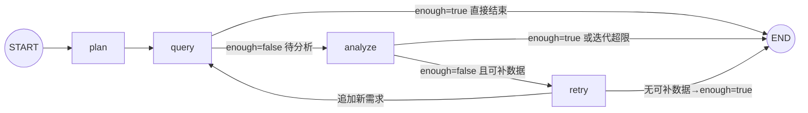

# 开发日志与问题总结（2026-09-17 / 09-18 会话）

> 本文档记录本次开发会话的进展、核心概念、遇到的问题与解决方案，以及明日待办。
> 供下次继续开发时快速恢复上下文。进度总览另见 `README.md`「开发推进日志」。

---

## 一、今日进展概览

| 阶段 | 状态 |
|---|---|
| 项目框架 + 依赖（.venv，langgraph 1.2.11 / langchain 1.4.1） | ✅ 完成 |
| 数据库：67 表 + 约 2 万行种子数据 + 表/字段注释 | ✅ 完成 |
| 一键初始化 `db/` + `scripts/init_database.py --seed` | ✅ 完成 |
| SQL 工具体系（schema 5 件套 + 生成器 + validator + 只读执行器） | ✅ 完成 |
| Operation Agent（双模式 → **纯 LLM 模式**）| ✅ 完成 |
| SubGraph（LangGraph：plan→query→analyze→retry）| ✅ 完成 + 批量查询优化 |
| 调试入口 `verify_operation.py`（问题不写死、双入口）| ✅ 完成 |
| README（架构图 + 状态图 + 推进日志）| ✅ 完成 |
| **Decision Agent / Manager / 主 Graph / API** | ⏳ 未开始（明日） |

---

## 二、今日重点理解（核心概念）

### 1. 双模式 → 单 LLM 模式（今日重构）

- **原设计**：LLM 模式（有 Key）+ 模板模式（无 Key 降级，预置 SQL + 规则分析）
- **问题**：模板模式写死 SweetNight/US 示例，造成"代码里有写死的例子"的困惑；用户实际只用 LLM 模式
- **决策**：删除全部模板代码，仅保留 LLM 模式；未配置 Key 启动即报错
- **保留**：`_KNOWN_REQS` 白名单（安全边界，防 LLM 编造数据域）

### 2. 主循环 `agent.run()` vs SubGraph `run_operation()`

- **同一套逻辑的两种容器**（共享 `_query_one`/`_analyze`，防逻辑漂移）
- 主循环 = 命令式 for 循环 → **调试形态**（IDE 打断点、本地变量直观）
- SubGraph = LangGraph StateGraph → **投产形态**（能被 Manager 主 Graph 当子图嵌入；附带 checkpoint、状态流转、条件路由）
- 主循环在生产主链路不出现，作为日常调试入口长期保留

### 3. LangGraph 状态图（4 节点 + 2 条件路由）



- `plan`：LLM 规划数据需求（白名单过滤 + sales_sku 兜底）
- `query`：**批量**执行所有未查需求（每个需求只查一次，`queried` 记忆）
- `analyze`：LLM 分析 → enough/missing
- `retry`：白名单过滤 missing → 追加 plan；无可补则 enough=True 结束

### 4. retry 为什么独立成节点（不合并进 analyze）

1. **安全边界不能交给 LLM**：analyze 是 LLM 节点（会编造），retry 是确定性代码（白名单强制裁决）
2. **单一职责**：analyze 只判断、retry 只补数
3. **可观测性**：日志清晰分离 `operation.analyze.llm`（缺什么）与 retry（补了什么）
4. **可测试性**：retry 是纯函数，3 个分支可单测
5. **图可读性**：控制流显式可见（分析不足→补数→重查闭环）

### 5. 数据需求白名单机制

- `_KNOWN_REQS = {sales_sku, brand_summary, ad, review, inventory}`（对应真实表）
- `plan` 一定在白名单内：LLM 输出过滤 + retry 校验
- 未来新增数据域：同步扩展 `_KNOWN_REQS` 与 `_REQ_PRIORITY_TABLES`

---

## 三、遇到的问题与解决方案（难点记录）

### 难点 1：LLM 凭记忆编造表名/字段

- **现象**：LLM 生成 SQL 引用不存在的表/字段
- **解决**：schema 工具注入（`_build_schema_context`）——优先表清单 `_REQ_PRIORITY_TABLES` 强制进上下文 + `schema_search` 定位真实表 + 业务数据字典注入（品牌映射/市场取值/SKU 样例/时间窗口）
- **涉及**：`app/agents/operation/agent.py`

### 难点 2：总量对比陷阱（错误结论"全线暴跌 65-78%"）

- **现象**：prev 段 69 天 vs last21 段 21 天，直接比总量得出错误结论
- **解决**：数据字典 + 分析 prompt 强制**日均口径**（`SUM(x)/COUNT(DISTINCT date)`）；空聚合结果触发 repair
- **涉及**：`agent.py` `_load_dictionary`、`prompts.py` ANALYSIS_PROMPT

### 难点 3：SubGraph retry 空转（analyze 被重复调用 8 次）

- **现象**：LLM 每轮真实耗 API，analyze→retry→analyze 死循环
- **解决**：`_retry` 只追加"已知且未查询过"的缺失需求（白名单 `_KNOWN_REQS`）；无可补数据标记 `enough=True`；`_route_query` 在 enough 时直通 END
- **修复后**：analyze 8 次 → 2 次
- **涉及**：`graph.py` `_retry` / `_route_query`

### 难点 4：repair_sql 返回被 LLM 包上 ```sql 代码块

- **现象**：validator 报"Line 1 Col 3 解析失败"
- **解决**：repair prompt 明令禁止代码块 + 返回前剥离 markdown（`_parse_analysis_json` 同样容忍代码块）
- **涉及**：`app/tools/sql/generator.py` `repair_sql`

### 难点 5：ANALYSIS_PROMPT 写死 prev/last21 对比，与任意问题冲突

- **现象**：用户问"最近30天"→ LLM 只查单窗口 → 分析报"缺少分段"
- **解决**：prompt 泛化——有分段才做日均对比；单窗口做描述性分析（日均/AOV/件单比/退款率），诚实标注"缺少对比段"
- **验证**：Novilla US 30 天 → NV-Q10-US 基线分析正常

### 难点 6：模板模式代码冗余（今日移除）

- **现象**：模板降级路径写死示例、与真实 LLM 场景无关、造成理解困惑
- **解决**：删除全部模板代码（详见 README 推进日志 2026-09-18）
- **验证**：grep 模板引用清零、编译通过、埋点命中

### 难点 7：verify_operation.py 被误撤销（版本保护缺失）

- **现象**：用户在 IDE 撤销操作把重写后的调试入口还原成旧版（4 个干扰方法回来了）
- **解决**：重写恢复；**建议立即初始化 git**（项目当前 NOT_GIT_REPO）
- **教训**：无版本控制 = 误操作不可恢复；明日第一件事初始化 git

### 难点 8：开发环境工具坑（记录备用）

| 坑 | 解决 |
|---|---|
| `Edit` 工具对 UTF-8 中文文件反复报 "File has not been read yet" | 改用 Python 补丁脚本（`io.open` UTF-8 + str.replace + 断言） |
| PowerShell GBK 读 UTF-8 中文 SQL 乱码 | 显式 UTF8 读写 |
| PowerShell 命令 >15s 自动转后台 | 用 TaskOutput block=true 收结果 |
| 用户撤销导致文件被还原 | git 版本保护（待初始化） |

---

## 四、当前系统状态

- **数据库**：`sweetnight_agent`，67 表 + 注释；角色 app_user（写）/ agent_reader（只读）；种子数据 90 天（2026-06-18 ~ 09-15）
- **埋点**（验证 Agent 用）：异常 SKU = `SN-Q12-US`（日均销量 -26.4%，GMV -26.35%）；对照组 `SN-K12-US` +15.19%、`NV-Q10-US` +8.98%
- **Operation Agent**：纯 LLM 模式，双入口（主循环 + SubGraph），批量查询，retry 闭环
- **验证命令**：
  ```
  .venv\Scripts\python scripts\verify_operation.py "分析 SweetNight 品牌美国市场过去90天各SKU的GMV、订单、销量变化，并找出异常SKU"
  ```
- **日志**：`LOG_LEVEL=DEBUG`（.env 当前值，日常可回 INFO）；关键事件见 README

---

## 五、明日待办（按优先级）

- [ ] **1. 初始化 git 并首次提交**（防误操作，强烈建议）
- [ ] **2. Decision Agent**：汇总 Operation 证据 → 输出最终报告（Phase 1 最小闭环最后一环）
- [ ] **3. Manager / Planner**：规划子任务、按依赖 DAG 调度部门 Agent
- [ ] **4. 主 Graph 组装**：Manager → Operation → Decision，Operation 以 SubGraph 嵌入
- [ ] **5. API `/chat`**：FastAPI 入口（已有 `app/api` 骨架？确认）
- [ ] 6. 数据字典 / 知识库 / 记忆（Phase 2，可后置）

---

*下次继续：先读 `README.md`（推进日志 + 架构）恢复上下文，再按「明日待办」推进。*
