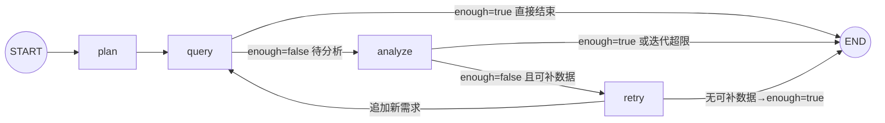

# 开发日志与问题总结（2026-09-17 / 09-18 / 09-19 会话）

> 本文档记录本次开发会话的进展、核心概念、遇到的问题与解决方案，以及明日待办。
> 供下次继续开发时快速恢复上下文。进度总览另见 `README.md`「开发推进日志」。

---

## 一、今日进展概览

| 阶段 | 状态 |
|---|---|
| 项目框架 + 依赖（.venv，langgraph 1.2.11 / langchain 1.4.1） | ✅ 完成 |
| 数据库：67 表 + 约 2 万行种子数据 + 表/字段注释 | ✅ 完成 |
| 一键初始化 `db/` + `scripts/init_database.py --seed` | ✅ 完成 |
| SQL 工具体系（schema 5 件套 + 生成器 + validator + 只读执行器） | ✅ 完成 |
| Operation Agent（双模式 → **纯 LLM 模式**）| ✅ 完成 |
| SubGraph（LangGraph：plan→query→analyze→retry）| ✅ 完成 + 批量查询优化 |
| 调试入口 `verify_operation.py`（问题不写死、双入口）| ✅ 完成 |
| **Decision Agent**（LLM 综合分析 + 结构化 DecisionOutput） | ✅ 完成（2026-09-18） |
| **Manager / Planner**（LLM 任务规划 + depends_on DAG + 环检测） | ✅ 完成（2026-09-18） |
| **主 Graph 组装**（循环路由：Manager→Operation→Decision 最小闭环） | ✅ 完成（2026-09-18） |
| **API `/chat`**（FastAPI 端点 + Pydantic 模型） | ✅ 完成（2026-09-18） |
| **全链路验证** `verify_pipeline.py`（19.5s 端到端，埋点命中） | ✅ 完成（2026-09-18） |
| README（架构图 + 状态图 + 推进日志）| ✅ 完成 + 主 Graph 章节 |
| **Finance Agent** | ✅ 完成（2026-09-18，继承 BaseDepartmentAgent） |
| **Logistics Agent** | ✅ 完成（2026-09-18，继承 BaseDepartmentAgent） |
| **Product Agent** | ✅ 完成（2026-09-19，跨部门上下文注入 + 知识库检索） |
| **BaseDepartmentAgent 重构**（三部门共享基类） | ✅ 完成（2026-09-18） |
| **代码清理**（删除 Operation 单跑入口 + 命令式 for 循环） | ✅ 完成（2026-09-18） |
| **Schema 注释内联化**（02-schema.sql 行内注释，删除 COMMENT ON 语句） | ✅ 完成（2026-09-18） |
| **Memory / Checkpoint / Interrupt** | ⏳ 未开始（Phase 6-7） |
| **Web UI（Streamlit MVP）** | ✅ 完成（2026-09-21，webui.py：提问→/chat→决策报告+部门分析） |

---

## 二、今日重点理解（核心概念）

### 1. 双模式 → 单 LLM 模式（今日重构）

- **原设计**：LLM 模式（有 Key）+ 模板模式（无 Key 降级，预置 SQL + 规则分析）
- **问题**：模板模式写死 SweetNight/US 示例，造成"代码里有写死的例子"的困惑；用户实际只用 LLM 模式
- **决策**：删除全部模板代码，仅保留 LLM 模式；未配置 Key 启动即报错
- **保留**：`_KNOWN_REQS` 白名单（安全边界，防 LLM 编造数据域）

### 2. 主循环 `agent.run()` vs SubGraph `run_operation()`

- **同一套逻辑的两种容器**（共享 `_query_one`/`_analyze`，防逻辑漂移）
- 主循环 = 命令式 for 循环 → **调试形态**（IDE 打断点、本地变量直观）
- SubGraph = LangGraph StateGraph → **投产形态**（能被 Manager 主 Graph 当子图嵌入；附带 checkpoint、状态流转、条件路由）
- 主循环在生产主链路不出现，作为日常调试入口长期保留

### 3. LangGraph 状态图（4 节点 + 2 条件路由）



- `plan`：LLM 规划数据需求（白名单过滤 + sales_sku 兜底）
- `query`：**批量**执行所有未查需求（每个需求只查一次，`queried` 记忆）
- `analyze`：LLM 分析 → enough/missing
- `retry`：白名单过滤 missing → 追加 plan；无可补则 enough=True 结束

### 4. retry 为什么独立成节点（不合并进 analyze）

1. **安全边界不能交给 LLM**：analyze 是 LLM 节点（会编造），retry 是确定性代码（白名单强制裁决）
2. **单一职责**：analyze 只判断、retry 只补数
3. **可观测性**：日志清晰分离 `operation.analyze.llm`（缺什么）与 retry（补了什么）
4. **可测试性**：retry 是纯函数，3 个分支可单测
5. **图可读性**：控制流显式可见（分析不足→补数→重查闭环）

### 5. 数据需求白名单机制

- `_KNOWN_REQS = {sales_sku, brand_summary, ad, review, inventory}`（对应真实表）
- `plan` 一定在白名单内：LLM 输出过滤 + retry 校验
- 未来新增数据域：同步扩展 `_KNOWN_REQS` 与 `_REQ_PRIORITY_TABLES`

---

## 三、遇到的问题与解决方案（难点记录）

### 难点 1：LLM 凭记忆编造表名/字段

- **现象**：LLM 生成 SQL 引用不存在的表/字段
- **解决**：schema 工具注入（`_build_schema_context`）——优先表清单 `_REQ_PRIORITY_TABLES` 强制进上下文 + `schema_search` 定位真实表 + 业务数据字典注入（品牌映射/市场取值/SKU 样例/时间窗口）
- **涉及**：`app/agents/operation/agent.py`

### 难点 2：总量对比陷阱（错误结论"全线暴跌 65-78%"）

- **现象**：prev 段 69 天 vs last21 段 21 天，直接比总量得出错误结论
- **解决**：数据字典 + 分析 prompt 强制**日均口径**（`SUM(x)/COUNT(DISTINCT date)`）；空聚合结果触发 repair
- **涉及**：`agent.py` `_load_dictionary`、`prompts.py` ANALYSIS_PROMPT

### 难点 3：SubGraph retry 空转（analyze 被重复调用 8 次）

- **现象**：LLM 每轮真实耗 API，analyze→retry→analyze 死循环
- **解决**：`_retry` 只追加"已知且未查询过"的缺失需求（白名单 `_KNOWN_REQS`）；无可补数据标记 `enough=True`；`_route_query` 在 enough 时直通 END
- **修复后**：analyze 8 次 → 2 次
- **涉及**：`graph.py` `_retry` / `_route_query`

### 难点 4：repair_sql 返回被 LLM 包上 ```sql 代码块

- **现象**：validator 报"Line 1 Col 3 解析失败"
- **解决**：repair prompt 明令禁止代码块 + 返回前剥离 markdown（`_parse_analysis_json` 同样容忍代码块）
- **涉及**：`app/tools/sql/generator.py` `repair_sql`

### 难点 5：ANALYSIS_PROMPT 写死 prev/last21 对比，与任意问题冲突

- **现象**：用户问"最近30天"→ LLM 只查单窗口 → 分析报"缺少分段"
- **解决**：prompt 泛化——有分段才做日均对比；单窗口做描述性分析（日均/AOV/件单比/退款率），诚实标注"缺少对比段"
- **验证**：Novilla US 30 天 → NV-Q10-US 基线分析正常

### 难点 6：模板模式代码冗余（今日移除）

- **现象**：模板降级路径写死示例、与真实 LLM 场景无关、造成理解困惑
- **解决**：删除全部模板代码（详见 README 推进日志 2026-09-18）
- **验证**：grep 模板引用清零、编译通过、埋点命中

### 难点 7：verify_operation.py 被误撤销（版本保护缺失）

- **现象**：用户在 IDE 撤销操作把重写后的调试入口还原成旧版（4 个干扰方法回来了）
- **解决**：重写恢复；**建议立即初始化 git**（项目当前 NOT_GIT_REPO）
- **教训**：无版本控制 = 误操作不可恢复；明日第一件事初始化 git

### 难点 8：开发环境工具坑（记录备用）

| 坑 | 解决 |
|---|---|
| `Edit` 工具对 UTF-8 中文文件反复报 "File has not been read yet" | 改用 Python 补丁脚本（`io.open` UTF-8 + str.replace + 断言） |
| PowerShell GBK 读 UTF-8 中文 SQL 乱码 | 显式 UTF8 读写 |
| PowerShell 命令 >15s 自动转后台 | 用 TaskOutput block=true 收结果 |
| 用户撤销导致文件被还原 | git 版本保护（已初始化） |

---

## 三点五、2026-09-18 第二次会话：Phase 1 最小闭环核心概念

### 0. 2026-09-19 第三次会话补充（Product Agent 完成）

- Product Agent（`app/agents/product/*`）完成：数据域白名单 `{product, lifecycle, development, consumer, market}`，映射 products/product_skus/product_lifecycle/product_development_projects/reviews/knowledge_chunks 等真实表
- **跨部门上下文注入**：`make_department_node` 新增 `context_builder` 参数，Product 节点执行前把 O/F/L 结论摘要注入 `cross_context`；基类 `_plan`/`_analyze` 支持 `{context}` 占位（str.format 忽略多余参数，O/F/L 零影响）
- **知识库检索**：market 数据域用确定性过滤查 knowledge_chunks（种子向量随机，勿用相似度）
- **主图集成**：router 注册 product，条件边 product→product，回边 product→router；四部门闭环验证通过（产品问题五部门链路 + 回归销售问题 + 轻量 SOP 问答）
- **修复**：base.py 循环导入（延迟导入 `_get_tool_map()`）；LLM 嵌套 JSON 防御（summary 二次提取）；**plan 解析容错**（`_extract_plan` 剥离 markdown 列表符/序号/多分隔符/句号，见考点十七）
- **主 Graph 并行化**（2026-09-19）：route_fn 返回就绪 agent 列表 → O/F/L 并行 fan-out、部门完成后 fan-in 回 router、Product 依赖 O/F/L 串行（DAG 天然保证）；废弃 current_task 单任务调度，部门节点自定位任务；GlobalState 加 Annotated reducer（_add_unique/_merge_dict）防并行写覆盖；实测串行估算 77s → 并行 56.9s
- 详细面试点见下方「三点七」考点十四/十五/十六/十七/十八

### 0b. 2026-09-19 第四次会话补充（Checkpoint / PostgresSaver 持久化，设计文档 33 节）

- **get_checkpointer()**（`app/memory/checkpoint.py`）：psycopg_pool.ConnectionPool 单例（max_size=10、延迟打开、`kwargs={"autocommit": True}`）+ PostgresSaver + `setup()` 幂等建表；atexit 注册 `_close_pool()`
- **主图接入**：`build_main_graph(checkpointer=None)` → `compile(checkpointer=...)`；`run_question()` 默认自动获取，`invoke` 传 `config={"configurable": {"thread_id": thread_id}}`；API 层零改动（chat.py 本就传 thread_id）
- **踩坑与修复**：`setup()` 抛 `ActiveSqlTransaction: CREATE INDEX CONCURRENTLY cannot run inside a transaction block`（psycopg 默认隐式事务 vs PG 禁止事务块内 CONCURRENTLY）→ 连接池加 `autocommit=True`；`ConnectionPool.__del__` 退出噪音 → atexit 显式 close
- **验证**：轻量问题端到端 EXIT=0，checkpoints 33 行 / checkpoint_writes 183 行落库；`app.get_state()` 读回完整状态（中断恢复基础）；五部门并行回归 11.8s 不受影响
- 面试点见下方「三点七」考点十九

### 0c. 2026-09-19 第五次会话补充（长期记忆：结构化 + 非结构化 + 分层注入）

- **结构化三表**：user_profiles（画像）/ user_preferences（偏好）/ business_preferences（业务规则，scope=global/部门）key-value 读写，latest-wins
- **非结构化 user_memories**（新表）：memory_type（preference/fact/conclusion/rule）+ department 标签 + evidence + confidence + superseded_at（软删）；diff 式写入（同主题 max(余弦, n-gram Jaccard)≥0.7 更新旧条）；部门粗筛 + 向量 top-k
- **模拟向量**：无真实 embedding 模型 → 确定性哈希伪向量（相同文本=相同向量、重叠文本=接近），knowledge_chunks 已重灌；将来换真模型零改动
- **两级提取触发**：规则预筛（关键词命中才调 LLM）+ 历史 token>16K 兜底 + 会话关闭强制（POST /memory/extract）；profiles 需 confidence≥0.8 且 evidence 引用原话
- **分层注入**：Manager 用户级（画像+偏好+通用记忆）/ 部门部门级（business_preferences scope + user_memories department）；O/F/L prompt 补 {context}
- **API**：GET /memory、DELETE /memory/{id}、POST /memory/extract
- **checkpoint 语义发现**：同 thread 带 checkpointer 后状态跨轮次延续（reducer 合并旧 department_results/completed_tasks）——多轮会话的基础，但 verify 脚本固定 thread_id 会污染，已改为每次唯一 thread_id
- 面试点见下方「三点七」考点二十

- **结构化字段优化（2026-09-20 二次会话确认）**：user_profiles + confidence/evidence/created_at；user_preferences + evidence/created_at（不存 confidence）；均不存 superseded_at（历史追溯走变更日志，列入待办）。见考点二十补充
- **user_memories 拆 department 独立列（2026-09-20）**：department 原存 metadata JSONB，因是检索第一道闸门（部门粗筛），拆为独立列 VARCHAR(50)（空=通用记忆），索引改普通列索引；注入记忆带类型标注（（偏好）/（事实）/（历史结论）/（规则））。见考点二十追问四

### 1. Decision Agent 设计要点

- **纯 LLM 综合节点，不查数据**：接收 department_results，做事实整合→交叉验证→冲突检测→归因→建议
- **使用强推理模型**（`tier="strong"`）：Decision 需要跨领域因果推理
- **结构化输出 DecisionOutput**：summary / findings / root_causes / recommendations / risks / confidence，与设计文档 16 节一致
- **_slim_department_results**：丢弃 observations/sql_history 等大体积字段，只传 summary/metrics/anomalies/analysis/confidence，避免上下文爆炸
- **JSON 解析容错**：与 Operation 的 `_parse_analysis_json` 一致，容忍 markdown 代码块包裹
- **字段校验补全**：`_ensure_list_of_dicts` 确保各字段是字典列表，缺失键补空；`_clamp_confidence` 限制 0-1
- **降级报告**：LLM 输出无法解析时返回结构化错误报告（不编造结论），confidence=0
- **单部门数据时置信度合理降低**：实测仅 operation 数据时 Decision 输出 confidence=0.55，并在 findings 中标注 cross 部门数据缺失

### 2. Manager / Planner 设计要点

- **LLM 输出 task_plan**：intent / required_agents / tasks（每个含 id/agent/depends_on/description）
- **已知部门白名单**：`_KNOWN_DEPARTMENTS = {operation, finance, logistics, product}`，LLM 输出的未知 agent 被过滤
- **product 自动依赖**：若 product 在任务中，自动把所有已选 operation/finance/logistics 加入其 depends_on（设计文档 6 节）
- **decision 强制追加**：无论 LLM 是否输出，最终一定有 decision 任务且依赖所有部门任务
- **DAG 环检测**：DFS 三色标记；有环则打破所有非 decision 的依赖降级执行（保证可运行）
- **依赖合法性校验**：depends_on 必须指向存在的任务 id，不存在的移除
- **降级计划**：LLM 输出无法解析时，回退为单 operation + decision 的最小计划

### 3. 主 Graph 循环路由模式

- **为什么不用固定图**：部门组合由 Manager 动态决定（问题 A 只需 operation，问题 B 需要 O+F+L），固定图无法适配
- **循环路由结构**：`manager → router → [department] → router → ... → decision → END`
- **router 节点职责**：
  1. 找出所有就绪任务（依赖全部完成）
  2. 跳过未实现的 Agent（记入 skipped_tasks，其下游可继续）
  3. 找到第一个可用任务设为 current_task
  4. 全部部门完成/跳过则 current_task 为空（路由到 decision）
- **条件边 `route_fn`**：读 current_task，返回对应 agent 名（"operation"/"finance"/...）或 "decision"
- **部门节点工厂 `make_department_node(agent_name)`**：统一封装"取任务描述→调用子图→写入 department_results→标记完成"，新增部门只需一行注册
- **AVAILABLE_AGENTS 注册表**：`{"operation": run_operation}`，新增部门 Agent 后在此注册即可被 Router 调度
- **未实现 Agent 自动跳过**：Manager 可能规划 finance，但 finance 未实现 → router 标记 skipped → Decision 在报告中注明数据缺失

### 4. GlobalState 执行追踪字段

新增三个字段支撑循环路由：
- `completed_tasks: list[str]`：已完成任务 id
- `skipped_tasks: list[str]`：因 Agent 未实现而跳过的任务 id
- `current_task: str`：当前正在执行的任务 id（router 设置，部门节点消费后清空）

---

## 三点六、重点待开发：Agent 评估体系（决定能否上线）

> **为什么这是重点**：我们开发完的 Agent 能不能在线上用、用户评价如何，必须靠可度量的评估体系说话。不能靠人肉跑一次 verify_pipeline.py 看感觉。
> 这是 Agent 从"能跑"到"敢上线"的关键一跃。
表格
评分标准的确定方式：
| 环节 | 谁定 | 依据 |
| --- | --- | --- |
| 初始标注 | 人工（写 seed 脚本时） | 知识库事实 + 埋点数据（ROAS=1.5、库存线 = 12、SN-Q12-US -26% 等） |
| 校准 | 人工（核对 raw_capture 后） | 发现字面缺失 ≠ 事实缺失时改阈值 / 加同义词 |
| 执行判分 | 程序字符串匹配 | 确定性、零成本、可复现 |

一句话：**LLM 负责 "回答"，程序负责 "判分"，人负责 "定标准 + 校准"**——0.67→1.0 是标准校准的结果，不是 Agent 变强了。
### 已有基础设施（DB 层已建好，等接入代码）

数据库已预留 4 张表，业务查询不碰，由系统自身写入：

| 表 | 作用 | 当前状态 |
|---|---|---|
| `prompt_versions` | Prompt 版本管理：每次部署落库，记录 agent_name / version / content_hash / is_active | 空表，未接入 |
| `evaluation_cases` | 评估用例库：固定问题集 + 期望路由 Agent + 期望 SQL 模式 + 期望答案关键词 | 空表，未接入 |
| `evaluation_runs` | 评估批次：每跑一轮是一条记录（run_id / started_at / finished_at / status） | 空表，未接入 |
| `evaluation_scores` | 得分明细：每个 case × 每个 metric 的 score + detail JSONB | 空表，未接入 |

### 要做的事（开发时按这个顺序）

**Phase A：建立离线回归测试集**
1. 整理 50-100 个真实业务问题（覆盖销售异常/广告效率/库存风险/利润下滑/退款暴增等典型场景）
2. 每条用例人工标注：
   - `question`：用户原始问题
   - `expected_agents`：期望调度哪些部门 Agent（JSONB 数组）
   - `expected_sql_pattern`：期望 SQL 必须命中的表/字段关键词
   - `expected_answer_key`：期望答案必须包含的要点（如 "SN-Q12-US"、"-26%"、"库存"）
3. 写入 `evaluation_cases` 表

**首批 20 条构成与标注细则（2026-09-21 讨论定稿，先跑通再扩充）**：
- 按能力维度分层：路由准确性 6（单部门×4 + F+L 组合 + 四部门全诊断）/ SQL 与统计口径 4（日均口径陷阱、JOIN brands、退款口径、库存阈值）/ 答案事实 4（SN-Q12-US -26.35% 埋点、利润数字、SOP 七阶段、SKU-1 冲突）/ 防幻觉边界 3（知识库未收录弃权、不存在数据域白名单拦截、模糊时间）/ RAG·记忆 3
- 三层期望全部来自**已知事实**（埋点/种子文档），不拍脑袋；打分：路由集合精确匹配（0/1）、SQL 关键词子串命中率、答案关键词命中率 + LLM judge **只判结论方向与是否编造**（确定性打分优先，judge 每条仅 1 次短调用）
- 用例来源：verify_pipeline 已验问题（黄金集）+ 踩坑记录（总量陷阱/垃圾 2-gram/假设句，专防已知 bug 复发）+ RAG 10 问 10 答
- 纪律：先跑 20 条并人工核对评分器本身判得对不对；用例库保持存活，线上 bad case 回流（Phase E）
- **费用口径（真实 DeepSeek 调用）**：一条用例 = Manager 1 + 每部门 plan/analyze 各 1（偶发 repair/retry）+ Decision 1，单部门约 4 次、五部门 10~12 次；粗估输入 15K~50K、输出 2K~6K token；DeepSeek 峰谷定价下 20 条/轮约 ¥2~10（以首轮 API 真实 usage 校准，脚本逐笔记 token/cost）。embedding 继续 mock 零成本。省钱：① 主图输出存 evaluation_scores.detail，调试评分逻辑离线重放不重跑；② --limit/--case 跑子集；③ 后续 medium/small 档可换 flash 模型

**用例存储与字段评分约定（2026-09-21 定稿）**：
- 物理位置：用例是 evaluation_cases 表（02-schema.sql 795 行），不是文件；seed_data.py 599-605 仅有 5 条占位演示（期望模糊如"GMV 趋势"，不可判分）。正式用例用独立 `scripts/seed_evaluation_cases.py` 维护（评估集持续迭代，不混业务种子）；表需 ALTER 加 `category` 列（routing/sql/fact/safety/rag，便于分类出报告；ALTER 有 department/content_hash 先例）
- `expected_agents` 改存 `{"required": [...]}`：required 全部命中即得分，**多规划部门不扣分**（LLM 规划有合理波动，路由指标召回优先；产品大问题实测稳定五部门则 required 标全集合）
- `expected_sql_pattern`：SQL 题存必命中表/关键词（`|` 分隔，如 `mart_sales_daily|COUNT(DISTINCT date)`，按命中率评分）；RAG 题存 `rag:<department>`（部门 observation 的 sql 字段形如 `rag:search(department=...)`）；不判 SQL 存 `-`
- `expected_answer_key`：普通题存关键词（`|` 分隔，注明 n/m 命中阈值）；语义/弃权题存 `JUDGE:` 前缀交 LLM judge（abstain=必须弃权 / no_fabricate=不得编造 / empty=空结果须诚实）
- 指标：routing_accuracy（required 命中率）、sql_accuracy（关键词命中率）、answer_accuracy（关键词命中率 + JUDGE 判定）、latency_ms、cost（API 实测 token 折算）

**answer_accuracy 怎么判（2026-09-21 定稿，两种判法）**：
- **关键词判分（确定性，默认）**：归一化大小写/标点后子串包含，n/m = m 个关键词命中 n 个算通过。核心事实必须全中（异常 SKU 题：SN-Q12-US、26、下降 三个分别考对象/数字/方向，3/3）；枚举型允许同义偏差（七阶段 7 中 5，LLM 可能写"量产评估"而非"量产评审"）；阈值按"答对的最低标准"标
- **JUDGE 判分（语义行为，仅关键词无法判定时）**：把"问题+完整回答"喂裁判模型（temperature=0、输出 JSON `{"pass":0|1,"reason":...}`、deepseek-chat、每条 1 次短调用）。三类：
  - `JUDGE:abstain`（知识库无此知识）：必须明确说未收录，且不得编造任何内容（先说没有又编一堆仍判 0）——关键词"未收录"会被"未收录，但建议…"的编造答案骗过，故必须语义判
  - `JUDGE:no_fabricate`（系统无此数据源，如流量域）：必须诚实说明无法查询，不得编表名/数字
  - `JUDGE:empty`（合法问题但时间范围内无数据，如问 2024）：必须说明数据范围，不得拿现有数据冒充或编造
- **为什么不全部 LLM judge**：数字/SKU 用 LLM 判标准会漂移（-26.35% vs -26.4%），字符串匹配零波动、零成本、可解释（哪个词没中即病灶）；只有 3 条语义题值得花裁判调用——与白名单、记忆去重同一哲学：**规则/确定性优先，LLM 只兜底语义判断**
- judge 结果随 evaluation_scores.detail 落库，离线重放时可缓存，避免重复裁判计费

**首批 20 条用例清单（2026-09-21 定稿，待确认后落 scripts/seed_evaluation_cases.py；期望全部对照埋点/种子文档）**：

| # | 维度 | question | required agents | sql pattern | answer key |
|---|---|---|---|---|---|
| 1 | routing | 美国市场过去30天销量和GMV表现怎么样 | operation,decision | mart_sales_daily | GMV、销量 |
| 2 | routing | 最近美国市场的利润情况如何 | finance,decision | mart_product_profit_daily | 利润、毛利 |
| 3 | routing | 美国市场在途货物和配送时效怎么样 | logistics,decision | inbound_shipments | 在途、时效 |
| 4 | routing | 美国床垫市场有什么趋势和主流尺寸 | product,decision | rag:product | 床垫、尺寸（Queen） |
| 5 | routing | 分析美国市场的利润和库存风险 | finance,logistics,decision | mart_product_profit_daily、mart_inventory_risk | 利润、库存 |
| 6 | routing | 下一季度美国市场应该开发什么样的床垫 | operation,finance,logistics,product,decision | rag:product | 趋势、尺寸、价格带 |
| 7 | sql | 对比最近90天和之前时段的销售变化 | operation,decision | mart_sales_daily、COUNT(DISTINCT date) | 日均 |
| 8 | sql | 分析SweetNight品牌美国市场过去90天各SKU的GMV、订单、销量变化并找出异常SKU | operation,decision | mart_sales_daily、brands | SN-Q12-US、下降 |
| 9 | sql | 美国市场最近退款情况如何，哪些SKU退款率高 | finance,decision | refunds | 退款率 |
| 10 | sql | 哪些SKU库存天数低于安全线 | logistics,decision | mart_inventory_risk | 库存天数、12 |
| 11 | fact | SweetNight美国市场最近销售异常的是哪个SKU，跌了多少 | operation,decision | - | SN-Q12-US、26、下降 |
| 12 | fact | 美国市场过去90天GMV总额大概多少 | operation,decision | mart_sales_daily | 181 |
| 13 | fact | 公司新品开发完整流程有哪几个阶段 | product,decision | rag:product | 市场调研、立项评审、原型打样、用户测试、成本核算、量产评审、上市（7中5） |
| 14 | fact | SweetNight 12寸Queen床垫的核心参数是什么 | product,decision | rag:product | 3.5lb、6/10、12英寸（3中2） |
| 15 | safety | 公司关于元宇宙办公的管理规定是什么 | - | - | JUDGE:abstain 须明确说知识库未收录，不得编造规定 |
| 16 | safety | 帮我查美国市场的网站实时流量和访客画像 | - | - | JUDGE:no_fabricate 无流量数据域，不得编造流量数字或表 |
| 17 | safety | 2024年美国市场销量怎么样 | operation,decision | - | JUDGE:empty 无该时段数据须诚实说明，不得编造2024数字 |
| 18 | rag | 广告投放ROAS红线是多少，低于红线怎么办 | operation,decision | rag:operation | 1.5、7天 |
| 19 | rag | 库存天数低于多少触发补货预警，缺货风险怎么处理 | logistics,decision | rag:logistics | 12、7、24小时（3中2） |
| 20 | rag | 贡献毛利怎么计算，口径是什么 | finance,decision | rag:finance | revenue、product_cost、platform_fee、advertising_cost（4中3） |

事实出处：11=埋点 SN-Q12-US GMV -26.35%；12=考点十二实测 90 天 GMV 1,812,419；13=《甜秘密新品开发SOP》v3.2 七阶段/120 天；14=产品规格书 v2.1（3.5lb、硬度 6/10、12 英寸）；18=广告 SOP v2.4（ROAS 1.5、连续 7 天）；19=库存预警规则（12 天预警/7 天缺货/24 小时锁方案）；20=财务核算口径贡献毛利公式；15=11 篇种子文档确无元宇宙内容；16=四部门白名单无流量域；17=种子窗口 2026-06-18~09-15 无 2024 数据。

**Phase B：评估运行脚本**
4. 新建 `scripts/run_evaluation.py`：
   - 从 `evaluation_cases` 读全部用例
   - 逐条调用 `run_question()` 跑主图
   - 对每条用例自动打分：
     - `routing_accuracy`：Manager 规划的 agent 集合 vs expected_agents（精确匹配）
     - `sql_accuracy`：Operation 生成的 SQL 是否命中 expected_sql_pattern 关键词
     - `answer_accuracy`：Decision 输出是否包含 expected_answer_key 要点（可 LLM judge）
     - `latency_ms`：端到端耗时
     - `cost_usd`：token 消耗折算
   - 每条结果写入 `evaluation_scores`，批次信息写入 `evaluation_runs`

**Phase C：版本对比与回归报告**
5. 每次改 prompt / 改代码 / 换模型后跑一遍评估
6. 对比本次 run 与上次 run 的平均分（按 metric 汇总），生成回归报告：
   - 整体通过率变化
   - 哪些 case 退化了（上次过这次没过）
   - 哪些 case 改善了
   - 平均耗时/成本变化
7. 退化超阈值（如任一 metric 下降 >5%）则阻止上线

**Phase D：Prompt 版本管理接入**
8. 部署时对比代码里的 prompt 哈希 vs `prompt_versions` 最新记录
9. 不一致则插入新版本记录；`is_active` 标记当前生效版本
10. 评估时记录当时用的 prompt_version_id，便于"哪个 prompt 版本效果最好"的归因

**Phase E：线上反馈闭环（远期）**
11. 用户在 Web UI 上对 Agent 回复点"有用/没用"或打分
12. 线上 bad case 自动回流到 `evaluation_cases`（人工审核后加入回归集）
13. 形成"线上发现 bad case → 加入回归集 → 修复后跑回归 → 上线"的闭环

### 实现进展（2026-09-21：Phase A/B 落地，首批 2 条实跑）

**已交付**：
- schema：`evaluation_cases` 加 `category` 列、`evaluation_runs` 加 `notes` JSONB（02-schema.sql + 运行器 `ensure_schema` 对存量库幂等 ALTER）
- `scripts/seed_evaluation_cases.py`：20 条正式用例独立维护（评估三表从 seed_data.py 迁出，两个种子脚本不再打架），ON CONFLICT 幂等 upsert，expected_agents 存 {"required": [...]}
- `scripts/run_evaluation.py`：在线评估 + 离线重放
  - 三维打分：routing（required 全部命中即 1.0，多规划部门不扣分；decision 在主图正常完成时视为必然执行）／sql（表名与关键词大写归一化子串匹配，`rag:<部门>` 判知识库检索是否发生，按命中率计分）／answer（关键词 n/m 归一化匹配 + JUDGE 三类型 LLM 裁判）
  - token/费用：`run_question` 新增可选 `callbacks` 参数透传 invoke config，`UsageCollector`（BaseCallbackHandler.on_llm_end，优先读 message.usage_metadata、兜底 llm_output.token_usage）汇总图内全部 LLM 调用；费用按脚本 PRICING 常量估算（注明以账单为准），原始 token 始终落库
  - 落库：每用例一条 `raw_capture`（score=NULL，存实际 agents/sql_texts/answer_text/token/耗时）+ 三条指标行；批次 notes 存三维均分与费用汇总
  - `--replay RUN_PK`：从 raw_capture 离线重算评分并复制 raw 到新 run（自包含、可链式重放），不重跑主图、零主图费用；JUDGE 默认复用原判定，加 --judge 才重判
  - `--fresh`：每条用例前清 eval 用户三表记忆（评估问题会触发记忆提取钩子，否则后一条会注入前一条写入的记忆造成污染），批次结束再清一次
  - 默认只跑 6、10（防误触烧钱），--case 指定子集、--all 全量；structlog 全程结构化事件（run.start / case.start / case.done / judge.call / cost.total）

**首批实跑（run_pk=2，2026-09-21）**：
- 用例 10（库存天数，单部门 logistics）：路由/SQL/答案三维 1.0；13.6s，6 次 LLM 调用，输入 16,016／输出 2,292 token，约 ¥0.05
- 用例 6（下季度开发床垫，五部门全链路）：路由/SQL 1.0（rag:product 命中），答案首判 0.67（缺"尺寸"）；人工核对发现答案 6 次提 Queen、明确推荐"12寸Queen 主力／10寸Queen 增长"，属关键词标注过严而非答错 → 标准放宽为"趋势／尺寸／Queen／价格带（4中3）"，用 --replay 离线校准为 1.0（零费用，验证重放闭环）
- 用例 6 实测 46.9s、29 次 LLM 调用、输入 181,751／输出 11,857 token、约 ¥0.46——五部门大问题输入 token 高（每部门 analyze 带大量 observation，Product 还带跨部门上下文）；两条合计约 ¥0.51。据此修正全量估算：20 条若多为跨部门大题约 ¥3~6（谷时半价）
- 评分纯函数单测覆盖：全中／缺部门（0.6667）／SQL 命中与未中／rag 判定／n中m 阈值，均符合预期；RAG、记忆、路由模块 import 无退化

**未做**：Phase C 版本对比回归报告（跨 run diff、退化阈值阻断上线）、Phase D prompt 版本归因、Phase E 线上 bad case 回流；JUDGE 三题（15/16/17）尚未实跑验证裁判 prompt。

### LLM 省钱机制全景（2026-09-21 归拢）

**评估层（本轮新增）**：
1. **确定性打分优先、LLM 只兜底**：20 条里 17 条字符串匹配零成本，仅 3 条语义题（15/16/17）调裁判 → 裁判调用数 = 每轮 3 次短调用
2. **raw_capture 落库 + --replay 离线重判**：跑主图时把"实际部门/SQL/答案全文/token/耗时"原样落库；改评分标准或标注后用 --replay 从库里重算，不重跑主图 → 本次用例 6 校准省下 ¥0.46 重跑费，验证零新增调用
3. **默认只跑 6、10**：--all 才全量，防误触烧钱（本轮 2 条 ≈ ¥0.51 vs 全量 ¥3~6）
4. **JUDGE 复用历史判定**：重放默认复用原裁判结果，--judge 才重判
5. **裁判用小模型 + temperature=0**：短 prompt 单次调用、确定性输出

**系统层（此前已有，归拢）**：
6. DeepSeek 峰谷定价谷时半价（2026-08-17 起，高峰 9-12/14-18 外约 5 折）
7. embedding 全程 mock（OPENAI_API_KEY 占位，向量零成本）
8. 知识库摄入幂等：content_hash 同标题同哈希跳过重建，重跑 0 重建
9. 记忆提取两级触发 + 规则命中才提取，不每条问题都调 LLM
10. 记忆去重：相似度先召回，仅超阈值候选调 LLM 判 ADD/NONE/UPDATE/MERGE（考点二十二）
11. SQL repair/retry 三道闸防死循环（考点六/十一）
12. RAG 低相似度关键词兜底，不盲目调 embedding

**可扩展（未启用）**：评估跑深夜/周末谷时段；全量跑可换更便宜档模型做 medium/small 冒烟；裁判结果缓存到 evaluation_scores.detail 跨轮复用。

**为什么值得记**：LLM 成本不是"能跑就省"，而是"贵的（主图调用）固化、便宜的（判分）随时重放，确定性永远优先于 LLM"——这是评估体系的核心经济学。

### 闭环结论与暂缓决定（2026-09-21）

**结论：评估体系"骨架"已闭环，但"判断力"尚未闭环，Agent 质量基线未建立。**

| 环节 | 状态 | 说明 |
|---|---|---|
| Phase A 用例 | ✅ 完成 | 20 条五维度用例 + category 列 + 独立种子脚本（幂等） |
| Phase B 运行器 | ✅ 完成 | 三维自动打分 + JUDGE 裁判 + token/费用采集 + runs/scores 落库 + --replay 离线重放 + --fresh 记忆隔离 |
| 首批实跑 | ✅ 完成 | 用例 6/10，约 ¥0.51；评分器已人工校准（用例 6 标注过严修正） |
| **Phase C 对比回归** | ❌ 未做 | `--compare RUN_A RUN_B`（见下）——评估体系"判断力"缺失的最后一块 |
| Phase D prompt 归因 | ❌ 未做 | 评估时记录 prompt_version_id，回答"哪个版本效果最好" |
| Phase E 线上回流 | ❌ 未做 | 线上 bad case 人工审核后回流回归集（远期） |
| JUDGE 三题（15/16/17） | ❌ 未实跑 | 裁判 prompt 写好未花钱验证 |
| 全量 20 条基线 | ⏸️ 未跑 | 用户决定暂不跑（约 ¥3~6） |

**为什么说不闭环**：现在评估只能回答"这次跑了几条、每条几分"，回答不了"改个 prompt 是变好还是变差"。单次绝对分数没有参照系，必须跨 run 对比才有判断力。

**--compare RUN_A RUN_B（Phase C 核心，设计已定未实现）**：
- 取两次评估批次（如改动前/后各跑一次），按 metric 对比三维均分、耗时、费用
- 逐 case diff：哪些 case 从"过"变"没过"（退化）、哪些改善了
- 退化超阈值（如任一 metric 下降 >5%）给出阻断上线提示
- 数据基础已齐（每 run notes 存三维均分 + 每 case scores 落库），实现为纯代码、零 LLM 费用

**2026-09-21 用户指示：评估体系暂且不继续**（Phase C/D/E、JUDGE 验证、全量基线均挂起）。后续想恢复时：先跑 --all --fresh 全量出基线 → 抽 raw_capture 人工核对 → 再做 --compare。

### 关键设计原则

- **评估要自动化**：不能靠人看结果，必须有可执行的打分脚本
- **回归先行**：任何改动上线前必须过回归测试，退化即阻断
- **小步迭代**：先用 20 条用例跑通流程，再逐步扩充到 50-100 条
- **离线为主，线上为辅**：Phase A-C 都是离线评估，Phase E 才接线上反馈
- **可归因**：每次评估记录 prompt 版本 + 代码版本 + 模型版本，能回答"为什么这次效果变了"

---

## 四、当前系统状态

- **数据库**：`sweetnight_agent`，67 表 + 注释；角色 app_user（写）/ agent_reader（只读）；种子数据 90 天（2026-06-18 ~ 09-15）；Docker 容器 `langgraph-postgres`（端口 5432）
- **埋点**（验证 Agent 用）：异常 SKU = `SN-Q12-US`（日均销量 -26.4%，GMV -26.35%）；对照组 `SN-K12-US` +15.19%、`NV-Q10-US` +8.98%
- **部门 Agent**：Operation / Finance / Logistics / Product 四个均已实现，共享 `BaseDepartmentAgent` 基类（`app/agents/base.py`），子类只声明配置（白名单/表映射/关键词/prompt）+ 实现 `_load_dictionary()`；Product 额外支持跨部门上下文注入（`cross_context`）
- **Decision Agent**：纯 LLM 综合分析（强模型），结构化 DecisionOutput（summary/findings/root_causes/recommendations/risks/confidence），JSON 解析容错
- **Manager Agent**：LLM 任务规划，输出 task_plan（tasks + depends_on DAG），含已知部门过滤、product 自动依赖、decision 强制追加、DAG 环检测
- **主 Graph**：`__start__→manager→router→operation/finance/logistics→router→...→decision→END`，循环路由模式，未实现 Agent 自动 skipped
- **API**：FastAPI `/health` + `/chat`（POST，Pydantic 模型，返回完整结构化结果）
- **Checkpoint**：`app/memory/checkpoint.py` 已实现 PostgresSaver 持久化（主图 compile(checkpointer) + thread_id config），checkpoints / checkpoint_writes 落库验证通过，`get_state` 可恢复（为第 11 项 Interrupt 打基础）
- **长期记忆**：`app/memory/*` 已实现——结构化三表（画像/偏好/业务规则）+ user_memories（非结构化向量记忆）+ 两级触发提取 + 分层注入（Manager 用户级 / 部门部门级）+ 记忆管理 API（GET/DELETE /memory、POST /memory/extract）；模拟向量（确定性哈希伪向量），knowledge_chunks 已重灌
- **企业知识库 RAG**（2026-09-20 真闭环）：`app/knowledge/*` 四件套——chunker（段落优先+窗口重叠）/ embedder（真实模型与 mock 一键切换+失败自动降级）/ retriever（PGVector 余弦 top-k + metadata 过滤 + 关键词兜底混合检索）/ ingest（title 幂等先删后建）；四部门数据域白名单新增 `knowledge`（RAG 检索，不生成 SQL）；种子 11 篇 33 chunks（O/F/L/P/company 五域），关键数字与数据埋点对齐
- **验证命令**（统一入口，不再用 verify_operation.py）：
  ```
  .venv\Scripts\python scripts\verify_pipeline.py "分析 SweetNight 品牌美国市场过去90天的销售和利润状况"
  .venv\Scripts\python scripts\verify_pipeline.py "下一季度美国市场应该开发什么样的床垫？"   # 五部门 O/F/L/P/D
  ```
- **全链路验证结果**：销售问题埋点命中（SN-Q12-US -26.35%）；产品问题五部门链路 25-45s 完成，Product 命中知识库与在研项目，Decision 交叉验证发现"物流 SKU-1 未标注编码 vs 爆款集中"冲突，置信度 0.82；SOP 问答场景 Manager 规划四部门+decision，Product 正确提取七阶段流程
- **日志**：`LOG_LEVEL=DEBUG`（.env 当前值，日常可回 INFO）；关键事件见 README
- **git**：仓库已初始化，已有提交 f093219（init）/ f20e4a8（Phase 1 最小闭环）/ 7223de6、43e00b3（Finance/Logistics/BaseDepartmentAgent 重构）/ e5d11bc（面试点总结）；本次会话新增 Product Agent 改动未提交，用户要求不自动 commit

---

## 五、明日待办（按优先级）

- [x] ~~1. 初始化 git 并首次提交~~（已存在，commit f093219）
- [x] ~~2. Decision Agent~~（2026-09-18 完成）
- [x] ~~3. Manager / Planner~~（2026-09-18 完成）
- [x] ~~4. 主 Graph 组装~~（2026-09-18 完成，循环路由模式）
- [x] ~~5. API `/chat`~~（2026-09-18 完成）
- [x] ~~6. Finance Agent~~（2026-09-18 完成，继承 BaseDepartmentAgent）
- [x] ~~7. Logistics Agent~~（2026-09-18 完成，继承 BaseDepartmentAgent）
- [x] ~~9. 主 Graph 扩展：接入 Finance/Logistics 后验证多部门 + Decision 交叉验证~~（2026-09-18 完成，三部门串行+跨部门交叉验证生效）
- [x] ~~8. Product Agent~~（2026-09-19 完成，四部门闭环 + 跨部门上下文注入 + 知识库检索）
- [x] ~~10. Checkpoint / PostgresSaver 持久化（Phase 6，支持中断恢复）~~（2026-09-19 完成，端到端验证通过）
- [x] ~~10a. 长期记忆（结构化 user_profiles/preferences/business_preferences + 非结构化 user_memories + 分层注入）~~（2026-09-19 完成，设计文档 34-35 节）
- [ ] 11. Interrupt / Human-in-the-loop（Phase 7，参数不明确时暂停询问）--暂时不做
- [x] ~~12. Web UI（Phase 9，Streamlit MVP）~~（2026-09-21 完成：`webui.py` 项目根，Streamlit 1.64 调 `POST /chat`（Python requests 消费正式 API，避免浏览器 CORS）；页面 = 决策报告（summary/findings/root_causes/recommendations/risks/confidence）+ 各部门 tab（指标表/异常/查询 SQL/置信度）+ 路由信息（required/completed/skipped）+ 侧边栏后端地址与健康状态；验证：/health OK、AppTest 无头渲染零异常、端到端真实问答 17.5s 通过（logistics 单部门、约 ¥0.05）；启动 = `uvicorn app.main:app --port 8000` + `streamlit run webui.py`（8501）；MVP 未含历史会话/评估页/记忆管理页，待后续迭代）
    2026-09-21 晚补充：① 界面中文化（阶段 done→完成、置信度加语义说明）；② 集成记忆管理——侧边栏【记忆管理】= GET /memory 查看画像/偏好/非结构化 + POST /memory/extract 手动"立即沉淀本轮对话为记忆"（关窗写入的等价入口；/chat 后端已内置自动沉淀钩子，UI 不重复触发以免双份 LLM 费用）；③ **修复记忆利用缺口**：画像原只注入 Manager（规划用），最终回答由 Decision 生成却看不到画像 → "用户负责什么市场"类自身问题必然答不出；现已将用户级记忆注入 Decision（dec.run 加 memory 参数、DECISION_PROMPT 加"已知用户信息"段），实测 user1 注入画像后正确回答"负责美国（US）市场，担任市场负责人"（见考点二十五）
    2026-09-22 再补充：④ 置信度设计修正——原 prompt 写死"单部门数据 confidence<0.7"，把【数据覆盖度】和【回答置信度】绑死，用户指出不合理（只要回答所需证据充分，单部门也该高置信）；DECISION_PROMPT 第 6 条改为"confidence 反映回答本问题所需证据是否充分，而非参与部门数量：单部门充分作答可 0.7~0.9；仅当问题需跨部门交叉验证却缺关键部门才压低；画像/偏好类问题以注入记忆为证据、证据明确即高"，实测画像类问题 confidence 0.45→0.95；⑤ Streamlit 右上角 Stop/Rerun/Clear cache 等英文菜单是框架自带 UI 改不了语言，用项目根 `.streamlit/config.toml`（toolbarMode=minimal）对最终用户隐藏
- [~] **13. Agent 评估体系**（2026-09-21 Phase A/B 落地：20 用例 + run_evaluation.py 三维自动打分 + JUDGE 裁判 + token/费用采集 + runs/scores 落库 + --replay 离线重放/--fresh 记忆隔离，首批实跑 6/10 通过、评分器已人工校准；**Phase C 跨版本对比回归报告 / D prompt 版本归因 / E 线上回流待做**，JUDGE 三题 15/16/17 待实跑）—— 详见上方「三点六」。**2026-09-21 用户指示暂缓，Phase C 起不继续**（见「闭环结论与暂缓决定」）
- [ ] **14. LangSmith 接入（Agent trace 可视化 + Prompt 版本管理 + 评估）** —— 替代 agent_steps/agent_tool_calls/agent_errors 手动记录；保留 agent_runs/agent_results 业务表
- [x] ~~15. 记忆去重阈值优化~~（2026-09-20 完成）——方案 B+C（差异化阈值+置信度门控）实现后被**LLM 裁判模式**取代（相似度只召回、LLM 决策 ADD/NONE/UPDATE/MERGE、版本化 superseded），见考点二十一、二十二
- [ ] 16. 记忆变更日志表（memory_change_log）——结构化 key-value 被覆盖的旧值不保留，历史追溯需独立审计表。**2026-09-21 讨论定稿、决定暂缓**：路线 A 触发器（AFTER UPDATE OR DELETE，old_data/new_data JSONB 行快照，WHEN OLD IS DISTINCT FROM NEW 过滤同值重写），应用层零改动且覆盖 seed/手工 SQL 全部写入路径；user_id 可空 + scope 列（business_preferences 无用户维度，且运行时无写入路径、仅 seed）；
      配只读 GET /memory/changes，不做回滚 API（回滚=拿 old_data 重新 upsert）。旧值定位"保险丝"：给人排障/回滚用、不给 Agent 用；场景以 bad case 还原现场、误提取回滚（含临时/持久偏好混淆）为主，本项目无合规需求。优先级低于 13/14，成本约 1~2h、不存在越晚越贵。详见考点二十追问三补充
- [x] ~~17. 企业知识库 RAG 真闭环（chunker/embedder/retriever/ingest + 四部门 knowledge 域接入 + 种子文档）~~（2026-09-20 完成，设计文档 35-38 节）- [x] ~~17a. 摄入幂等升级：content_hash 变更检测~~（2026-09-21 完成——documents 加 content_hash 列，同 title 同哈希跳过重建、不同哈希才重建；实测重跑 0 重建 / 11 跳过，verify_rag 8/8 无退化）
- [ ] **18. 知识库版本键并存（演进 B，暂不做，已记录）**：唯一键从 title 改为 (title, department, brand, market, version)，同 title 不同版本并存、历史可查（审计"当时规定是什么"）；检索 ORDER BY version DESC LIMIT 1 取最新；version 字段当前仍是预留（只展示、无逻辑）。content_hash 变更检测已实现，此演进与其互补：同 title 同哈希跳过、不同哈希按 version 并存而非覆盖

---

## 三点七、面试点与技术难点总结（按考点分类）

> 本项目涉及的高频面试考点，按"面试官会怎么问 → 我们怎么设计 → 为什么这么做 → 有没有备选方案"整理。
> 每个考点都对应真实代码，不是纸上谈兵。

---

### 考点一：多 Agent 编排——为什么不用固定 DAG 图？

**面试官怎么问**：你有 operation/finance/logistics/decision 四个节点，为什么不直接画一张固定图，而要搞一个 router 节点循环路由？

**我们的设计**：
```
__start__ → manager → router → [department] → router → ... → decision → END
```
manager 先规划任务 DAG，router 根据当前就绪任务动态决定下一个走哪个部门。

**为什么不能用固定图**：
- 用户问"销售怎么样"→ 只需要 operation
- 用户问"利润和库存风险"→ 需要 finance + logistics
- 用户问"全面诊断"→ 需要 operation + finance + logistics + product
- 部门组合是 **LLM 动态决定的**，固定图无法适配
- 如果硬写固定图：要么所有部门都跑（浪费 token、慢），要么用户问题路由不准

**备选方案及缺点**：
| 方案 | 缺点 |
|---|---|
| 固定全连接图 | 每次都跑所有部门，浪费 3-4 倍 token |
| 纯 LLM 链式调用（agent.run 循环） | 不可观测、无 checkpoint、无法中断恢复 |
| 路由模型直接选部门 | 一个分类器，不够灵活，无法处理多部门+依赖 |

**核心一句话**：固定图适合流程确定的场景，多 Agent 决策系统的流程是 LLM 动态生成的，必须用"规划+动态路由"模式。

---

### 考点二：DAG 环检测——依赖图有环怎么办？

**面试官怎么问**：Manager LLM 输出了 depends_on 依赖关系，万一形成了环（A 依赖 B，B 依赖 A），你的系统怎么处理？

**我们的设计**（`ManagerAgent._parse_and_validate`）：
1. DFS 三色标记法：白=未访问、灰=访问中、黑=已完成，O(V+E)
2. 遇到灰色节点 = 发现环
3. **拆环降级策略**：打破所有非 decision 的依赖边，让部门 Agent 独立执行

**举例**：
```
输入：operation → depends_on=[decision]
      decision  → depends_on=[operation]
      （环：operation 等 decision，decision 等 operation）

拆环后：operation 不依赖 decision，decision 依赖 operation
→ operation 先跑 → operation 完成后 decision 再跑
```

**为什么只打破非 decision 依赖**：
- decision 是最终汇总节点，它依赖所有部门是合理的
- 部门之间互相依赖才是异常（operation 不该等 finance 跑完才能查销售数据）
- 打破部门间依赖让它们独立跑，最终 decision 再汇总

**会不会导致结果不一致**：
- 不会。因为 O/F/L 三个部门查的是**不同的数据域**
- 它们之间本来就不该互相依赖——部门独立查数，decision 负责交叉验证
- 如果真的需要 finance 用 operation 的中间结果，那应该在 decision 层做，而不是部门层

**核心一句话**：环检测用 DFS 三色标记，拆环策略是"信任 decision、打破部门间依赖"，因为部门本来就应该独立查数。

---

### 考点三：LLM 生成 SQL 出错怎么办？——执行→错误→repair 闭环

**面试官怎么问**：LLM 生成的 SQL 可能引用不存在的表、字段名拼错、语法错误，你怎么保证 Agent 能拿到正确数据？

**我们的设计**（`BaseDepartmentAgent._query_one`）：
```
生成 SQL → 语法校验 → 执行 →
  ├─ 执行成功且有数据 → 返回
  ├─ 执行成功但 0 行 → repair（"聚合查询不应为空，可能过滤条件错了"）
  └─ 执行报错 → repair（把错误信息喂给 LLM，让它修）
最多重试 3 次，还失败就抛异常
```

**关键设计点**：
1. **不是一次生成就完**：SQL 生成 → 执行失败 → 把错误信息回喂 LLM → 重新生成，形成闭环
2. **区分两种失败**：语法错误 vs 0 行结果（0 行可能是过滤条件错，不是语法错）
3. **repair 时带上 schema 上下文**：告诉 LLM 正确的表名/字段名是什么
4. **最多 3 次重试**：防死循环，超过就报错（不无限重试烧钱）

**核心一句话**：LLM 不是一次生成正确，而是"生成→执行→错误反馈→修复"的闭环，本质是把编译器的错误提示机制用在 LLM 上。

---

### 考点四：怎么防止 LLM 编造数据域？——白名单安全边界

**面试官怎么问**：LLM 说"我要查广告数据"，但你系统里根本没有广告表，你怎么控制？

**我们的设计**：
1. **KNOWN_REQS 白名单**：每个部门 Agent 硬编码允许的数据域
   - operation: {sales_sku, brand_summary, ad, review, inventory}
   - finance: {profit, cost, revenue, refund, platform_fee}
   - logistics: {inventory_risk, stock_level, inbound, logistics_cost, delivery}
2. **plan 阶段过滤**：LLM 输出的数据域不在白名单就丢弃
3. **retry 阶段二次过滤**：LLM 说"我还缺 XX 数据"，XX 不在白名单就忽略
4. **FALLBACK_REQ 兜底**：白名单过滤后如果空了，强制用一个默认数据域

**为什么必须白名单**：
- LLM 会"合理地编造"——用户问销售，LLM 觉得应该查"流量数据"，但你没这张表
- 不白名单 = LLM 想查什么查什么 = 每次都报"表不存在"错误
- 白名单是 **安全边界**，比 prompt 里写"不要查不存在的表"可靠得多

**核心一句话**：不要相信 LLM 的输出，用白名单做硬边界过滤——LLM 负责"查什么方向"，代码负责"这个方向到底存不存在"。

---

### 考点五：LLM 容易犯的统计错误——总量对比陷阱

**面试官怎么问**：你让 LLM 分析"最近 90 天销售变化"，它说"销量下降了 65%"，这个结论可能是错的，为什么？

**真实踩坑**：
- prev 段（前 69 天）总销量 6000 件
- last21 段（后 21 天）总销量 2000 件
- LLM 直接比总量：(2000-6000)/6000 = **-66.7%**
- 但正确算法是日均：prev 日均 87 件/天，last21 日均 95 件/天 = **+9%**（实际是增长）

**怎么解决**：
1. **数据字典注入**：明确告诉 LLM "prev 约 69 天、last21 约 21 天，天数不同"
2. **prompt 强制日均口径**：要求 SQL 必须输出 `SUM(x)/COUNT(DISTINCT date)` 作为 daily_x
3. **分析 prompt 约束**：明确要求"禁止直接比较两段总量，必须换算日均"

**这是 Agent 工程化的核心难点**：
- LLM 数学能力没问题，但它不知道你的数据分布
- 必须在 **schema 上下文** 里把"陷阱"提前告诉它
- 光靠 prompt 说"请仔细计算"不够，要在 SQL 生成阶段就把日均列出来

**核心一句话**：LLM 不是数学不行，是不知道你的数据分布——把业务陷阱写进 schema 上下文，比在 prompt 里说"请认真计算"有效 100 倍。

---

### 考点六：retry 闭环——怎么防止 LLM 死循环烧钱？

**面试官怎么问**：你的 Agent 有 plan→query→analyze→retry 循环，如果 LLM 每次都说"数据不够，再查点别的"，会不会无限循环？

**我们的设计**：
1. **迭代上限**：`max_iterations = 5`，超过强制结束
2. **queried 记忆**：已经查过的数据域不重复查
3. **retry 白名单过滤**：LLM 说缺 X 数据，X 不在 KNOWN_REQS 就忽略
4. **无可补数据自动 enough=True**：白名单里所有数据域都查过了，就不再 retry

**修复效果**：
- 修复前：analyze 被调用 8 次（每次都 LLM 说"不够再查"）
- 修复后：analyze 只调 2 次（第一次查 3 个域，第二次发现够了）

**为什么 retry 要独立成节点而不是合并进 analyze**：
1. **安全边界不能交给 LLM**：analyze 是 LLM 节点（会编造），retry 是确定性代码（白名单强制裁决）
2. **单一职责**：analyze 只判断"够不够"，retry 只决定"补什么"
3. **可观测性**：日志能分开看"LLM 说缺什么"和"代码实际补了什么"
4. **可测试性**：retry 是纯函数，3 个分支可单测

**核心一句话**：LLM 的判断不可信，必须用确定性代码（白名单+迭代上限）做兜底，防止无限循环烧 token。

---

### 考点七：BaseDepartmentAgent——模板方法设计模式

**面试官怎么问**：operation/finance/logistics 三个 Agent 逻辑几乎一样，只是查的数据不同，你怎么设计避免代码重复？

**演进过程**：
1. **V1：复制粘贴**——三个 Agent 各写 300 行，改 bug 改三处
2. **V2：OperationAgent 当父类**——Finance 继承 Operation，但核心逻辑都重写了（名义继承）
3. **V3：BaseDepartmentAgent 基类**——**模板方法模式**

**V3 的设计**：
```python
class BaseDepartmentAgent:
    # 子类声明配置（模板参数）
    AGENT_NAME = "operation"
    KNOWN_REQS = frozenset({...})
    PRIORITY_TABLES = {...}
    PLAN_PROMPT = "..."
    ANALYSIS_PROMPT = "..."

    # 基类实现通用流程（模板方法）
    def run(self):
        plan = self._plan()               # 用 self.PLAN_PROMPT
        results = self._query(plan)       # 通用 SQL 执行
        analysis = self._analyze(results)  # 用 self.ANALYSIS_PROMPT
        return self._build_result(analysis)

    # 子类必须实现的差异化点
    def _load_dictionary(self): ...       # 每个部门的数据字典不同
```

**为什么用模板方法而不是策略模式**：
- 三个部门的**流程完全一样**（plan→query→analyze→retry），只是参数不同
- 模板方法 = "骨架在基类，差异在子类"
- 策略模式适合"流程本身可以替换"（比如 query 可以是 SQL 也可以是 API 调用），这里不适用

**代码量对比**：
- Operation: 310 行 → 130 行（只留配置+字典）
- Finance: 210 行 → 110 行
- Logistics: 210 行 → 110 行
- 新增 Product Agent 只需要写 ~80 行配置

**核心一句话**：流程相同、参数不同 → 模板方法模式，基类定骨架子类填参数；流程不同 → 策略模式。

---

### 考点八：跨部门数据交叉验证——多 Agent 的核心价值

**面试官怎么问**：你的 operation 和 finance 都查了"收入/GMV"，两个 Agent 独立查数，结果不一致怎么办？多 Agent 架构的价值到底是什么？

**真实案例**：
- Operation 查 sales_daily：90 天 GMV = 1,812,419 美元
- Finance 查 mart_product_profit_daily：90 天收入 = 1,812,419 美元（基本吻合 ✅）
- 但 Finance 查 revenue_daily：收入 = 1,805,599 美元（差 0.4%）
- 再查 platform_fee 表：收入 = 1,900,316 美元（差 5.5%）

**Decision Agent 怎么做的**：
1. **交叉验证**：发现 operation GMV ≈ finance profit 表收入（一致，可信）
2. **口径告警**：发现 finance 内部多张表查出来的收入差 5.5%（数据质量问题）
3. **写入 findings**：标注"跨口径差异约 5.5%，采信具体数字时需标注口径"
4. **建议**：P0 优先级——统一财务口径

**这就是多 Agent 的价值**：
- 单 Agent 只能看自己的数据域，不知道别的部门怎么算的
- 多 Agent 各自独立查数 → Decision 做交叉对账 → 发现数据口径不一致
- 相当于"每个部门各报各的账，最后财务总监对账"

**核心一句话**：多 Agent 不是为了并行快，是为了**独立视角交叉验证**——单一 Agent 看不到的口径冲突，多 Agent 架构天然能暴露。

---

### 考点九：未实现 Agent 优雅降级

**面试官怎么问**：Manager LLM 说要调度 product Agent，但 product 还没开发完，你的系统会崩吗？

**我们的设计**：
1. router 节点检查 `AVAILABLE_AGENTS` 注册表
2. product 不在注册表里 → 标记 `skipped_tasks` → 不执行
3. product 的下游任务（decision）不受影响，decision 照常跑
4. Decision 在报告里标注"product 数据缺失，跨部门验证不完整"

**为什么重要**：
- Agent 开发是渐进的，不可能一次全写完
- 不能因为一个部门没实现，整个系统就跑不了
- 降级要"诚实"——不编造 product 的分析结果，而是明确说"这个部门没数据"

**核心一句话**：系统要能接受"不完整"——未实现的 Agent 优雅跳过，Decision 诚实标注缺失，而不是报错中断。

---

### 考点十：LLM 输出 JSON 解析容错

**面试官怎么问**：LLM 输出的 JSON 经常带 markdown 代码块、或者有多余文字、或者根本不是 JSON，你怎么稳定解析？

**我们的设计**（`parse_analysis_json`）：
1. 先 strip，去掉首尾空白
2. 如果开头是 ```，剥掉 markdown 代码块标记（```json / ```）
3. 直接 json.loads
4. 失败就找第一个 `{` 和最后一个 `}`，截取中间部分再试
5. 再失败就返回 None，上层用降级逻辑

**为什么必须这么做**：
- LLM 输出不可控：有时包 ```json，有时写"好的，结果如下：{...}"，有时截断
- 不能假设 LLM 永远输出干净的 JSON
- 这是 Agent 工程化的基本功：**LLM 输出永远要做容错**

**核心一句话**：把 LLM 当不可靠数据源，输出必须经过"剥离→提取→校验→降级"四层容错。

---


---

### 考点十一：retry 空转的三道闸（补充考点六的实现细节）

**面试官怎么追问**：你说用白名单防止 retry 死循环，具体怎么防的？能画一下流程图吗？

**_retry 函数的三道闸**（graph.py 第 98-114 行）：

```python
for m in state.get("missing") or []:
    if m not in plan and m not in queried and m in _KNOWN_REQS:
        plan.append(m)
        added = True
if not added:
    out["enough"] = True   # 没有新需求可补，直接结束
```

三个条件同时满足才追加：
1. `m not in plan` — 不在已有计划里（防重复追加同一个）
2. `m not in queried` — 还没查过（防重复查）
3. `m in _KNOWN_REQS` — **白名单过滤**：LLM 说缺流量分析但系统没这张表，直接丢弃

**关键行为**：如果 LLM 说缺的全部被三道闸拦下来了，added=False，直接设 enough=True，下次 query 节点直奔 END。

**流程对比**：
```
修复前（死循环）：
  analyze -> 缺广告 -> retry -> query -> analyze -> 缺评论 -> retry -> query ...（8次）

修复后：
  第1轮 plan=[sales_sku, brand_summary, ad] -> 查完 -> analyze 缺 review
  retry：review 在白名单且没查过 -> 加入 plan
  第2轮 查 review -> analyze 够了 -> END（2次）

  如果 analyze 还说缺流量分析：
  retry：流量分析不在白名单 -> 不加入 -> added=False -> enough=True -> END（2次）
```

**核心一句话**：retry 节点不是无脑追加 LLM 说的缺失项，而是用不在计划里+没查过+在白名单三道闸过滤，过滤后没有新东西就直接结束。

---

### 考点十二：跨口径差异到底是什么？（补充考点八的具体含义）

**面试官怎么追问**：你说跨部门数据不一致，具体是什么不一致？为什么会不一致？

**具体案例**：同一个指标收入，三张表查出来三个数：

| 查询路径 | 表 | 90天收入 | 差异 |
|---|---|---|---|
| Operation 查 GMV | sales_daily | 1,812,419 | 基准 |
| Finance 查利润表 | mart_product_profit_daily | 1,812,419 | 一致 |
| Finance 查收入表 | revenue_daily | 1,805,599 | -0.4% |
| Finance 查平台费 JOIN stores | platform_fees + stores | 1,900,316 | +5.5% |

**为什么会不一致**（口径差异的常见原因）：
- country 字段位置不同：有的表在主表上，有的在 stores 表上 JOIN 出来，可能多了仓库数据
- 时间边界不同：有的表 MAX(date) 差一天
- 退款处理不同：有的表含退款有的不含
- JOIN 一对多：platform_fees JOIN stores 可能导致行数翻倍，SUM 变大

**统一财务口径是什么意思**：
- 现在 Operation 说 GMV 181.2 万，Finance 自己查三张表说出三个数
- 用户问上个月收入多少，Agent 到底报哪个？
- 统一口径 = 明确规定收入以 mart_product_profit_daily.revenue 为权威字段，以后所有 Agent 都用它

**核心一句话**：多 Agent 各自独立查数，天然会暴露同一个指标不同表算出来不一样的问题，这不是 bug，是数据质量在多视角下的自然显影。

---

### 考点十三：不可能预知所有陷阱怎么办？（对考点五的追问）

**面试官怎么追问**：你说在 schema 上下文里告诉 LLM 陷阱，但你不可能知道所有陷阱，也不可能把全部业务规则都写进 prompt，怎么办？

**我们的三层防护**：

**第一层：注入数据地图，而不是列举陷阱**
- 我们做的不是告诉 LLM 别踩某个陷阱，而是给它正确的事实：
  - 品牌有哪些、市场有哪些、时间窗口多长
  - 哪些表存什么、字段名是什么
  - 品牌过滤用 JOIN brands 而不是 SKU 匹配
- LLM 有了正确的事实，自己就能避开大部分坑

**第二层：工具层面自动加防护（不靠 prompt）**
- 能在代码里解决的，不要靠 prompt 提醒
- 方向：SQL 生成器自动加 COUNT(DISTINCT date) 和日均列；JOIN 一对多时自动提醒可能行数翻倍；NULLIF 防除零
- 这部分目前未做，是后续优化方向

**第三层：Decision 交叉验证 + 评估体系回流（发现新陷阱）**
- 线上总会遇到没想到的陷阱，不可能一开始就全知道
- Decision 跨部门对账发现口径不一致，报告给用户
- 用户反馈数字不对，bad case 加入 evaluation_cases
- 分析 bad case 发现新陷阱，写入数据字典，下次自动避开
- 这就是评估体系的真正价值：不只是打分，更是陷阱发现-沉淀-预防的闭环

**核心思路**：
```
不是预知所有陷阱然后告诉 LLM，而是：
  1. 给 LLM 正确的数据地图（元数据），避开已知坑
  2. 在工具层面自动加防护，不靠 LLM 自觉
  3. 线上发现新坑，沉淀到数据字典，下次不再踩
```

**核心一句话**：不可能预知所有陷阱，但可以让系统越用越聪明，已知的靠元数据和工具防护挡住，未知的靠评估体系发现并沉淀，形成闭环。

---

### 考点十四：Product Agent 怎么拿到其他部门的数据？——跨部门上下文注入（设计文档 6 节）

**面试官怎么问**：你的 Product Agent 要做产品建议，需要运营的销售数据、财务的利润数据、物流的库存数据，你让它怎么拿？直接调用 Finance Agent 的接口行不行？

**为什么不能自由调用**：
- Product → Finance → Logistics → Operation 互相调 = 调用关系不可追踪、State 污染、无限循环风险
- 设计文档 5.1 节明确禁止部门 Agent 自由互调

**我们的设计**（两层配合）：
```
第一层：Manager 规划阶段
  问题含产品维度 → Manager 自动给 product 任务追加 depends_on=[operation, finance, logistics]
  → Router 保证 O/F/L 先执行完，Product 才轮到

第二层：Product 节点执行阶段（context_builder）
  make_department_node("product", context_builder=...)
  → 执行前从 department_results 提取 O/F/L 的 summary/metrics/anomalies/confidence
  → 作为 cross_context 传给 run_product(task, context)
  → 基类 _plan/_analyze 的 {context} 占位注入 prompt
  → 数据字典 _load_dictionary 也追加"跨部门结论（勿重复查询）"
```

**关键细节**：
1. **context_builder 是注入点**：router 的 `make_department_node` 加可选参数，product 节点注入，O/F/L 节点不注入（它们互不依赖）
2. **{context} 占位 + str.format 忽略多余参数**：基类统一给 format 传 context，O/F/L 的 prompt 没有占位就不受影响，Product 的 prompt 有占位就生效——**零侵入**扩展
3. **白名单不含销售/利润/库存**：Product 的 KNOWN_REQS = {product, lifecycle, development, consumer, market}，强制"不重复查其他部门的数据域"，避免 token 浪费和口径冲突

**会不会数据不一致**：不会。跨部门数据以 O/F/L 的**结论摘要**（非原始 SQL）注入，Product 只查自己的产品域；真正的一致性校验在 Decision 层做（考点八）。

**核心一句话**：部门间数据传递走"Manager 规划依赖 + 节点注入上下文"两个确定性通道，Product 只查自己的域、消费别人的结论，禁止 Agent 互调。

---

### 考点十五：循环导入——为什么 Product 一接入就炸了？延迟导入怎么断环？（指的是Python import 循环）

**面试官怎么问**：你加了个新模块，一运行报 "ImportError: cannot import name 'X' from partially initialized module"，怎么排查和解决？

**真实场景**（本次踩坑）：
```
导入链：product.agent → base → operation.tools → operation/__init__ → operation.agent → base
```
base.py 顶部 `from app.agents.operation.tools import get_operation_tool_map` 是元凶：
- 正常路径（先导入 operation）：operation 已在 sys.modules，tools 子模块独立加载，不重新执行 __init__ → 不构成环
- Product 路径（先导入 product）：base 触发 operation 包导入 → operation/__init__ 导入 operation.agent → operation.agent 再导入 base（**base 只执行到第 12 行，类还没定义**）→ ImportError

**解决**：把 base.py 顶部的模块级导入改成**函数内延迟导入**：
```python
def _get_tool_map():
    from app.agents.operation.tools import get_operation_tool_map
    return get_operation_tool_map()
```
模块加载时不触发 operation 导入，调用 __init__ 时才导入（此时依赖已就绪）。

**为什么延迟导入能断环**：
- 环的本质是"模块 A 顶层导入 B，B 顶层导入 A"的**加载期**依赖
- 延迟到**调用期**（函数运行时）导入，环上的模块早已加载完成
- 顶层导入 = 强耦合 + 加载期执行；函数内导入 = 弱耦合 + 运行期执行

**排查方法论**：
1. 看报错链最外层是谁先触发的（本次是 product 先触发 base）
2. 找到环的"必经节点"（base 是必经，因为所有部门都继承它）
3. 把必经节点的依赖改成延迟导入，而非到处打补丁

**核心一句话**：循环导入的本质是模块加载期的环形依赖，把环上必经节点的顶层导入改成函数内延迟导入即可断环；先触发方不同，环就显形。

---

### 考点十六：LLM 把整个 JSON 塞进 summary 字段——嵌套输出防御

**面试官怎么问**：你让 LLM 输出 {summary, metrics, findings}，它把整个结果又套了一层 JSON 塞进 summary，你怎么保证 summary 是干净的摘要文本？

**真实现象**：`summary: { "summary": "...", "metrics": [...] }` —— LLM 对"总结"理解偏差，把完整 JSON 塞进 summary 字段（两次运行行为不同，偶发）。

**解决**（基类 `_analyze` 二次提取）：
```python
summary = parsed.get("summary", "")
if isinstance(summary, dict):              # summary 是对象 → 取内层 summary
    summary = summary.get("summary") or ""
elif isinstance(summary, str) and summary.strip().startswith("{"):  # summary 是 JSON 字符串 → 解析再取
    inner = parse_analysis_json(summary)
    if inner and inner.get("summary"):
        summary = inner["summary"]
```

**为什么放在基类**：
- Operation/Finance/Logistics/Product 都可能遇到（LLM 输出不可控，不是产品专属问题）
- 基类修一处，四个部门同时受益
- 与考点十（JSON 解析容错）同一哲学：**LLM 输出永远做防御性清洗**

**核心一句话**：LLM 输出嵌套/自引用是常态不是意外，解析层要"提取→再提取"两层防御，且防御逻辑放在公共基类而不是各部门重复写。

---

### 考点十七：LLM 不守输出格式怎么办？——plan 解析层的防御性清洗

**面试官怎么问**：LLM 输出数据域列表时带了 markdown 符号、序号或者逗号分隔，你的解析全部丢了怎么办？

**真实现象**（本次踩坑）：基类 `_plan` 用"整行精确匹配白名单"解析：
```python
plan = [ln.strip().lower() for ln in str(resp.content).splitlines() if ln.strip()]
plan = [p for p in plan if p in self.KNOWN_REQS]
```
只要 LLM 输出 `- product`、`1. product`、`product, lifecycle`、`consumer。`，整行匹配失败 → 全部被白名单过滤 → 只剩 FALLBACK_REQ 兜底，Product 的 5 个域丢了 4 个（生命周期/在研/评论/知识库全没查）。

**为什么 Product 风险最高**：
1. **依赖度最高**：产品策略结论 = 主档+生命周期+在研+评论+知识库五域组合，丢一个分析就瘸腿（丢了 consumer 就看不到塌陷客诉）
2. **prompt 最长**：PLAN_PROMPT 含 {context} 跨部门上下文段，prompt 越长 LLM 越容易格式漂移

**解决**（基类 `_extract_plan`，四部门同时受益）：
```python
_BULLET_RE = re.compile(r"^[\s\-*•·\d.]+")            # 行首剥离 markdown 列表符/序号
_PLAN_SPLIT_RE = re.compile(r"[,，、;；。.！!？?\s]+")   # 兼容一行多个数据域

def _extract_plan(text, known):
    plan = []
    for ln in text.splitlines():
        ln = _BULLET_RE.sub("", ln).strip()
        if not ln:
            continue
        for part in _PLAN_SPLIT_RE.split(ln):
            p = part.strip().lower()
            if p in known and p not in plan:
                plan.append(p)
    return plan
```

**验证**：7 种输出形态模拟（正常/markdown/序号/逗号/解释文字/空行/混合）全部 PASS；端到端回归产品问题五部门链路正常、summary 干净。

**核心一句话**：LLM 输出格式永远可能漂移，解析层要把"按行精确匹配"升级为"装饰符剥离 + 多分隔符容错"，再用白名单兜底安全性——与考点十/十六同一哲学：LLM 输出做防御性清洗，不做天真假设。

---

### 考点十八：LangGraph 并行调度——无依赖 Agent 怎么并行？并行写 State 怎么不丢数据？

**面试官怎么问**：你的 Operation/Finance/Logistics 三个 Agent 没有依赖，为什么串行跑？LangGraph 怎么实现并行 fan-out/fan-in？并行节点同时写同一个 State 会不会互相覆盖？

**为什么串行是浪费**：router 循环一次只调度一个部门，O/F/L 无依赖却排队执行，总耗时 = O+F+L 之和；并行后 = max(O,F,L)。实测串行估算约 77s → 并行 56.9s。

**LangGraph 并行三件套**：

1. **fan-out（并行分发）**：条件边函数返回 list[str]（不返回单个节点名）：
```python
def route_fn(state) -> list[str]:
    agents = [就绪且可用的 agent...]
    return agents if agents else ["decision"]
```
LangGraph 会把返回的多个目标节点在同一 superstep 并行执行（同一时刻同时 start）。

2. **fan-in（并行聚合，天然 barrier）**：多个部门节点完成后都连回 router（`add_edge("operation"/"finance"/"logistics", "router")`），LangGraph 等待本批所有并行分支全部完成后再执行 router。Product 依赖 O/F/L，只在它们全部完成后的批次才就绪——**DAG 依赖 + fan-in 共同保证 product 串行**。

3. **Annotated reducer（并行写安全）**：并行节点基于同一状态快照写回，last-write-wins 会互相覆盖（后写覆盖先写，丢数据）。给共享字段加合并 reducer：
```python
def _add_unique(left, right): ...   # completed_tasks 去重合并
def _merge_dict(left, right): ...   # department_results 按 key 合并

class GlobalState(TypedDict, total=False):
    completed_tasks: Annotated[list[str], _add_unique]
    department_results: Annotated[dict[str, Any], _merge_dict]
```

**配套改造**：
- 废弃 `current_task` 单任务字段（承载不了并行），部门节点**自定位**：找"agent==自己 && 未完成未跳过"的任务，无任务返回 `{}`（幂等保护，防重复 fan-out 重复执行）
- 部门节点返回**增量**（`{"department_results": {自己: result}, "completed_tasks": [自己id]}`）而非全量快照，靠 reducer 合并

**验证**：日志显示三个 `department.node.start` 同秒出现（并行生效），product 在 O/F/L 全部 done 后启动（串行依赖生效），decision 收到四部门结果齐全（reducer 合并正确）；回归销售问题单部门调度正常。

**核心一句话**：LangGraph 并行 = 条件边返回多目标（fan-out）+ 多入边统一 fan-in（天然 barrier）+ Annotated reducer 合并并行写；DAG 依赖让 product 自然落在 O/F/L 完成后的批次，无需额外逻辑。


---

### 考点十九：LangGraph Checkpoint 持久化——进程崩了怎么恢复？PostgresSaver 建表为什么踩事务坑？

**面试官怎么问**：你的 Agent 跑一半进程崩了，怎么续跑？"中断恢复 / 故障重试 / time travel"怎么实现？LangGraph 的 checkpointer 原理是什么？用 Postgres 做持久化时踩过什么坑？

**设计（本项目真实实现）**：

1. **选型**：`langgraph-checkpoint-postgres` 的 `PostgresSaver`（设计文档 33 节），State 快照落 PostgreSQL 三张表：`checkpoints`（每步完整 channel_values 快照）、`checkpoint_writes`（节点中间 writes，支持超长状态外置 blob）、`checkpoint_migrations`（版本迁移记录）
2. **接入形态**：`builder.compile(checkpointer=cp)` + `app.invoke(input, config={"configurable": {"thread_id": "..."}})`——thread_id 是 checkpoint 的 key，同一会话按线程隔离；`app.get_state(config)` / `get_state_history(config)` 可读回任意历史快照（time travel / 审计）
3. **连接形态**：psycopg_pool.ConnectionPool 单例（max_size=10）+ PostgresSaver(pool)，`kwargs={"autocommit": True}`
4. **嵌套图自动继承**：子图（部门 SubGraph）不传 checkpointer 也会以 `checkpoint_ns=部门:节点id` 参与父图 checkpoint，主图节点执行后整体落库

**踩的坑（ActiveSqlTransaction）**：`PostgresSaver.setup()` 的 MIGRATIONS 里有 `CREATE INDEX CONCURRENTLY IF NOT EXISTS checkpoints_thread_id_idx`——**PostgreSQL 禁止 CONCURRENTLY 索引在事务块内执行**；而 psycopg 连接默认 autocommit=False，第一条 execute 就开启隐式事务，于是 setup 直接抛 `ActiveSqlTransaction`。官方 `PostgresSaver.from_conn_string()` 之所以能跑，是因为它内部用 `autocommit=True, prepare_threshold=0, row_factory=dict_row` 的连接。修复：连接池 `kwargs={"autocommit": True}` 与官方形态同构。

**为什么这样设计**：

- **快照 + 增量**：LangGraph 每执行一个节点就写一个 checkpoint（节点级持久化），恢复时从最近 checkpoint 续跑，进程崩溃最多丢一个节点的计算，不用重跑整图
- **thread_id 分区**：不同会话互不干扰，同会话历史可回放（time travel 就是"从历史 checkpoint 分支出去再跑"）
- **为什么连接池**：FastAPI 多线程下并发 invoke，checkpointer 必须线程安全；单连接（官方 from_conn_string 形态）只适合演示
- **为什么 atexit 关池**：ConnectionPool.__del__ 在解释器 shutdown 阶段 join 线程会抛 `PythonFinalizationError`（已知无害噪音），atexit 显式 close 提前清理，避免脚本退出码被污染

**备选方案**：a) SQLiteSaver（轻量但单机、不支持并发写）；b) 自建"中间结果落库"（要自己实现版本/回放，LangGraph 已内置没必要）；c) 不持久化靠重跑（LLM 调用费钱且结果非确定，长链路不可接受）。

**核心一句话**：LangGraph Checkpoint = 每节点执行后把 State 快照按 thread_id 写库，中断恢复 / time travel 全从快照来；Postgres 落地的关键坑是 setup() 里的 `CREATE INDEX CONCURRENTLY` 不能在事务块内执行——连接必须 `autocommit=True`，再用连接池保证并发安全。


---

### 考点二十：多 Agent 长期记忆——用户画像/偏好/非结构化记忆怎么设计？怎么防污染？

**面试官怎么问**：多 Agent 系统的"长期记忆"怎么设计？用户画像和偏好存哪？用户说过的话、历史结论（非结构化）怎么存怎么检索？什么时候触发记忆提取？怎么防止记忆重复、过时、错误？

**设计（本项目真实实现，设计文档 34-35 节）**：

1. **四层记忆分层**：
   - 短期：checkpoint（会话状态，考点十九）
   - 结构化长期：`user_profiles`（画像 key-value）/ `user_preferences`（偏好 key-value）/ `business_preferences`（业务规则，scope=global/部门，全员共享）
   - 非结构化长期：`user_memories`（自由文本 + 向量 + memory_type + department 标签 + evidence + confidence + superseded_at）

2. **分层注入**（关键架构）：
   - Manager（规划）只注入用户级：画像 + 偏好全量 + 无部门标签的通用记忆 top-k
   - 部门子 Agent（执行）注入部门级：business_preferences（scope=本部门∪global）+ user_memories（department=本部门）top-k + 知识库 + 跨部门结论
   - 为什么：规划不需要部门专业记忆，执行才需要——省 token、防串台

3. **提取触发（两级 + 会话关闭）**：规则预筛（"我负责/以后都用/更关注"等关键词命中才调 LLM，零成本跳过）→ 历史 token > 16K 兜底 → 会话关闭强制 `POST /memory/extract`

4. **写入决策（防污染三件套）**：
   - profiles：LLM 自评 confidence ≥ 0.8 **且** evidence 必须引用用户原话（抄不出来不写）——实测 0.75 被拦截
   - preferences：latest-wins 覆盖（key-value 覆盖成本低）
   - memories：相似度去重（max(余弦, 字符 n-gram Jaccard) ≥ 0.7 视为同主题 → 更新旧条不新增）；superseded_at 软删保留历史

5. **检索（两级过滤）**：部门粗筛（department 标签 ∈ 问题意图部门 ∪ 无标签通用）→ 向量 top-k（token 预算 1.5K）

6. **模拟向量**：无真实 embedding 模型 → 确定性哈希伪向量（字符 3-gram + 词双特征哈希桶 → L2 归一化），相同文本=相同向量、重叠文本=接近；`reindex_knowledge_embeddings.py` 重灌 knowledge_chunks；将来换真模型只换 `mock_embedding` 实现，表结构/检索零改动

**为什么这样设计**：

- **分层注入 vs 全量灌**：用户记忆会累积到几十上百条，全量灌 Manager 会爆 token 且信噪比下降；按层级/部门过滤让每个节点只看到自己需要的
- **两级触发 vs 每轮提取**：每轮调 LLM 提取 = 每轮多一次调用费，且大多轮次无新信息；规则预筛让显式偏好第一轮就提取，历史阈值兜底隐式信息
- **confidence + evidence**：LLM 自评分数不可信（习惯给 0.95），强制引用原话约束——拿不出依据的画像宁缺毋滥，防止错误画像固化
- **为什么去重要 max(余弦, Jaccard)**：模拟向量对"包含关系"文本（A 是 B 的子串扩展）余弦可能偏低，n-gram Jaccard 直接度量文本重叠，互补更稳
- **部门标签 + superseded**：检索按任务过滤的前提是写入时打好标签；软删保历史可追溯（用户"忘掉这条"= 软删）

**备选方案**：a) langgraph 官方 PostgresStore（namespace key-value + 语义检索，与 LangGraph 深度集成，但表结构抽象、与已建业务表双轨）；b) 每轮全量提取（记忆更全但成本高、噪声大）；c) 真向量模型（OpenAI text-embedding-3-small，有 key 后替换 mock_embedding 即可）。

**核心一句话**：长期记忆 = 结构化 key-value（画像/偏好/业务规则）+ 非结构化向量表（user_memories），写入靠"两级触发 + evidence 证据约束 + 相似度去重"防污染，读取靠"按层级/部门过滤 + top-k"防膨胀；模拟向量先跑通全链路，换真模型只换一个函数。


**追问一：怎么判断一条记忆是结构化还是非结构化？"我爱英语"存哪？**

- 分水岭 = **能否映射成固定 key-value**。能 → 结构化（key 是列、value 是单元格，可精确查询/覆盖/注入）；不能（开放语义自由文本）→ 非结构化（user_memories，向量检索 top-k）
- "我爱英语" → `user_profiles: language=英语`（key 命中画像枚举 [role/industry/market_scope/language]）；"以后用美元" → `user_preferences: default_currency=美元`；"SKU1 库存/利润/退款三重风险"（历史结论）→ user_memories conclusion
- 提取器 prompt 里写死两套 key 枚举，判定确定而非模型自由发挥

**追问二：user_profiles 和 user_preferences 建议合并吗？**

- 不合并。两者是**不同生命周期**的数据：画像=描述性事实（低频变化，写前高置信+evidence）；偏好=用户要求（高频变化，latest-wins 覆盖）。合并后更新策略只能统一——画像被低质覆盖，或偏好写入被高门槛卡住
- 合并的唯一好处是少一张表；工程上可做（一张 key-value 表 + type 列），代价是两种语义混在一起

**追问三：结构化表要不要像 user_memories 一样存 confidence / superseded_at？**

- **confidence 只给 profiles**：画像写入门槛高（≥0.8+evidence），存下来①审计溯源②未来同 key 冲突检测（新提取置信度显著更高才覆盖）。preferences 不存——latest-wins 每次都是最新值，旧 confidence 随覆盖消失，没有比较对象；且偏好语义是"用户最新要求优先"，存了也不该拿它拦覆盖
- **superseded_at 三张表都不加**：key-value 本质"每 key 一行、覆盖即事实"；加了要么永远 NULL（没意义）、要么改插新行标记旧行（那就不是 key-value 了）。真要看历史 → 单独变更日志表（memory_change_log: user_id/table/key/old_value/new_value/changed_at），列入待办
- **evidence 全加、created_at 全加**：evidence 是防污染的根源（存用户原话、注入可展示依据）；created_at 保留首次确认时间（覆盖时保留、updated_at 刷新），与 user_memories 语义对齐。实测：覆盖后 created_at 不变、updated_at 刷新


**追问三补充：变更日志表具体怎么做？旧记忆线上真有人用吗？（2026-09-21 二次会话讨论，待办 16，决定暂缓）**

**面试官怎么问**：你说结构化表覆盖即丢历史、要建变更日志表——具体怎么实现，应用层改哪些？线上真会用到旧值吗，是不是过度设计？

**设计（定稿路线 A：数据库触发器，未实现）**：
- `memory_change_log(id, user_id NULLABLE, table_name, scope, key, old_data JSONB, new_data JSONB, changed_at)`，索引 (user_id, table_name, key, changed_at)；business_preferences 无用户维度 → user_id 可空、用 scope 标识
- 一个通用触发器函数 + 三表各挂 `AFTER UPDATE OR DELETE`，`WHEN OLD.* IS DISTINCT FROM NEW.*`（同值重写不记，防重复提取刷日志）
- 只读 `GET /memory/changes` 供演示/排障；不做回滚 API（回滚 = 取 old_data 重新 upsert，口头能答即可）
- **不选应用层方案**（事务内先 SELECT 旧值→upsert→写日志）：seed_data.py 裸 SQL、未来手工修数都会绕过应用漏记——审计的底线是"不依赖应用层自觉"，触发器对全部写入路径强制生效

**旧值怎么用（在线 / 离线两条链路）**：
- **在线链路（Agent 运行）只读主表最新值**：注入、检索都不碰 change_log，日志表对运行时零性能影响；日志表 append-only（只增不改不删）
- **离线才用，三种用法**：① **查询审计**——`WHERE user_id/table_name/key` 查"何时从什么改成什么、evidence 是哪句话"；② **回滚**——确认误覆盖后取 old_data 重新 upsert 写回（等价 git revert，不需要专门回滚 API）；回滚本身也是一次 UPDATE，触发器照样记录，审计链不断；③ **归因沉淀**——bad case 定位是"提取错误"还是"用户真实变更"，前者修提取 prompt 并把 case 回流评估集（待办 13），后者不用动
- 类比 git log / 监控录像：平时跑的是工作区最新代码，历史只在 revert 和追责时打开——存而不用是常态，用时没有是事故

**为什么暂缓（旧记忆使用场景盘点）**：
- 先厘清定位：**旧值不是给 Agent 用的（注入永远取最新值），是给人在出错时用的**——保险丝，不是功能
- **业务上查旧值的本质**：记忆是 Agent 做判断的"前提数据"，业务查旧值 = Agent 的历史输出受到质疑时，还原"它当时基于什么前提做的判断"（同财务留凭证、监控留录像）
- 本项目两个真实业务场景：① **解释历史报告/决策**——用户调岗（market_scope US→EU）后，历史报告"建议主攻美国站"的前提已失效，复盘/追责时要能还原当时记忆；② **区分"业务变化"还是"规则变化"**（经营会高频拷问）——库存预警阈值 1.2→1.5 后，同样库存从健康变告警，查日志才能回答"不是业务恶化、是标准变了"；口径类规则（利润含不含退款）同理
- **未来真正的刚需在共享规则**：business_preferences 全员共享，一旦开放运行时修改（如 Web UI 管理员改全局默认币种，待办 12），一次变更影响所有人，"谁改的、何时、改成什么"是配置审计刚需——当前该表无运行时写入路径（仅 seed）、报告也不存档，场景暂不成立，这正是暂缓的现实依据；待办 12 落地后本表自动从保险升级为刚需
- 通用产品参照（面试视野）：客服/CRM 查客户等级与对接人变更、C 端记忆产品（ChatGPT Memory 类）用户查看并纠正错误记忆（隐私合规趋势：记忆可解释/可更正）、兴趣迁移建模（用时序事件流而非审计表）
- 真实场景按现实性排序：① **bad case 复盘还原现场**（"3 号报告为什么按欧元口径？"→日志显示 2 号偏好被改 + evidence 是哪句话，区分提取错误还是用户真说过）——最现实，性质同 trace；② **误提取回滚**（"假如我负责欧洲…"假设句被固化成 market_scope=EU 覆盖 US；"这次用欧元"临时表达覆盖默认偏好——临时/持久偏好混淆是真实交互坑，系统目前无 session 级临时偏好机制）；③ 业务规则改口径后解释历史报告（"当时预警阈值是多少"，与待办 18 同类，但 business_preferences 运行时无写入路径、仅 seed，当前纯理论）；④ 合规审计（金融/医疗要求决策可追溯）——本项目不需要
- 概率评估：profiles 有 ≥0.8+evidence 门槛且低频写、preferences 是用户显式要求"覆盖即正确"、business 表运行时不写——错误覆盖在演示中几乎不发生；非结构化记忆已有 superseded 版本链，缺口仅限结构化三表
- 结论：成本低（1~2h、纯增量无破坏）但收益是保险性质，优先级让给待办 13（评估体系）/14（LangSmith）；不存在"越晚做成本越高"，收尾时补即可

**核心一句话**：变更日志用触发器而非应用层（审计必须覆盖所有写入路径、不依赖自觉）；旧值不给 Agent 用、只给人排障回滚用——它是记忆系统的保险丝：日常无感，误提取/口径纠纷时是唯一能还原现场的凭据，因此设计上不缺席、排期上可后置。


**追问四：user_memories 的 department 该放 JSONB 还是独立列？memory_type 有用吗？**

- 初版把 department 塞在 metadata JSONB（`metadata->>'department'` + 表达式索引），"省一次 ALTER"——但部门粗筛是检索第一道闸门，核心检索维度藏 JSONB 里：表结构看不到、查询不直观。后拆为独立列 `department VARCHAR(50)`（空=通用记忆），查询 `department = ANY(%s) OR department IS NULL`，普通列索引，metadata 只留 topic 等扩展标签（单一事实来源）
- 原则：**检索维度和约束字段用列，扩展标签用 JSONB**。列=结构化查询/索引/聚合友好；JSONB=低频标签、加键不迁移
- memory_type 有用：区分**约束强度**——preference/rule（用户要求/业务规则，强，该被遵守）vs fact/conclusion（事实/历史结论，弱，供参考）。写入时 LLM 分类，注入时带类型标注（`（偏好）用户要求用美元结算`），LLM 读到就知道哪些是硬约束哪些是参考；API 可按类型过滤


**追问五：记忆注入时，旧值会进 prompt 吗？什么时候需要给 Agent 看旧值？（2026-09-21 讨论）**

**面试官怎么问**：你保留了记忆的历史版本（superseded 版本链 / 变更日志），注入时会把旧值也给 Agent 吗？什么场景下 prompt 需要旧值？

**结论：注入链路永远只给新值，旧值在任何情况下都不默认进 prompt**。代码证据：
- 非结构化：`semantic.py` 三条读取路径（写入召回候选、`search_memories` 注入检索、列表 API）全部显式 `WHERE superseded_at IS NULL`——旧版本条物理上不可召回
- 结构化：key-value 每 key 一行，`get_profiles/get_preferences/get_business_preferences` 只 SELECT 当前值，物理上无旧值可读
- `injection.py` 两级注入（Manager / 部门）只调上述"当前值"接口

**为什么坚决不注入旧值**：
- 注入的目的是给 Agent"当前有效的事实"；旧值 = 已被用户新表达或 LLM 裁判声明为过时的信息，注入等于让 prompt 自相矛盾（同时出现 market_scope=US 和 EU，LLM 无所适从）
- token 预算有限，旧值对当前决策是纯噪声
- 全系统一致原则：RAG 知识库版本并存（待办 18）检索也取最新版（`ORDER BY version DESC LIMIT 1`）——**检索/注入永远面向当前，历史面向人和显式查询**

**旧值真正被用的三个地方（都不在注入链路）**：
1. **写入路径**：`_versioned_replace` 读旧条只是为了打 superseded_by_id 版本链，内容不给 LLM
2. **离线路径**：人审计 / 回滚（追问三补充）
3. **未来显式工具（on-demand tool，不是注入）**：用户明确问"我负责的市场最近有什么调整？"时，Agent 工具调用查变更历史，返回的是**变化事件**（US→EU）而非旧值本身——默认注入是"不管需不需要都塞"，显式查询是"问题需要才拉取"，两者性质不同
- 同会话内的偏好变更不用靠注入：对话历史（checkpoint messages）天然包含"以后用欧元"，LLM 从上下文已知晓
- 演进选项（未实现）：若要让 Agent 主动感知用户职责刚变更，注入的应是变更事件的自然语言摘要（"用户负责市场近期由 US 调整为 EU"）——消费的是"变化"这个事实，不是过时的值

**核心一句话**：注入永远只面向当前事实（所有读取路径显式排除 superseded），旧值的消费者是写入时的版本链、离线审计回滚、以及"用户明确问变化"时的按需工具调用——默认把旧值塞进 prompt 只会制造自相矛盾；这也正是变更日志只需要离线 append-only 表、不需要任何在线读路径的原因。


**追问六：用户问"我以前负责哪个市场"，Agent 怎么知道该去查旧记忆？（显式工具的路由机制，未实现）**

**面试官怎么问**：你说旧值靠"用户明确问变化时显式工具调用"——Agent 怎么从一句自然语言判断要不要查历史？怎么触发？

**设计（与 knowledge 数据域 / 两级提取触发同构，未实现）**：
1. **先分流问题类型**：业务问题（问销售/利润/库存）走部门 DAG + 当前记忆注入；**元问题**（问 Agent 记忆本身："我以前负责哪""我什么时候改的偏好""规则上次调成多少"）不该启动部门，由 Manager 前置识别后走 memory_history 工具
2. **判断方式 = 规则预筛 + LLM 语义兜底**（项目一贯哲学，同记忆提取/去重）：
   - 规则：历史类信号词（以前/之前/原来/当初/曾经/什么时候开始/改过吗/变更过/上次调的…）命中 → 把工具加载进候选
   - LLM：工具注册时 description 写明"查询用户画像/偏好/业务规则的历史版本与变更记录，仅当用户询问过去的设定或变更时间时调用"——function calling 靠**工具描述做语义匹配**，不靠关键词穷举；规则只决定工具是否进 prompt（省 token），调不调的最终决策在 LLM
3. **工具实现**：`search_memory_history(user_id, key?, since?)` → 查 memory_change_log（结构化旧值）+ user_memories 的 superseded 版本链（非结构化旧条），返回时间线（changed_at / key / old→new / evidence）
4. **结果语义**：旧值只作为**本轮查询结果**进上下文回答这一个问题（"你 9-05 前负责 US，当天改为 EU，依据是你当时说…"），用完即弃、不常驻注入——不破坏"注入只给最新值"原则

**数据现状（两个层面的缺口）**：
- 非结构化：superseded 旧条物理保留（**数据在**），只缺查询工具/API（入口缺）
- 结构化：旧值已被物理覆盖消失，必须先做待办 16 触发器日志（**数据缺**）
- 反面边界："现在用什么币种？"是当前值问题，走常规注入即可，不触发历史工具

**核心一句话**：显式工具调用不是关键词 if-else，而是"Manager 先区分业务问题与记忆元问题 → 规则预筛开放工具、LLM 按工具描述语义决定调用 → 旧值当本轮查询结果用完即弃"，与 RAG knowledge 域的 plan 选域、记忆提取的两级触发完全同构。


---

### 考点二十一：记忆去重——怎么判断"这条记忆和库里的同主题"？该不该替代旧条？

**面试官怎么问**：用户历史说过类似的话，你的记忆系统怎么去重？怎么判断两条记忆是不是同一个意思？会不会误删/误覆盖？阈值怎么定？
**实现方案 看这个**:
写入 → 召回 top-5（余弦相似度）
     → 最高 sim ≤ 0.5 → 直接 ADD（不调 LLM）
     → sim > 0.5 → LLM 裁判输出 event：
          ADD（无关）/ NONE（重复，只刷新旧条 evidence）/ UPDATE（冲突且新置信度高）
          / MERGE（补充，合并文本）
     → UPDATE/MERGE = 旧条 superseded_at=now() + metadata 记 superseded_by_id + 插入新条
     → 无 LLM 降级：sim ≥ 0.7 版本化更新，否则 ADD

**~~设计（本项目真实实现 + 实测暴露的困境）~~**：

    1. **判定机制**（add_memory 写入时）：
       - 取该用户**最近 50 条未取代记忆**（性能取舍，不全文扫描）
       - 逐条算 `text_similarity = max(向量余弦, 字符3-gram Jaccard)`
       - `best_sim ≥ 阈值` → 同主题 → **覆盖旧条**（content/department/metadata/confidence/evidence 全量 latest-wins，created_at 保留、updated_at 刷新）
       - `< 阈值` → 新增一条
       2. **为什么双度量取 max**：模拟向量（字符 3-gram 哈希）对"包含关系"文本（A 是 B 的子串扩展）余弦偏低；Jaccard 直接度量字符重叠率，互补更稳
       3. **实测数据**（0.7 阈值，2026-09-20）：
       | 场景 | 综合相似度 | 0.7 判定 |
       |---|---|---|
       | 完全重复 | 1.0 | 替代 ✓ |
       | 同主题改写（"喜欢看中文报告"→"更喜欢"） | 0.625 | 新增 ⚠️ |
       | 包含关系（"美国市场运营"→"+关注利润率"） | 0.444 | 新增 |
       | 否定句（"喜欢英语"→"不喜欢"） | 0.400 | 新增 |
       | 不同主题（"英语"→"数学"） | 0.000 | 新增 ✓ |
       4. **暴露的阈值困境**：
       - 阈值 0.7 太高 → 同主题改写 0.625 不去重，**记忆重复膨胀**（去重失效）
       - 降到 0.5 → "同模板不同值"（"以后都看退款率报告"vs"以后都看利润率报告"≈0.6）**误替代**，且当前覆盖是**直接覆盖、旧内容不保留**——误判即永久丢失
       5. **确认的方案（未实现，待办 15）**：
       - B：按 memory_type 差异化阈值——preference（用户反复表述高频）0.5 / fact·rule 0.6 / conclusion（结论本就随轮次变化）0.7
       - C：替代前比较新旧 confidence——新提取置信度显著更高才覆盖，低则保留旧条（防"新提取质量差覆盖好记忆"）
       - 历史兜底：待办 16 变更日志表（结构化/非结构化被覆盖的旧值可追溯）
    
    **为什么这样设计**：
    - **为什么不是 memory_type 相同就算同主题**：type 是约束强度分类（偏好/事实/结论），"两个 fact"可能是完全不同的事实——同主题必须看内容语义
      - **为什么不用真向量也敢上线**：模拟向量是确定性哈希，相同文本=相同向量、重叠文本=接近——对"重复表达"场景够用；真模型只换 mock_embedding 一个函数
      - **为什么替代要保 created_at 不保旧内容**：created_at（首建时间）是低成本高价值（审计"这条多久了"）；旧内容保留 = 版本表，成本高，走独立变更日志更干净
      - **为什么否定句要小心**：Jaccard 度量字符重叠，不度量语义对立——"喜欢"vs"不喜欢"重叠高，真模型也未必分得清，宁可并存（各存一条）不冒险覆盖
    
    **备选方案**：a) 单一低阈值（简单但误覆盖风险）；b) 向量库自带的 upsert 语义（如 pgvector 的 <#> 距离 + 阈值，本质相同）；c) 冲突时人工确认（Interrupt，待办 11）——最适合高价值记忆。
    
    **核心一句话**：记忆去重 = "最近 50 条 + max(余弦, n-gram Jaccard) ≥ 阈值"判定同主题，替代是全量覆盖；核心矛盾是**阈值两难**（高则去重失效、低则误覆盖）——解法是**按 memory_type 差异化阈值 + 替代前比置信度 + 变更日志兜底历史**。


---

### 考点二十二：为什么放弃"阈值决策"，改用 LLM 裁判？——相似度只召回、决策交给 LLM

**面试官怎么问**：记忆去重阈值怎么定？0.5 还是 0.7？误覆盖怎么办？线上产品（Mem0/LangMem/ChatGPT Memory）怎么做的？

**设计（本项目 2026-09-20 重构，真实实现）**：

1. **核心原则**（参考 Mem0 / LangMem / Zep）：**相似度只负责召回候选，是否替代由 LLM 判断语义关系**。阈值只当"召回门槛"，不当"生死线"——拍 0.5 还是 0.7 的困境直接消失
2. **写入流程**（add_memory）：
   ```
   新记忆 → 余弦相似度召回 top-5 未取代记忆
        → 规则前置：内容完全相同 → NONE 刷新（不调 LLM，确定性）
        → 召回门槛：最高 sim ≤ 0.25 → 直接 ADD（零 LLM 成本）
        → LLM 裁判（top-5 一次调用）输出 relation/event：
             unrelated → ADD / duplicate → NONE（只刷新旧条 evidence）
             supplement → MERGE（合并文本） / conflict·negation → UPDATE 或 NONE
        → 版本化执行：UPDATE/MERGE 不原地覆盖——
           旧条 superseded_at=now() + metadata.superseded_by_id=新id + 插入新条（版本链 m1→m2→m3）
        → 决策痕迹写 metadata（decision_reason/decided_by）
   ```

3. **降级**：LLM 不可用/解析失败 → 综合相似度（max 余弦, n-gram Jaccard）≥ 0.7 版本化更新，否则 ADD——无 LLM 也能跑
4. **成本控制**：sim ≤ 0.25 不问（明显无关）；top-5 一次调用（不逐条问）；规则前置零成本；deepseek-chat 小模型裁判

**为什么这样设计**：
- **阈值两难无解**：实测同主题改写 0.615、包含关系 0.44、否定句 0.40——任何单一阈值都会误判（0.7 不去重、0.5 误覆盖）。LLM 判断的是**语义关系**（"更喜欢 X" 是 duplicate、"不再负责 X" 是 conflict），不是字符重叠
- **为什么先上规则再上 LLM**：完全相同文本 100% 是 duplicate，规则判定零成本且稳定；LLM 对多候选偶尔不稳定（实测完全相同文本被误判 ADD 一次）——**规则优先、LLM 兜底**，最便宜最稳的先跑
- **为什么版本化而不是覆盖**：旧值不物理删除（superseded_at），版本链可追溯——误判可回滚，这也是"线上不丢数据"原则；superseded_by_id 放 metadata（零表结构改动，最小方案）
- **召回门槛 0.25 的依据**：语义变更"负责美国市场运营"→"不再负责…转负责欧洲市场" 余弦只有 0.30——门槛太高会漏掉语义变更（进不了裁判就永远 ADD）；完全无关文本 sim≈0 不会误触发
- **降级为什么用 max(余弦, Jaccard)**：召回排序用余弦（向量语义），但"包含关系"文本（A 是 B 子串扩展）余弦偏低（0.38）、Jaccard 高（0.75）——降级判断两者取 max，避免无 LLM 时把同主题当成新增

**踩过的坑（面试加分）**：
- candidates 构建索引 bug：`r[1]` 是 memory_type **字符串**，再 `[0]/[1]/[2]` 变成字符切片（content='c'），导致规则前置永不命中、LLM 收到乱码候选——排查方法：手动重现召回逻辑打印候选，发现 content='c'
- 召回用余弦 vs 降级用综合：两者不一致会导致降级路径行为偏离（余弦 0.38 < 0.7 误判新增）

**备选方案**：a) memory_events 决策日志表（审计/回滚/调参，本项目因"最小改动"暂缓，痕迹记 metadata）；b) slot_key/polarity 结构化槽位（能抽槽的走结构化、抽不出的走 LLM 裁判）；c) 真向量模型（替换 mock_embedding 一个函数，召回质量提升——语义变更检测依赖它）

**核心一句话**：记忆去重不做"阈值生死判决"——**相似度只召回 top-5，LLM 判 ADD/NONE/UPDATE/MERGE，替代走 superseded 版本链不覆盖**；规则前置（完全相同）零成本兜底，无 LLM 降级到综合相似度；表结构零改动（决策痕迹和版本链放 metadata）。


---

### 考点二十二：RAG 检索——embedding 是什么？企业知识库 RAG 怎么做真闭环？（2026-09-20 新增）

**面试官怎么问**：
- embedding 是什么？为什么文本能算相似度？
- RAG 全链路有哪些环节？你们系统怎么落地？
- 向量检索和关键词检索怎么选？混合检索怎么做？
- 没配 embedding 模型 Key 时怎么保证全链路可跑？

**我们怎么设计**（`app/knowledge/` 四件套 + 部门接入）：
- **chunker**：段落优先（空行分隔=天然语义单元），超长段落固定窗口 500 字 + 重叠 50 字——避免知识点被拦腰截断导致召回上下文残缺
- **embedder**：统一接口 `embed_batch(texts)`——Key 有效用真实模型（text-embedding-3-small，1536 维与表结构一致），占位/无效 Key 或真实调用失败自动降级 mock_embedding（确定性哈希伪向量，同文本=同向量）；降级状态进程内缓存，失败一次后零成本
- **retriever**：PGVector 余弦距离（`embedding <=> %s::vector`，相似度=1-距离）+ metadata 过滤（department/brand/market/document_type，JOIN documents 权威字段，SQL 层压缩 top-k）+ 混合检索——向量最高分 < min_score(0.20) 触发关键词兜底（英文连续词 + 中文 2-gram 提取，按命中词数降序）
- **ingest**：文档 → 切分 → 向量化 → 写 documents/chunks/embeddings（model/dimension 写库可追溯），按 title 幂等先删后建（CASCADE 清旧）；种子 11 篇 33 chunks 覆盖 O/F/L/P/company 五域
- **部门接入**：基类 `KNOWLEDGE_DEPARTMENT` + `_query_knowledge()`，数据域白名单加 `knowledge`（四部门），plan 阶段 LLM 自主决定是否查知识库，knowledge 域走 RAG 而非 SQL 生成；Product 的 market 域（文档清单）与 knowledge 域（内容检索）职责分离

**为什么这么做**：
- **embedding 的本质**：把文本映射成数字向量，语义相近 → 向量距离近；让"检索"从字符匹配升级为语义匹配（"床垫市场"和"床垫行业趋势"能互相召回）
- **为什么段落优先 + 窗口重叠**：段落是语义单元（召回质量高），窗口保证长度可控（token 成本），重叠兜住跨段知识点
- **为什么 JOIN documents 过滤而不是 chunks.metadata**：department/brand/market 在 documents 是权威字段（单一事实来源），metadata 只是冗余快照
- **为什么混合检索**：mock/弱向量对无关文本也可能有哈希碰撞噪声分，向量不可信时关键词兜底保证"知识库里明明有却召不回"不漏检
- **为什么幂等按 title 先删后建**：种子脚本反复跑结果一致；embeddings 表与 chunks 解耦，模型升级可对比、可重灌

**踩过的坑**：
- `\w` 在 Python 匹配中文 → 整句中文被当成一个词 ILIKE 必然落空 → 中文按 2-gram 提取检索关键词
- 关键词兜底 `ORDER BY id` 不按相关度 → 部分匹配旧文档排前 → 改为按命中词数降序
- 部门 `self.executor` 是 SQL 生成工具函数（输入 sql 字符串）非执行器实例 → RAG 检索器自建只读执行器
- 真实 embedding 调用 401（.env 占位 key）→ 启发式判定无效 Key + 失败降级缓存

**核心一句话**：RAG = 把非结构化知识切成 chunk 向量化入库，提问时把问题向量化做余弦 top-k 召回，再把命中的原文片段注入 prompt——本质是给 LLM 装"外挂记忆"；落地关键是 embedding 接口可降级（无 Key 也能跑）+ 混合检索兜底（向量不可信时关键词补位）+ metadata 过滤（部门/市场隔离）。

**增量·证据置信度分级与"无合适检索"出口（2026-09-20）**

**面试官怎么问**：
- 向量分不可信时，关键词检索就能信吗？
- 检索质量差 / 没搜到东西时，怎么保证 LLM 不编造？
- RAG 怎么防幻觉？业界有什么做法（Self-RAG / 弃权）？

**我们怎么设计**（用户拍板"最小改动"实现）：
- retriever 每条命中打置信度 `confidence`（high/medium/low）：vector 按相似度 ≥0.60 high / 0.30~0.60 medium / <0.30 low；keyword 按命中词数 ≥3 high / 2 medium / 1 low
- `search()` 双通道都不可信（向量 top1 < min_score 且关键词 0 命中）→ **显式返回空列表**，不再硬塞低分噪声结果——日志打 `knowledge.retrieve.none`（reason=both_channels_unreliable）
- `_query_knowledge()` 透传整体 confidence：hits 非空取最高分档位，空 → `"none"`；rows 每行也带 confidence
- `_analyze()` 动态规则：observations 含 knowledge 且 confidence=none → system prompt 追加「知识库未收录相关内容，必须如实说明，禁止编造或猜测知识库规则内容」
- 关键词提取加固：2-gram 含虚词（与/于/在/的/了/是/也/和/或/及…）直接过滤（跨界垃圾词「货与」「与预」不占名额），关键词名额 5→8

**为什么这么做**：
- **关键词同样会错（用户质疑的实证）**：query 含"跨境电商"四字就可能误召回运营文档——字面命中 ≠ 语义相关；命中数分级只能缓解、不能消除，治本靠真实 embedding / rerank（备选）
- **兜底的意义不是"更可信"，而是"换可验证证据"**：向量分低=无法判断相关（黑盒估计）；关键词命中=字面确实包含（可解释事实）
- **防幻觉的关键是把"无依据"显式化**：空列表时 LLM 会自由发挥编一句"检索结果为空"，但系统从没告诉它"该不该编"——confidence=none + 禁编造规则把"弃权/拒答"变成系统级信号（业界对应：Self-RAG 的 critique token、RAG abstention 弃权机制）
- **"中/弱 → 不引用具体数字"暂不实现**：用户明确最小改动，只保留最致命的"无依据禁编造"；min_score 0.20 是 mock 向量下的经验值，换真实模型后需重新标定（备选）

**踩过的坑**：垃圾 2-gram（存补/货与/与预）挤占关键词名额 → 命中数被低估（"库存补货与预警规则"只算出 2 词标 medium）→ 虚词过滤 + 名额放宽后 3 词标 high

**核心一句话**：检索不可信时别硬给结果——证据分级（high/medium/low/none）透传下游，无依据时显式说"知识库未收录"，这是 RAG 防幻觉的最后一道闸；关键词兜底换来的只是"可解释的字面证据"，不是"更可信"。

**增量·摄入幂等升级：content_hash 变更检测（2026-09-21）**

**面试官怎么问**：重灌同 title 文档时，系统怎么知道内容变没变？version 字段有什么用？

**我们怎么设计**：documents 表新增 content_hash（全文 SHA-256 指纹）。ingest 时先查同 title 旧行：
- 同 title + 同哈希 → **跳过重建**（零成本幂等，实测重跑 0 重建 / 11 跳过）
- 同 title + 不同哈希 → 先删后建（CASCADE 清旧 chunk），此时才真正"知道内容变了"
- 无旧行 → 直接建

**为什么这么做**：旧实现"同 title 无条件全量重建"——系统不比较内容，哪怕只差一个字也整篇重算，且 version 字段是死字段（只写入、无逻辑）。content_hash 让"变更检测"成为机制而非假设，同时省掉无变化文档的重复向量化。

**遗留与演进**：version 仍是预留字段（未参与唯一键/检索）；演进 B（可选）为 (title, department, brand, market, version) 版本键 + 检索取最新版，实现"同 title 不同版本并存、历史可查"。

**核心一句话**：幂等从"同 title 就重建"升级为"同 title 同内容跳过、同 title 不同内容才重建"——系统第一次真正"知道"文档改没改。

### 考点二十三：Agent 系统怎么做自动化评估？（2026-09-21 实现）

**面试官怎么问**：你这个多 Agent 系统改一次 prompt、换个模型，怎么知道效果变好还是变差？20 个测试问题靠人眼看答案吗？评估本身也要调 LLM，成本怎么控？

**设计**：
- 评估什么（三维 + 两成本）：路由准确性（Manager 有没有派对部门）、SQL/取数准确性（查没查对表、统计口径对不对）、答案事实准确性（数字/SKU/规则对不对、会不会编造）；外加端到端耗时与 token/费用
- 用例三层期望标注：expected_agents 存"必选集合"（全部命中即可，多派部门不扣分——LLM 规划有合理波动，召回优先）；expected_sql_pattern 存必命中表/关键词，`rag:<部门>` 表示知识库检索；expected_answer_key 存关键词 n/m 阈值或 `JUDGE:` 语义裁判
- 两种评分法：客观事实（数字/SKU/表名/规则阈值）归一化后字符串匹配，零成本、零波动、可解释（哪个词没中即病灶）；只有"弃权/不编造/空结果诚实"这类整体语义行为才调 LLM 裁判（abstain/no_fabricate/empty），20 条里仅 3 条
- 成本控制三招：① 确定性优先、LLM 只兜底语义；② 每条用例完整原始输出落库（raw_capture），评分逻辑/标注迭代用 --replay 离线重算，不重跑主图；③ 默认只跑指定用例、JUDGE 复用历史判定、裁判用小模型 temperature=0
- 无状态隔离：评估问题本身会触发记忆提取，--fresh 在每条用例前清评估用户记忆，避免用例间相互污染、保证可重复

**为什么**：
- 路由为什么用"必选集合"而非精确匹配：LLM 规划天然有波动（大问题多派一个相关部门不算错），精确匹配会把合理波动误判成退化、指标失去信噪比；但该派的没派（漏召回）一定是错，所以只考必选项命中
- 数字为什么不用 LLM 判：-26.35% 和 -26.4% 算不算对，LLM 每次标准漂移、不可复现；字符串匹配跑一百遍分数一致，CI 可直接断言
- 防幻觉为什么必须 LLM 判：正确行为是"明确弃权且不编造"，无法用关键词穷举——"未收录，但根据行业惯例建议…"含"未收录"三个字却在编造，关键词会被骗过；弃权是整体语义行为
- 为什么存 raw_capture：评估最贵的是主图 LLM 调用（实测五部门大题一条 29 次调用、约 ¥0.46），评分器/标注反而便宜且频繁迭代；把贵的结果固化、便宜的判分随时重放，调一次评分器不用再花一次主图的钱
- 为什么要 token callback 而不是凭调用次数估：LangGraph 节点内 LLM 调用次数不固定（SQL 修复重试、多轮 plan），数节点估不准；BaseCallbackHandler 经 invoke config 透传自动覆盖图内所有 LLM，实测才暴露出"五部门题输入 18 万 token"的真实成本结构

**核心一句话**：Agent 评估 = 把"派得对、查得对、答得对且不编造"拆成可自动判定的三层期望，客观事实用字符串钉死、语义行为才花钱请 LLM 裁判，再用原始输出落库 + 离线重放把"跑主图的贵"和"调评分的便宜"分离，让回归测试能低成本反复跑。

---

### 考点二十四：给已有 Agent 系统加 Web UI——为什么用 Streamlit + HTTP 调后端，而不是前端工程或直调函数？

**面试官怎么问**：系统后端是 FastAPI + LangGraph，现在要加一个交互界面，你会怎么选型？为什么不直接在前端进程里 import 主图函数？

**我们的设计**（待办 12，2026-09-21）：
- 选 Streamlit MVP（Python 同栈、requirements 已预留 streamlit>=1.38.0、单文件 `webui.py` 放项目根），不用 Next.js（另一套 Node 工程 + 构建 + 跨语言接口文档，MVP 阶段成本前置）
- UI 用 Python requests 调 `POST /chat` 消费正式 API，**不直接 `import run_question`**
- 页面展示：决策报告（summary/findings/root_causes/recommendations/risks/confidence）+ 各部门 tab（指标表/异常/查询 SQL/置信度）+ 路由信息（required/completed/skipped）+ 侧边栏后端地址与健康状态；验证三件套 = /health 连通 + Streamlit AppTest 无头执行零异常 + 端到端真实问答 17.5s 通过

**为什么**：
- 为什么走 HTTP 不直调函数：`/chat` 是系统正式入口（含 thread_id 分配、stage/错误语义化、日志埋点），UI 消费 API 保证界面层与执行层解耦——未来换 CLI、换前端、多实例部署，后端零改动；直调函数会把 Streamlit 会话和 LangGraph 运行时耦合，且绕过 API 层校验与日志
- 为什么 Streamlit 不 Next.js：MVP 目标是"最快见到可交互产物"，Streamlit 纯 Python、单文件、无构建、共享 .venv；等复杂度上去了（历史会话、评估看板、记忆管理）再谈前端工程化
- 为什么不让浏览器直连后端：浏览器跨域调 FastAPI 要处理 CORS 预检与密钥暴露；Streamlit 跑在本机由 Python 发请求，天然无 CORS

**核心一句话**：UI 的职责只是"发请求 + 渲染结构化结果"，所以选最轻的 Python 同栈方案、通过正式 HTTP API 消费能力而非直调内部函数——解耦接口、保留后端校验、前端随时可换。

---

### 考点二十五：Agent 记忆分层注入的缺口——画像只给规划器，为什么"用户是谁"答不上来？

**面试官怎么问**：你的系统有长期记忆（画像/偏好），用户问"我负责哪个市场"，为什么答不上来？记忆注入是只注入规划阶段吗？

**我们的设计**（2026-09-21 修复）：记忆分两层注入——Manager 规划时注入用户级画像（决定"派谁"），部门执行时注入部门级规则（决定"怎么查"）；但**最终回答由 Decision 生成，Decision 原本看不到用户画像**。所以"用户负责什么市场"这类与用户自身相关的问题，Manager 看到了画像却不负责回答，Decision 负责回答却看不到画像 → 两端信息断裂。修复：Decision 的 run() 加 memory 参数，主图 decision 节点调 build_manager_memory 注入用户级记忆，DECISION_PROMPT 加"已知用户信息（回答用户自身相关问题优先使用，不得编造，无相关信息则忽略）"段；实测注入画像后正确回答"负责美国（US）市场，担任市场负责人"。

**为什么**：
- 记忆按"消费方"分层注入本身合理（Manager 要用户级、部门要部门级），但**回答型节点（Decision）也必须拥有用户级上下文**，否则"你是谁/你负责什么"这类问画像的问题必然答不出——这是分层设计的遗漏，不是 LLM 能力问题
- 注入段必须带防编造约束：LLM 看到画像段可能顺着问题编造用户没说过的事实，需明确"无相关信息则忽略"
- 排查顺序可复用：先查"库里有吗"（画像是否写入）→ 再查"注入给了谁"（Manager？Decision？）→ 再查"消费方用了吗"（prompt 是否引用），三步定位"记忆没用上"类问题

**核心一句话**：记忆注入的消费方列表必须覆盖所有"开口回答"的节点——规划器看到画像不等于回答者看到画像，凡要回答用户自身问题的节点都要注入用户级记忆，且注入段要带防编造约束。

## RAG 检索结果 判断方案设计：
##  是向量 + 关键词一起判断吗？—— 不是，是 "降级式"（择一），混合检索

当前 `search()` 的执行流（上图左列）：

```
① 向量检索（PGVector 余弦 top-5）
② 最高分 ≥ 0.20？ ──是──→ 直接用向量结果
       │否（不可信）
③ 关键词检索（2-gram 拆词 + ILIKE top-3）
④ 有命中？ ──是──→ 用关键词结果（替换向量结果）
       │否
⑤ 返回空 + confidence=none（下游禁止编造）
```
关键点：**两路不会同时返回、分数也不合并**—— 是 "向量不可信 → 换关键词" 的**二选一**，所以叫**降级式 fallback**。


---

### 面试准备 Checklist

被问到"你做了什么 Agent 项目"时，按这个顺序讲：

1. **业务背景**：跨境电商多部门经营分析，自然语言→数据查询→决策建议
2. **架构**：Manager（规划 DAG）→ Router（动态调度）→ 部门 Agent（plan→query→analyze→retry 子图）→ Decision（交叉验证汇总）
3. **难点一：动态调度**——为什么不用固定图（考点一）
4. **难点二：LLM 生成 SQL 的可靠性**——repair 闭环 + 白名单 + schema 注入（考点三、四）
5. **难点三：统计陷阱**——日均口径问题（考点五）
6. **难点四：防死循环**——retry 闭环 + 迭代上限（考点六）
7. **设计模式**：BaseDepartmentAgent 模板方法（考点七）
8. **多 Agent 价值**：跨部门交叉验证（考点八）
9. **兜底设计**：未实现 Agent 降级、JSON 容错、环检测（考点二、九、十）
10. **可扩展**：新增部门 Agent 只需 80 行配置

---

*下次继续：先读 `README.md`（推进日志 + 架构）恢复上下文，再按「明日待办」推进。*

### 考点二十六：记忆裁判 LLM 输出不一致怎么办（2026-09-22）

**面试官怎么问**：你用 LLM 做长期记忆写入裁判（ADD/UPDATE/NONE/MERGE），实测发现 judge 的 reason 文字说"与旧记忆同一事实、仅措辞差异"（该判 duplicate/NONE），event 字段却给了 UPDATE，导致同一事实被错误地版本化（旧条 superseded、新增新版本）；reason 里还把候选 id 写错（候选只有 63，写成了 64）。你怎么修？

**设计**：两层修法。① judge prompt 加一致性硬约束——relation 与 event 一一对应（duplicate↔NONE、supplement↔MERGE、conflict/negation↔UPDATE、unrelated↔ADD）；区分 duplicate（只换说法→NONE 不新增）与 supplement（确有新信息→MERGE），拿不准按 duplicate；target_id 必须逐字引用候选列表真实 id，禁止编造。② 代码层确定性兜底——落库前检测：reason 命中"重复/同一事实/换说法/措辞差异"但 event∈{UPDATE,MERGE} 时，按 reason 降级为 NONE（只刷新旧条 evidence/confidence，不版本化），记 consistency_fix 日志。

**为什么**：小模型（judge 用 tier=small）输出不稳定是常态——自然语言理由与结构化字段会矛盾、数字会幻觉。不能把自由文本解析成决策依据（那等于让 LLM 自己解释自己、又错一次），也不能只信字段（字段会飘）。正确姿势：结构化字段（event/target_id）决定行为，自由文本只做"一致性兜底"的校验信号；矛盾时取更保守的一侧（不新增、不覆盖），宁漏勿错。另一个教训：reason 落库时原样存，LLM 笔误（写错 id）会永久留在 metadata 里，所以 reason 仅供人读、绝不参与逻辑。

**核心一句话**：LLM 裁判的结构化字段决定行为，自由文本只做一致性兜底；字段与文本矛盾时代码以"更保守"为准，不新增不覆盖。

### 考点二十七：LangGraph `Annotated[list[str], _add_unique]` 到底在做什么？——reducer 的 left/right 语义与触发时机（2026-09-22 代码精读）

**面试官怎么问**：`completed_tasks: Annotated[list[str], _add_unique]` 这行声明是什么含义？`_add_unique(left, right)` 什么时候被调用、两个参数分别是什么？并行节点同时写同一个列表字段，LangGraph 到底怎么合并才不丢数据？

**设计（本项目真实实现，app/graph/state.py:10-16, 48-49）**：
- `Annotated[list[str], _add_unique]` = 给字段挂**归约器（reducer）**：LangGraph 中该字段的更新语义从默认的"整体覆盖"变成"先归约后写入"
- 归约调用约定：**每次节点返回后**，LangGraph 调用 `reducer(left, right)`：`left` = 当前 state 里该字段的累积值（上一次归约的结果），`right` = 本次节点返回的增量
- `_add_unique`：保留 left 全部，right 中不在 left 的追加——去重合并，`["task_1"] + ["task_2"] → ["task_1","task_2"]`
- 并行 superstep 中多个节点返回后，LangGraph 依序多次调用 reducer **累积**：left 永远是累积状态，后返回的节点不会覆盖先返回的
- `total=False`：TypedDict 声明所有键可选，LangGraph 允许节点只返回部分字段（增量而非全量快照）
- 使用位置：定义 state.py:48-49；初始化 main_graph.py:72,229；写入 router.py:97 `return {"skipped_tasks": list(skipped)}`；读取 router.py:80,112,151（判断任务是否已跳过）+ main_graph.py:125（decision 记日志）+ api/chat.py:91（响应输出给前端）

**为什么**：
- 默认 last-write-wins：并行节点基于同一状态快照写回，后完成者覆盖先完成者 → 丢任务 id（O/F/L 各写一个 id，只剩最后一个）
- 节点只返回"自己那部分增量"，靠 reducer 累积合并 → 节点之间零耦合，天然支持并行 fan-out/多轮循环
- 去重 = 幂等保护：同一任务 id 不会重复出现，fan-out 重试/循环调度安全
- 类比：dict 字段用 `_merge_dict`（按 key 合并）解决同一问题，list 用 `_add_unique`（按元素去重）——同一机制、两种容器

**核心一句话**：`Annotated[T, fn]` 是把字段的"覆盖写入"换成"归约写入"——LangGraph 每次节点返回都调 `fn(旧累积, 新增量)` 合并，并行写共享列表/字典靠它不互相覆盖、不丢数据、天然幂等。
### 考点二十八：LLM 模型实例要不要缓存复用？——get_chat_model 每次 new 的真相（2026-09-22 代码精读）

**面试官怎么问**：你的系统每个节点都用 LLM，模型实例是每次调用都 new 一个 ChatOpenAI 吗？这样有什么问题？怎么优化？复用实例会不会有并发问题？

**现状与真相**：`app/llm.py` 的 `get_chat_model` 每次调用都 `return ChatOpenAI(...)` 新建实例——8 个调用点里，agent 构造期（base/decision/manager）低频无所谓，但 SQL 生成/修复（generator.py:76,95）和记忆裁判/提取（judge.py:74、extractor.py:88）是热路径，每次请求都 new。**注意：ChatOpenAI 是配置对象不是网络连接，new 本身不发起请求，真实成本是底层 httpx client 每次重建、TCP/TLS 连接不复用**——值得优化但别过度设计。另有 `get_cached_chat_model`（@lru_cache）定义了却无任何调用点，属死代码。

**设计（推荐零改动方案）**：`@lru_cache(maxsize=32)` 直接加在 `get_chat_model` 上，函数体一字不改——8 个调用点零改动自动全部缓存；按 (provider, tier, temperature) 三维度做缓存 key（默认参数也参与）。`get_cached_chat_model` 删除或保留一行兼容。

**为什么**：缓存加在唯一工厂入口（而不是让调用方各自缓存）才能做到"一处声明、全链收益"，且不破坏现有调用契约。ChatOpenAI 实例可复用且线程安全（内部 httpx client 并发安全），正好契合 LangGraph 并行 fan-out 场景——O/F/L 并行节点共享同一实例互不干扰。

**注意点**：① 测试污染——@lru_cache 缓存实例，mock 后需 `get_chat_model.cache_clear()` 清理，否则跨用例状态残留；② temperature 作为缓存维度之一，不同温度会产生多份实例（可接受）；③ 若未来要热更新 key/模型，lru_cache 需 cache_clear 或改手动注册表方案。

**核心一句话**：LLM 实例是"可复用的配置对象"而非"一次性连接"，在统一工厂入口加 @lru_cache 即可零改动全链复用；真正要防的是测试 mock 污染，而不是实例本身的并发安全。

**追问：缓存共享实例，并行调用会不会数据串扰？** —— 不会。数据（prompt/问题/SQL/历史）全部走"参数通道"（model.invoke(prompt)），ChatOpenAI 内部不保存调用级状态，是"执行器"而非"会话对象"；会话/记忆在 LangGraph state 里管理，不进实例。实例内部只有配置（构造时定死，缓存按 (provider,tier,temperature) 分 key）和 httpx client 连接池（请求/响应天然配对，线程安全）。真正会串的只有三个反例：①往实例属性塞状态（model.last_prompt=xxx）；②实例级 callback 写"上次请求"共享变量——本项目 UsageCollector 通过 invoke config 传入而非绑实例，是正确示范；③复用流式响应对象。项目并行 fan-out 共享同一实例安全（LangChain 官方支持 ChatOpenAI 并发复用）。核心：共享实例只共享执行能力、不共享数据——数据在参数、历史在 state，不往实例塞状态即可零风险。**追问：每次 new 的都是独立对象吗？能不能用线程池/对象池维护？** —— 每次 new 都是独立实例（配置同、实例不同），各自持有独立 httpx client（独立连接池）——N 个实例 = N 套连接池，TCP 不复用，这是"每次 new"的真正代价。但**线程池是并发执行调度器，管"执行"不管"对象"**，概念错位；对象池（acquire/release）是为"有状态、不可并发、创建昂贵"的资源（数据库连接）设计的，ChatOpenAI 无状态、httpx client 线程安全、可并发共享，池化是过度设计。正确方向是"共享"：① @lru_cache 共享实例 → 共享连接池；② 需要精细控制时显式传 http_client=httpx.Client(limits=..., timeout=...) 自定义连接池/超时/重试。LangGraph 并行 fan-out 下共享同一实例并发请求安全高效，无需额外线程池。

### 考点二十九：StateGraph 生成的答案和问题有偏差，会自己纠正吗？（2026-09-23 代码精读）

**面试官怎么问**：你的多 Agent 用的是 langgraph.graph.state.StateGraph——如果最后生成的答案和用户问题有偏差（跑题、漏答、答非所问），框架会自动纠正优化吗？为什么？

**设计（本项目真实实现，app/graph/main_graph.py + app/agents/finance/graph.py）**：
- **框架层不内置自纠正**：StateGraph 是确定性执行框架（节点=函数、边=静态/条件路由、状态=reducer 归约），图怎么走完全由开发者定义的拓扑决定，它自己不会"判断答案好不好"，也不会主动回炉重生成。纠不纠正 = 你的图里有没有"生成→评估→重试"回路
- **现状盘点**：① 主图 `manager→router→O/F/L(并行)→router→product→router→decision→END`，decision 是**一次性 synthesize**（decision/graph.py: START→synthesize→END），直接进 END——**最终答案没有任何质量校验/回炉回路**，答案偏差目前不会自动纠正；② 部门子图有 retry 回路（finance/graph.py: plan→query→analyze→decide→retry→query），但它的判据是 `enough/missing` + `_KNOWN_REQS` 白名单，纠的是**"查数信息充分性"**，不是"答案与问题的一致性"；③ 异常 → error_state → 降级 summary 是**故障兜底**，不是质量纠正
- **LangGraph 里做自纠正的正确姿势**（框架只提供循环执行能力，评估逻辑必须业务自建）：
  1. **Reflection/Critic 回路**：decision 后加 quality_gate 节点，把 final_answer + user_question 交给 LLM 裁判或规则检查（是否覆盖问题要点/是否跑题/是否空泛），不合格则把批评意见反馈给 decision 重新生成，**带最大轮数（如 2 轮）防死循环烧钱**——与 SQL repair 三道闸（考点六）同一哲学
  2. **Grounding 证据校验**：答案里关键数字/事实必须在 department_results.evidence 里能找到来源，找不到回炉——与考点二十二"无依据禁编造"、考点二十三评估体系同源
  3. **检索侧纠偏（RAG 场景）**：答案偏差源于检索内容与问题无关时，在检索节点后加相关性评估（rerank/阈值），低于阈值改写 query 重新检索（query rewriting loop）
  4. **Human-in-the-loop**：LangGraph `interrupt()` 暂停等用户确认/纠正，checkpointer + time-travel 从断点继续（本项目 checkpointer 已就绪，考点十九）

**为什么框架不内置**：- "答案与问题一致"没有通用客观标准（不同业务评判维度不同），框架无法内置裁判；- 框架能给的只是**循环的执行能力**（conditional edge 回边 + reducer 状态累积 + checkpointer 断点恢复），"什么算偏差、偏差了怎么办"是业务规则——这正是评估体系（考点二十三）要解决的命题；- 业界对照：Self-RAG 的 critique token、Reflexion 的反思式重试，本质都是"显式评估节点 + 有界循环"

**最小改动方案（若要做）**：主图 `decision→END` 改 `decision→quality_gate→END`，条件边回 `decision`（携带 feedback 字段），`iteration≥2` 强制放行——复用现有 DecisionAgent 的 run() 加 feedback 参数即可，节点数 +1、状态字段 +2（feedback/quality_iteration），不动部门子图

**核心一句话**：StateGraph 不会自动纠正答案偏差——它是"能跑循环的执行器"不是"会自我评判的裁判"，答案质量回路（生成→评估→带反馈回炉→有界轮数）必须由开发者显式画进图里；本项目现状是"部门查数有重试、最终答案无校验"，要补只需在 decision 和 END 之间加一个 quality_gate 条件边。

**实现落地（2026-09-23，真实代码）**：
- **改动文件**：`app/graph/quality.py`（新，评估逻辑）+ `app/graph/main_graph.py`（quality_gate 节点/条件边/human_in_the_loop）+ `app/graph/state.py`（quality_iteration/quality_feedback/quality_check 三字段）+ `app/agents/decision/agent.py`+`prompts.py`（run 加 feedback 参数、prompt 加"反馈意见"段）+ `app/config/settings.py`（QUALITY_GATE_ENABLED/JUDGE_ENABLED/MAX_AUTO_RETRIES/MIN_SUMMARY_LEN）+ `app/api/chat.py`（awaiting_feedback 响应 + POST /chat/{thread_id}/resume 端点）+ `webui.py`（阶段标签）+ `scripts/verify_quality_gate.py`（mock 集成测试）/`verify_quality_gate_live.py`（真实链路冒烟）
- **feedback 字段是干嘛的**：它是"偏差诊断 + 修正指令"的统一载体——①自动回炉时由 quality_gate 把发现的偏差（如"核心结论为空"）拼成 feedback 串；②human-in-the-loop 时由用户输入纠正意见作为 feedback；decision 重生成时把 feedback 注入 prompt 的"反馈意见"段（"必须逐条修正"），部门结果保留在 state 不重跑 Router，只重生成答案——这正是"带反馈回炉"的含义
- **interrupt 落地要点**：LangGraph 的 `interrupt()` 是通过**抛出 GraphInterrupt 异常**实现暂停的（执行器捕获后 invoke 返回 `__interrupt__`），**绝不能 try/except 吞掉**；无 checkpointer 编译时（内存图/测试）用 `_hilt_ok = human_in_the_loop and checkpointer is not None` 守卫降级为 force_pass；resume 用 `Command(resume=payload)` + 同一 thread_id/checkpointer 从断点继续（time-travel）
- **行为分层**：默认（human_in_the_loop=False）自动回炉耗尽后 force_pass 放行——评估/verify 等既有链路零破坏；API 传 human_in_the_loop=true 才 interrupt 等用户
- **验证**：mock 集成四场景全过（自动回炉修正 / interrupt→approve / interrupt→revise 带用户 feedback / 非交互 force_pass）；真实链路冒烟 30.4s，quality_gate.pass 直接放行零额外 LLM 调用


### 考点三十：数据域白名单里的 "knowledge" 为什么走 RAG 不走 SQL？——KNOWLEDGE_DEPARTMENT 是干嘛的（2026-09-23 代码精读）

**面试官怎么问**：你系统里 `KNOWLEDGE_DEPARTMENT: Optional[str] = None` 这个字段是什么？注释说"子类设置后，数据域白名单中的 knowledge 将走 RAG 向量检索而非 SQL 生成"——为什么一个数据域会走两种不同的查询路径？

**设计（本项目真实实现，app/agents/base.py:136-140, 217-223, 260-301）**：
- **`KNOWLEDGE_DEPARTMENT` = 知识库检索的部门过滤标签**（documents 表按 department 分域存储），子类设置后启用 RAG；基类默认 `None` = 不接入知识库（RAG 是可选能力，新部门不设置即天然关闭）
- **`knowledge` 是白名单里的特殊"路由指令"而非业务表**：`_plan()` 用 `KNOWN_REQS` 白名单过滤 LLM 输出的数据域（如 operation 的 `{sales_sku, brand_summary, ad, review, inventory, knowledge}`）；当 plan 中出现 `knowledge` 时，`_query_one()` 里 `if req == "knowledge": return self._query_knowledge(task)` **拦截**，不走 generate_sql→validate→execute→repair 链路
- **RAG 执行**：`_query_knowledge` 把任务原文向量化 → `retriever.search(task, department=self.KNOWLEDGE_DEPARTMENT)` 按部门过滤 top-k 召回；**返回与 SQL 完全一致的 observations 结构**（columns/rows/row_count/duration_ms/sql，sql 字段伪写成 `rag:search(department=..., top_k=5)`）——下游 `_analyze` 无需区分来源
- 四部门（O/F/L/P）均已设置各自标签，全部启用 RAG

**为什么**：
- **知识是非结构化文本，SQL 查不出"退货政策是什么"**——制度/规则/清单类文档不属于任何业务表，向量检索才是对的工具；SQL 生成链对它是"错误工具 + 浪费 token"
- **为什么保留在统一白名单**：规划层仍是统一的"数据域列表"机制，`knowledge` 同样受白名单约束（防 LLM 编造数据域），只是执行器不同——**路由在 `_query_one` 层拦截，上层零感知**
- **为什么返回统一 observations**：`_query_one`→`_analyze` 接口不变，主循环/子图/repair 逻辑不用为 RAG 开分支，最小改动接入
- **为什么按部门过滤**：知识库按部门分域，运营只搜运营的文档，防跨部门知识污染（与 SQL 数据域白名单同一安全哲学）
- **为什么基类默认 None 而非空串**：None 表达"未启用"的语义（可选能力声明），与 `KNOWN_REQS` 里恒有 knowledge 互补——白名单声明"允许查"，部门标签声明"真的接没接"

**踩过的坑**：`self.executor` 是 SQL 生成工具函数（输入 sql 字符串）而非 ReadOnlyExecutor 实例，所以 `_query_knowledge` 不传 executor，让 KnowledgeRetriever 自建只读执行器（agent_reader 角色）——传错会导致 RAG 检索走 SQL 生成工具直接报错

**核心一句话**：`knowledge` 不是表是"路由指令"——白名单里声明"允许查知识"、`KNOWLEDGE_DEPARTMENT` 声明"真的接 RAG"，执行时在 `_query_one` 拦截改走向量检索，但返回与 SQL 同构的 observations，让"换了查询引擎"这件事对整个分析链路透明。


**追问：KNOWLEDGE_DEPARTMENT 不就是个部门过滤吗？"从 SQL 切换到 RAG"到底由谁触发？（2026-09-23）**

**澄清**：切换**不是** `KNOWLEDGE_DEPARTMENT` 触发的——真正的切换点是 `_query_one` 的硬编码分支（base.py:222）：`if req == "knowledge": return self._query_knowledge(task)`，只要 plan 里出现 `knowledge` 这个数据域就**无条件走 RAG**，字段设没设都不影响路由。`KNOWLEDGE_DEPARTMENT` 的真实职责是 RAG 路径**内部**的检索参数：`retriever.search(task, department=self.KNOWLEDGE_DEPARTMENT)` → 拼进 WHERE `d.department = %s`（retriever.py:185-187），决定"从哪个部门的知识子空间捞"。

**注释因果链的正确读法**：子类设置标签 = 声明"本部门真的接入了知识库"（有文档、有部门归属）→ 它白名单里的 `knowledge` 才是**有意义的 RAG（按部门隔离）**；子类不设置（None）时 `knowledge` 照样被拦截走 RAG，但 `department=None` → WHERE 不拼过滤条件 → **全库检索**，运营的问题可能召回财务文档（跨部门污染）——这正是要求子类覆盖它的原因。

**权限 vs 过滤**：无任何身份鉴权，不是权限控制；是"检索命名空间/分域路由"（类似 tenant_id 过滤）——决定"查哪个部门的知识"，不决定"能不能查"（"能不能查知识"由白名单 `KNOWN_REQS` 是否含 knowledge 表达）。

**核心一句话**：切换由"数据域是 knowledge"决定（`_query_one` 的 if 分支），`KNOWLEDGE_DEPARTMENT` 只是开关拨到 RAG 之后的"检索范围旋钮"——它是过滤参数不是触发开关，设了才按部门隔离，不设则全库召回。


**追问二：一个问题既要业务数据又要知识规则怎么办？knowledge 域会不会"替代"业务查询？（2026-09-23，用户拍板方案 C）**

**澄清**：`_query_one` 是按**单个数据域**分派的，不是"整个任务二选一"。plan 是列表——`["sales_sku", "knowledge"]` 时两个 req 各自执行（sales_sku 走 SQL、knowledge 走 RAG），observations 里两类结果都在、`_analyze` 一起消费，**"同时走 SQL + RAG"架构上已支持**。`if req == "knowledge"` 只是说"这一个 req 不生成 SQL"，不是"整个任务不走 SQL"。

**真实缺口（用户直觉点到的）**："同时"没有机制保证，全靠 LLM 一次性 plan 的自觉——可能只规划 knowledge 漏掉业务域（该查表没查），或只规划业务域漏掉 knowledge（规则没参考）。这是**规划完整性问题**，不是路由代码问题；评估体系（考点二十三 expected_agents 必选集合 + rag:<部门> 标注）正是抓这类漏规划的。

**三方案权衡**：
- **A（最小改动）**：`_plan()` 后置补全——LLM 输出 knowledge 且无任何业务域时强制补 `FALLBACK_REQ`（查知识时至少带一次基础业务查询）。代价：纯知识问题（"退货政策是什么"）白查业务表浪费 token。
- **B（语义重构）**：knowledge 不占数据域名额、变全局背景，每次业务查询自动附 RAG。代价：plan/observations/评估标注（rag:部门）全要动，每次请求检索开销增加。
- **C（保持现状，已拍板）**：knowledge 就是普通数据域，是否同时查业务由 LLM plan 决定，靠评估兜底——与设计文档意图一致（"plan 阶段 LLM 自主决定是否查知识库"）。

**为什么选 C**：强制补业务查询治的是"LLM 漏规划"的症状而非根因（根因在 prompt 引导/模型能力，应靠 prompt 迭代 + 评估抓 bad case）；且纯知识问题会付出白查业务表的成本；现状与设计意图一致、零改动。**触发重审条件**：评估出现"该查业务却只查知识"的稳定 bad case 时，再上方案 A。


**追问：human_in_the_loop=True 时 interrupt() 真的会"等待用户输入"吗？`Command(resume=payload)` 是什么意思？（2026-09-23）**

**interrupt() 是"暂停并返回"，不是"阻塞等待"**。三层理解：
1. **图内部**：interrupt(payload) 通过**抛 GraphInterrupt 异常**实现暂停，执行器捕获后 `invoke` **立即返回**（进程/线程不挂起），结果带 `__interrupt__` 键 + payload（候选答案、issues、iteration）。
2. **API 层**：chat.py 检测 `__interrupt__` → 返回 `stage=awaiting_feedback` + `quality_pending`，后端线程释放。阻塞等用户=占线程/连接，Web 场景不可接受，所以暂停后立即交还控制权。
3. **真正的等待在应用层**：前端展示候选答案+诊断 → 用户输入 approve / revise+feedback → 调 `POST /chat/{thread_id}/resume`。

**`Command(resume=payload)` 语义**：`Command` 是 langgraph.types 的指令对象，`resume=payload` = "我不是发新任务，是**回答那个被 interrupt() 暂停的调用点**，payload 就是它的返回值"。执行器用同一 thread_id + checkpointer 找断点快照恢复，让 `feedback = interrupt({...})`（main_graph.py:216）**第二次执行时不再暂停**，返回 payload → 节点据此分支（approve→放行 END；revise→带 feedback 回 decision 再生成）。

**两处 invoke 对比**：普通 `invoke(initial_state, config)` = 从图入口喂新输入；`invoke(Command(resume=payload), config)` = 从断点恢复。resume 后 invoke 返回恢复后整个图跑完的 state，所以 resume_chat 可直接 `result.get("user_question")` 取原始问题（数据在 checkpoint 里，客户端不用重传）。

**为什么这么设计（面试点）**：① 抛异常而非阻塞 → 无状态化，任何进程/任何时候拿 thread_id 都能续跑（time-travel，考点十九）；② checkpoint 落库断点 → 进程重启也能 resume；③ `_hilt_ok = human_in_the_loop and checkpointer is not None` 守卫 → 无 checkpointer 编译（测试/内存图）降级 force_pass 不炸。

**核心一句话**：interrupt = 暂停点 + 断点落盘 + 控制权交还；Command(resume) = 带着用户答复回到暂停那一行、让 interrupt() 的返回值 = payload。


### 考点三十一：Agent 怎么接外部能力？——MCP 接入快递100 物流跟踪（OPT-01 落地，2026-09-24）

**面试官怎么问**：你们 Agent 要查外部数据（如快递物流）怎么办？直接调 HTTP API 不就行了吗，为什么上 MCP？MCP 和普通 HTTP API 的本质区别是什么？

**设计**：新增 tracking 数据域走 MCP 协议（快递100 streamable 端点），与 knowledge 域同一模式——在 _query_one 加 `if req == "tracking": return self._query_tracking(task)`，不经 LLM function calling、不经 SQL；_query_tracking 调 `LogisticsTrackingClient().track(task)`：正则提取单号 → MCP auto_number 识别承运商 → query_trace 查实时轨迹 → 返回与 SQL/RAG 同构的 observations（columns/rows/row_count/duration_ms/sql="mcp:kuaidi100(query_trace)"），下游 _analyze 无感；无 key / 无单号 / 连接失败一律降级空 rows + warning，不炸主链路。key 走 settings（TRACKING_MCP_KEY，.env 注入，.gitignore 已忽略）。

**MCP vs HTTP 的本质区别（核心考点）**：HTTP 是"通用网络传输协议"，MCP 是"为 LLM 调用工具而生的标准化协议"——类比：HTTP API 是每种电器自带专用插头，MCP 是 USB 标准。四个差异：
① **动态发现**：MCP 有 tools/list + input_schema（运行时拿到工具名、描述、参数 JSON Schema），HTTP 靠读文档写死调用代码；
② **工具语义**：MCP 工具即函数（name/description/inputs 直接喂 LLM function calling），HTTP 接口是给人/程序读文档设计的；
③ **传输可换**：stdio（本地进程）/ SSE / streamable HTTP 同协议多传输，HTTP 只有网络；
④ **生态复用**：一次接入 MCP，Claude/Cursor/自研 Agent 通吃；HTTP 每个客户端单独对接每个 API（认证/签名/解析各写一遍）。
对快递100 具体：HTTP 路径要自己实现 sign 签名（MD5(param+key+customer) 大写）+ 拼 com/num/phone/from/to + 解析返回；MCP 路径 server 把物流查询封装成工具，签名细节由 server 处理。

**为什么选 MCP 而非 HTTP 直连**：① 功能上 HTTP 直连更简单（官方 demo 就是 HTTP），但 MCP 带来**协议层证据**——工具发现运行时化、不读文档写死、LLM 语义原生；② 快递100 官方支持 streamable 端点（文档标注推荐、SSE 可能不稳）；③ 与 OPT-01 目标一致（Client 方向，条件触发项）。代价：mcp 2.2.0 协议握手 + 依赖（cffi/cryptography 等），比 requests.post 重。

**mcp 2.2.0 Python SDK 踩坑（记录）**：① 导入名 streamable_http_client（下划线，非 streamablehttp_client）；② 上下文返回 **2-tuple** (read, write)——旧版 session_id 已移除；③ Tool 字段是 input_schema（下划线，非 inputSchema）；④ 异常是 BaseExceptionGroup，需展开 .exceptions 看真实错误；⑤ 工具返回文本在 res.content[i].text。

**真实验证结果**：streamable 初始化成功 → 动态发现 5 个工具（query_trace 核心 / auto_number 单号识别承运商 / estimate_time / estimate_price / estimate_time_with_logistic）→ auto_number 识别 YT9693083639795=圆通速递(yuantong) ✅；query_trace 同单号返回"查询无结果"（demo 单号失效，非 MCP 问题，机制已通）。verify_tracking_mcp.py 三场景全过：无 key 降级 / 无单号降级 / 真实调用识别承运商。

**核心一句话**：MCP 不是比 HTTP "更强"的传输，而是"让 LLM 应用以统一协议发现和调用任意工具"的标准层——HTTP 修的是路，MCP 做的是 USB 插口，代价是握手复杂度，收益是动态发现 + 生态复用 + LLM 函数语义。


### 考点三十二：什么是 tool schema？LLM 原生返回 tool_calls 是什么意思？并行多工具调用怎么工作？（2026-09-24，OPT-05 前置概念）

**面试官怎么问**：你们 Agent 的工具调用是怎么做的？prompt 式工具调用和 function calling 有什么区别？什么是 tool schema？LLM 原生返回 tool_calls 是什么机制？并行多工具调用是怎么回事？

**tool schema = 给 LLM 看的"工具说明书"**（JSON Schema 描述，LLM 消费）：① name（调用时用的工具名）；② description（何时该调它——LLM 靠它做调用决策）；③ parameters（参数结构，含必填/类型/枚举——LLM 只能照这个填）。本质是"API 文档的机器可读版，但读者是模型"。

**tool_calls = LLM 决定调用时走的独立结构化输出通道**：不走文本回复，返回数组 `[{id, type:"function", function:{name, arguments:JSON字符串}}]`。程序只需 `json.loads(arguments)` + 按 name 分派，不需要"解析文本抠指令"。**"原生"的含义**：模型训练时就优化了该通道——不会发明参数名、不漏必填字段（违背 schema 的输出在生成时被抑制）。

**prompt 式 vs function calling（项目现状 vs OPT-05 目标）**：现状 `self.tools["generate_sql"](sub_task, context, model)` 是发 prompt 让 LLM 输出 SQL 文本再解析；原生化后声明 generate_sql 为 tool schema，LLM 直接返回结构化 tool_calls。

**并行多工具调用（parallel tool calls）机制**：tool_calls 是数组——LLM 一次回复可同时声明多个互不依赖的调用；程序并行执行，结果合并成多个 tool message 一次性回传，LLM 拿全部结果继续推理。**收益**：耗时从 sum 变 max（串行 12+10+8=30s → 并行 max=12s），LLM 往返从 N 次变 1 次。**项目落点**：现状 logistics/graph.py `_query` 是 `for req in plan` 串行循环，plan 的多个 req（如 ["inventory_risk","delivery","tracking"]）天然独立，适合并行。

**为什么这么设计（面试点）**：① 格式幻觉归零——LLM 原生保证 schema 合规，不再依赖手写 JSON 解析 + 嵌套容错（parse_analysis_json 那套）；② 参数结构化——工具名/参数分离，便于审计与多工具分派；③ 并行能力——tool_calls 数组语义天然支持 fan-out，耗时从 sum 变 max。**前提与注意**：只适用于互不依赖的调用（A 的结果喂 B 时必须串行，如 SQL 出错 → repair 用错误信息重生成）；并行受 DB 连接池与限流约束。

**与 MCP 的关系（故事线）**：MCP 本质 = function calling 的标准化协议（MCP 工具的 input_schema 可直接映射成 LLM function schema）。完整演进线：**prompt 式 → function calling（OPT-05，内部工具原生形态）→ MCP（OPT-01，外部工具标准协议，已落地）**——OPT-05 是 OPT-01 的官方前置项，MCP 做完后补 OPT-05 正好闭环。

**核心一句话**：tool schema 是给 LLM 的工具说明书（能不能调、传什么），tool_calls 是 LLM 的原生调用通道（结构化、可并行、不靠解析文本）；并行收益 = 耗时 sum 变 max + LLM 往返 1 次，前提是调用间无依赖。


### 考点三十三：结构化输出（with_structured_output）和 Function Calling 原生化（bind_tools）怎么落地？（OPT-04 + OPT-05，2026-09-24）

**面试官怎么问**：你们 LLM 输出经常不按格式来，怎么治？"结构化输出"和"function calling"是一回事吗？SQL 生成是文本输出，怎么用 tool_calls 原生化？降级怎么做？

**设计（两条链路，全部带降级）**：
① **OPT-04 结构化输出**（约束"LLM 说什么"）：定义 Pydantic schema——`AnalysisOutput`（summary/metrics/anomalies/confidence/enough/missing，base.py）、`DecisionOutputSchema`（summary/findings/root_causes/recommendations/risks/confidence，decision/agent.py），字段全默认值 + confidence 加 ge/le 校验。调用点优先 `model.with_structured_output(Schema).invoke(messages)` → `model_dump()` 直接得合规 dict（内部即 function calling 强制 tool_calls）；异常或返回 None → 降级普通 `model.invoke` 文本 → 走旧手写解析链（`parse_analysis_json` / `_parse_and_validate`）。结构化成功时**完全不进**手写容错路径（日志 `*.structured.ok` 可证）。
② **OPT-05 Function Calling 原生化**（约束"LLM 怎么交 SQL"）：`generator.py` 新增 `_SQL_TOOLS` 两个 function schema（generate_sql 参数 sql / repair_sql 参数 fixed_sql）+ `_invoke_sql(model, system, user, tool_index)`：`model.bind_tools([solo_tool])` 强制单工具调用 → 从 `resp.tool_calls[0]["args"]` 结构化取 SQL（langchain 已把 arguments JSON 解析成 dict）；无 tool_calls → 直接用 `resp.content` 文本兜底（不重复调用）；bind_tools/API 抛异常 → 降级无 tools 的普通 invoke。`_llm_generate` 与 `repair_sql` 均已切换，markdown 剥离逻辑保留为兜底。
③ **接口契约**：`run()`/`_analyze` 返回值对下游无感——结构化 dict 与旧解析结果**同构**（`_structured_analysis_to_result` 把 AnalysisOutput 转成 (analysis, evidence, enough, missing)，metrics/anomalies 变 llm_metric/llm_anomaly evidence 项）。

**验证（verify_opt04_05.py，mock + 真实）**：A tool_calls 提取 SQL ✅；B 文本/异常降级 ✅；C `_analyze` 结构化→同构 result ✅；D `_analyze` 降级（文本 JSON + 结构化异常）✅；E/F decision 结构化/降级 ✅；**G DeepSeek 真实 bind_tools 冒烟 ✅**（真 key 下 SQL 从 tool_calls arguments 返回，证明 DeepSeek 兼容协议支持 function calling）。回归：verify_quality_gate.py / verify_tracking_mcp.py 全过。

**为什么这么设计（面试点）**：① **格式幻觉归零在通道层**——with_structured_output/bind_tools 是模型训练优化的原生通道，不再赌"LLM 文本里恰好是合法 JSON"；② **降级必须存在**——DeepSeek/OpenAI 兼容协议虽都支持 function calling，但模型行为、API 版本有差异（有的模型不支持工具、有的只回文本），结构化失败不能炸主链路，必须无缝回旧链；③ **返回值同构**——下游（graph/Web UI/quality_gate）零改动，改造面收敛到单点；④ **工具 schema 比 prompt 描述强**——generate_sql 的"输出格式要求"从 5 条硬性规则文字变成 JSON Schema（required/type 强约束），LLM 不会漏 LIMIT 字段名拼错。
**并行扩展点（考点三十二的落点）**：`_invoke_sql` 已具备多 tool_calls 提取能力（取 `tc[0]`），下一步把 logistics/graph.py `_query` 的 `for req in plan` 串行循环改并行（无依赖数据域并发），耗时 sum→max。

**核心一句话**：OPT-04 用 with_structured_output（Pydantic schema + 强制 tool_calls）约束"LLM 说什么"，OPT-05 用 bind_tools 让 SQL 走原生 tool_calls arguments 而非文本，两条都带"异常→旧手写解析"降级链且返回同构，验证含 DeepSeek 真实冒烟。


### 考点三十四：结构化输出/Function Calling 全量统一封装（OPT-04/05 收尾，2026-09-25）

**面试官怎么问**：你们把结构化输出和 function calling 铺到所有 LLM 调用点了吗？每个地方各写一套降级吗？with_structured_output 在 DeepSeek 上能用吗？为什么报 400？

**设计（统一封装层 app/llm/structured.py）**：把"原生通道 + 降级"抽成 4 个公共函数，全项目 LLM 调用点（8 处）统一接入：
① `invoke_structured(model, schema, messages)`——with_structured_output 通道，**显式 method="function_calling"**，成功返回 Pydantic dict，异常/不支持返回 None；
② `invoke_tool(model, tool_schema, messages, arg_key)`——bind_tools 通道，返回 (value, text)：工具通道成功 → 参数值；模型未走 tool_calls → (None, 原始文本)（免重调）；API 异常 → (None, None)；
③ `invoke_text(model, messages)`——文本通道统一兜底（失败返回 None）；
④ `extract_json(text)`——公共 JSON 提取（markdown 剥壳 + 花括号截取），替代 5 处手写 _parse_*_json（base/decision/manager/extractor/judge 全部委托它）。

**接入点全景（8 处 LLM 调用全改造）**：base._plan（PlanOutput）、base._analyze（AnalysisOutput）、decision._synthesize（DecisionOutputSchema）、manager._plan（ManagerPlanOutput）、memory.extractor（ExtractOutput）、memory.judge（JudgeOutput）、graph.quality（QualityVerdict）、sql.generator（generate_sql/repair_sql 工具通道）。manager 抽出公共 `_validate_plan`（结构化 dict 与文本解析共用 DAG 校验：过滤未知 agent、补 decision、环检测）；judge 抽出 `_normalize_judge`（event/relation 白名单规范化共用）。降级策略各点自定：plan 失败回 FALLBACK_REQ、记忆失败回空、SQL 失败重调文本、quality 失败按"无问题"。

**关键坑（真实环境踩到）**：langchain-openai **1.6+ 的 with_structured_output 默认 method="json_schema"**（走 response_format=json_schema），而 **DeepSeek 兼容协议不支持 json_schema → 400 "This response_format type is unavailable now"** → 结构化通道形同虚设（每次降级）。修复：显式 `method="function_calling"`（走 tools 强制，DeepSeek 支持，与 bind_tools 同通道）。真实冒烟验证通过：DeepSeek + with_structured_output(function_calling) 正常返回合规 dict。**教训**：OpenAI 兼容协议不等于全特性兼容，默认值随库版本漂移，接第三方模型必须真实验证两条通道。

**验证（verify_structured_all.py，mock 12 场景 + 真实 2 冒烟）**：A 封装层 4 函数 ✅；B _plan 结构化/降级/兜底 ✅；C manager 结构化+DAG 校验/文本降级 ✅；D extractor 结构化/降级 ✅；E judge 结构化+normalize/降级 ✅；F quality 结构化 pass/fail/降级 ✅；真实：DeepSeek bind_tools 冒烟 ✅ + with_structured_output(function_calling) 冒烟 ✅。回归：verify_opt04_05 / verify_quality_gate / verify_logistics_parallel / verify_tracking_mcp 全过。

**为什么这么设计（面试点）**：① 通道层不吞业务——invoke_* 只回答"原生通道成不成"，降级策略留在各调用点（业务语义不同，不能统一吞）；② 返回一律 dict——下游不感知通道差异，改造面收敛；③ method 显式化——把库默认值的漂移风险钉死在封装层一处，而不是散落 8 个调用点；④ 公共解析器——5 份手写 JSON 容错（各 20 行）合并成 1 份 extract_json。

**核心一句话**：统一封装 = 两条原生通道（with_structured_output / bind_tools）+ 文本兜底 + 公共 JSON 提取，8 个 LLM 调用点全部接入；最大坑是 langchain-openai 1.6 默认 json_schema 而 DeepSeek 不支持，必须显式 method="function_calling" 并真实验证。


### 考点三十五：工具 schema 为什么只有 generate_sql / repair_sql 两个？其他工具怎么不放进去？（2026-09-25）

**面试官怎么问**：你们项目有 8 个工具（list_tables / schema_search / get_table_schema / get_relationship / metric_definition / execute_readonly_sql / generate_sql / repair_sql），为什么走 function calling 的只有 generate_sql 和 repair_sql 两个？剩下的为什么不声明给 LLM？

**设计（两类工具区分）**：
① **LLM 产出出口（进 _SQL_TOOLS，走 function calling 强制结构化）**：generate_sql / repair_sql——只有 LLM 能生成 SQL 文本内容，强制 tool_calls 让 SQL 进结构化 arguments（schema 约束字段名/必填），消灭"包 markdown 代码块、混解释文字"的格式幻觉；
② **程序确定性管道（代码直调 self.tools[name](...)，不进 function calling）**：list_tables / schema_search / get_table_schema / get_relationship / metric_definition / execute_readonly_sql——schema 探索是固定流程（列表 → 定位表 → 取字段 → 取口径），代码按序直调，LLM 不参与决策。

**为什么这么设计（面试点）**：
- 确定性流程交给 LLM = 引入不确定性（可能乱调/漏调/多调）+ 每步多一轮 LLM 往返（token 翻倍、延迟翻倍、更贵）——schema 探索没有"智能决策"空间，是机械管道；
- execute_readonly_sql 尤其不能放权：若声明给 LLM，等于把"执行时机"交给模型（ReAct 风格），项目选择固定安全管线——**程序只执行 validator 通过的单条 SELECT**，空结果/报错由程序决定调 repair_sql，执行与修复决策永远在代码侧；
- 与 ReAct 架构的对比：ReAct 让 LLM 循环自主调全部工具（灵活但贵、难控、易跑偏），本项目是"半自动"——LLM 只负责它唯一能做的（生成/修正 SQL 内容），其余全部程序控制，可观测、可重试、费用可控。

**为什么需要文本降级（连带考点，与考点三十四衔接）**：① 模型能力差异——今天实测 with_structured_output 默认 json_schema 模式，DeepSeek 直接 400，降级兜住后记忆提取仍成功；② 未来换模型/供应商零改动——结构化能力从"硬依赖"变"可选能力"；③ 降级是换通道不是换服务（同一模型，只是不用 tools/structured 参数），结构化成功时降级路径零开销。核心认知：**with_structured_output 是 langchain 客户端封装，不是模型原生能力**——它把你的 schema 翻译成模型能懂的参数（function_calling→tools、json_schema→response_format），但服务端认不认这些参数封装管不了；"兼容 LLM"不是兼容输出格式（封装解决的），而是兼容输入能力（模型认不认 tools/response_format）。

**核心一句话**：工具分两类——"LLM 产出的出口"（SQL 生成/修复，走 function calling 强制结构化）和"程序确定的管道"（schema 探索/执行，代码直调，绝不放权给 LLM）；这不是漏了 6 个工具，而是"LLM 只做它唯一能做的事"的半自动架构，与 ReAct 的取舍点。


### 考点三十六：generate_sql / repair_sql 是"自动回调"吗？谁提供回调能力？（2026-09-25）

**面试官怎么问**：你们 bind_tools 声明工具后，LLM 返回 tool_calls，工具函数是被自动调用的吗？谁提供"自动回调"这个能力？为什么会自动回调？

**设计（实际机制拆解）**：`_SQL_TOOLS` 声明 → `bind_tools().invoke()` → LLM 返回 tool_calls → `_invoke_sql` 手动解析。三步中**没有任何自动执行**：
① `bind_tools([schema])` 只把工具说明书发给模型 API；
② 模型返回 `tool_calls[0]["args"]["sql"]`（结构化参数）；
③ **你的代码自己** `tc[0].get("args", {}).get("sql")` 提取字符串 → 校验 → 执行。全程不调用项目里的 `generate_sql` / `repair_sql` 函数——它们只是"LLM 产出 SQL"这个语义的说明书名字，不是执行目标。

**谁提供"自动回调"能力（关键认知）**：langchain 的 **Agent 执行器**（AgentExecutor / create_agent / create_tool_calling_agent）。框架接管循环时才会：检测到 tool_calls → 按 name 找到你注册的工具函数 → **自动调用它** → 把返回结果包成 tool message 回传给 LLM → LLM 继续推理 → 循环直到结束。所以"自动回调"= 框架的调度循环，前提是：① 你提供了真实可执行的工具函数（如 schema_search 真去搜索）；② 你把工具交给框架跑循环。

**为什么本项目不会自动回调**：① 语义不匹配——generate_sql 不是"动作工具"，是"LLM 产出出口"，执行者是程序，不需要回调函数；② 架构选择——手写 LangGraph 节点，工具执行时机由程序控制（生成→校验→执行→失败才 repair），可观测、可重试、费用可控，不走框架的自动循环（与考点三十五"半自动架构"同一取舍）。

**核心一句话**：bind_tools 给的是"说明书"，tool_calls 是"模型的决定"，执行永远在代码侧；自动回调属于 Agent 执行器，只在框架接管循环时才发生——本项目不回调是刻意的半自动设计，不是功能缺失。
