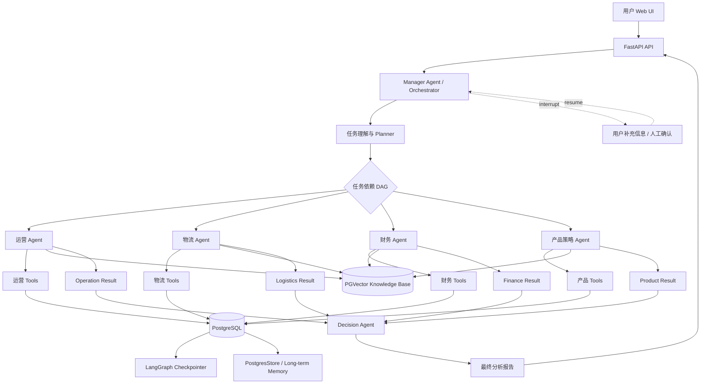
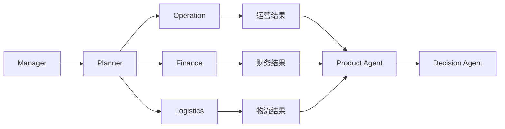
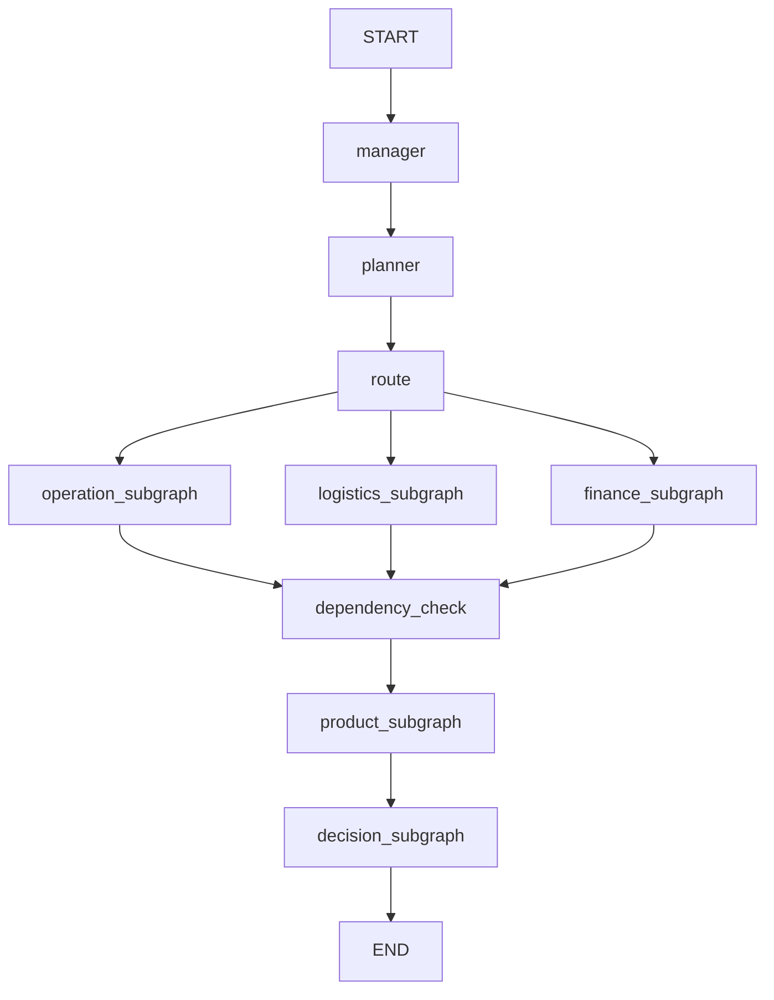
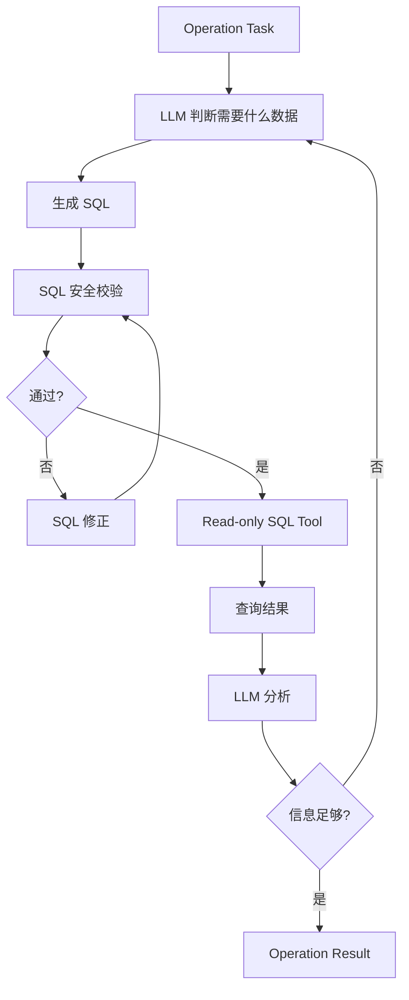
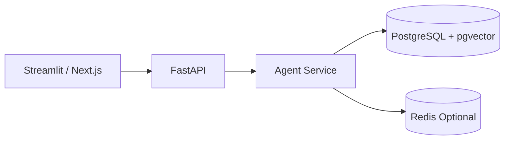
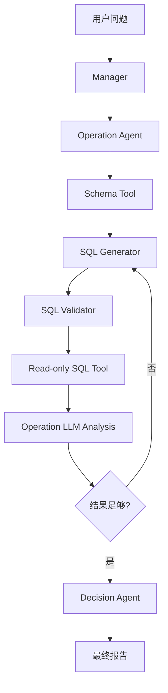

# 甜秘密跨境电商 AI Multi-Agent 开发设计文档

> 项目定位：面向甜秘密（SweetNight、Novilla、Avenco、甜秘密等品牌）的企业级跨境电商运营智能决策系统。  
> 核心技术：Python + LangGraph + LangChain + OpenAI / DeepSeek + PostgreSQL + PGVector + Docker。  
> 核心架构：**Manager/Orchestrator Agent + 4 个部门 Agent + 1 个汇总分析决策 Agent + Tool 层 + 企业知识库 + 持久化 State + 长短期 Memory + Web UI**。

---

## 1. 项目目标

### 1.1 业务目标

系统面向企业内部运营、物流、财务、产品等部门，解决以下问题：

1. 自然语言提出经营问题。
2. 系统自动识别问题涉及的业务部门。
3. 自动拆解任务并形成有依赖关系的任务 DAG。
4. 调度对应部门 Agent。
5. 每个部门 Agent 在自己的 SubGraph 内部循环调用 Tool，直到完成本部门任务。
6. 部门 Agent 不允许直接自由调用其他部门 Agent。
7. 如果一个 Agent 需要其他部门的数据，由 Manager 根据任务依赖关系提前调用相关部门 Agent，并把结果作为上下文传入。
8. 当信息不足、口径不明确或者需要用户确认时，通过 LangGraph `interrupt()` 暂停会话。
9. 最终由 **Decision Agent（汇总分析决策 Agent）** 统一汇总事实、分析原因、形成建议。
10. 全过程具备状态持久化、重试、日志、审计、SQL 安全和可观测性。

---

# 2. 总体架构



---

# 3. 核心设计原则

## 3.1 部门 Agent 平级

四个部门 Agent：

```text
Operation Agent
Logistics Agent
Finance Agent
Product Strategy Agent
```

是业务领域上的平级 Agent。

它们分别代表：

| Agent | 核心问题 |
|---|---|
| Operation | 怎么卖、卖得怎么样 |
| Logistics | 怎么高效稳定交付 |
| Finance | 到底赚不赚钱 |
| Product Strategy | 下一阶段做什么产品 |

另外增加：

```text
Manager Agent
Decision Agent
```

其中：

- Manager：负责理解、拆解、规划、调度。
- Decision：负责跨部门结果汇总、因果分析、决策建议。

---

# 4. 为什么需要 Manager + Decision 两个 Agent

二者职责必须分开。

## Manager Agent

负责“做事之前”：

```text
用户问题
↓
理解问题
↓
确定目标
↓
判断涉及部门
↓
拆解任务
↓
建立依赖关系
↓
调度 Agent
↓
控制执行状态
```

它不负责最终业务结论。

## Decision Agent

负责“所有任务完成之后”：

```text
各部门结果
↓
事实校验
↓
交叉验证
↓
原因归因
↓
冲突检测
↓
形成结论
↓
给出建议
```

这样可以避免：

```text
Manager 一边规划
一边分析
一边总结
```

导致职责过重。

---

# 5. 最重要的跨 Agent 协作原则

## 5.1 禁止部门 Agent 自由互调

不要设计：

```text
Operation → Finance → Product → Logistics → Operation
```

这样很容易出现：

- 无限循环
- State 污染
- 调用关系无法追踪
- 权限边界混乱
- Debug 困难

推荐：

```text
Manager
   ↓
Task DAG
   ↓
Department Agents
   ↓
Department Results
   ↓
Decision Agent
```

## 5.2 部门 Agent 可以自己内部循环

例如：

```text
Operation Agent
    ↓
LLM
    ↓
SQL Tool
    ↓
查询结果
    ↓
LLM
    ↓
发现还缺广告数据
    ↓
SQL Tool
    ↓
结果
    ↓
LLM
    ↓
判断已足够
    ↓
最终结果
```

这个循环只存在于 Operation SubGraph 内部。

---

## sql tools 怎么生成sql语句
用户问题
   ↓
SQL Agent
   ↓
① 找有哪些表
   ↓
② 判断哪些表可能相关
   ↓
③ 获取相关表 Schema，和表之间的关联
   ↓
④ LLM 生成 SQL
   ↓
⑤ SQL Validator
   ↓
⑤  LLM 再判断，判断sql是否正确
     ↓ 
⑥ Read-only PostgreSQL 执行
   ↓
⑦ 结果
   ↓
⑧ LLM 分析


所以我建议你的 SQL Tool 以后实际上不是一个 Tool

而是一套工具体系：

SQL Tool System
│
├── list_tables_tool
│
├── schema_search_tool
│
├── get_table_schema_tool
│
├── get_relationship_tool
│
├── metric_definition_tool
│
├── sql_validator
│
└── execute_readonly_sql

最终变成：

               SQL Agent
                   │
        ┌──────────┼──────────┐
        ↓          ↓          ↓
  Schema Search  Metric     Relationship
        │        Search        │
        └──────────┼───────────┘
                   ↓
              SQL Generator
                   ↓
             SQL Validator
                   ↓
             Read-only DB

# 6. 产品 Agent 如何获得其他部门数据

这是整个架构的关键。

例如：

> “未来半年美国市场应该开发什么样的床垫？”

产品分析需要：

- 运营历史销售
- 财务利润
- 物流库存风险
- 市场/竞品/消费者信息

不要让：

```text
Product Agent → Finance Agent
```

自由调用。

而是：



Manager 首先得到一个任务 DAG：

```yaml
tasks:
  - id: operation_analysis
    agent: operation
    depends_on: []

  - id: finance_analysis
    agent: finance
    depends_on: []

  - id: logistics_analysis
    agent: logistics
    depends_on: []

  - id: product_strategy
    agent: product
    depends_on:
      - operation_analysis
      - finance_analysis
      - logistics_analysis

  - id: decision
    agent: decision
    depends_on:
      - operation_analysis
      - finance_analysis
      - logistics_analysis
      - product_strategy
```

因此：

```text
Operation
Finance
Logistics
     ↓
Product
     ↓
Decision
```

而不是 Agent 自由递归调用。

---

# 7. Graph 总体设计

推荐使用 Parent Graph + Department SubGraph。



实际执行中，不一定每次都调用四个 Agent。

例如：

### 问题 A

> “美国市场广告 ROI 为什么下降？”

```text
Manager
 ↓
Operation Agent
 ↓
Decision Agent
```

### 问题 B

> “为什么最近利润下降？”

```text
Manager
 ↓
Operation
Finance
Logistics
 ↓
Decision
```

### 问题 C

> “下一季度应该开发什么产品？”

```text
Manager
 ↓
Operation
Finance
Logistics
 ↓
Product
 ↓
Decision
```

---

# 8. Global State 设计

Global State 只负责跨部门共享的最小信息。

```python
from typing import TypedDict, Any

class GlobalState(TypedDict, total=False):
    thread_id: str
    user_id: str

    user_question: str

    task_plan: dict
    required_agents: list[str]

    current_stage: str

    department_results: dict[str, Any]

    product_context: dict[str, Any]

    decision_result: dict[str, Any]

    interrupt_payload: dict[str, Any]

    error_state: dict[str, Any]

    final_answer: str
```

原则：

> GlobalState 不保存所有 SQL、所有中间 Tool 输出和全部 Agent 消息。

只保存跨 Agent 必须共享的信息。

---

# 9. Department State 设计

每个部门 Agent 有自己的 State。

例如：

```python
class OperationState(TypedDict, total=False):
    task: str
    messages: list
    iteration: int
    tool_calls: list
    sql_history: list
    observations: list
    analysis: list
    evidence: list
    final_result: dict
    error: dict
```

物流：

```python
class LogisticsState(OperationState):
    inventory_context: dict
    logistics_context: dict
```

财务：

```python
class FinanceState(OperationState):
    finance_context: dict
    profit_context: dict
```

产品：

```python
class ProductState(OperationState):
    market_context: dict
    consumer_context: dict
    competitor_context: dict
    cross_department_context: dict
    product_plan: dict
```

---

# 10. State 分层设计理念

State 分层有四个核心目的：

```text
1. 上下文隔离
2. 数据最小暴露
3. 控制复杂度
4. 明确 Agent 职责边界
```

可以理解成：

```text
Global State
=
公司会议室

Department State
=
各部门自己的工作台
```

部门 Agent 可以在自己的工作台里循环几十步。

完成后，只向 Global State 返回：

```text
最终结果
关键证据
关键指标
置信度
```

而不是把所有内部过程暴露给其他 Agent。

---

# 11. Operation Agent

## 职责

回答：

> “现在卖得怎么样？哪里出了问题？怎么提升销售？”

### Tools

```text
1. sales_sql_tool
2. product_sql_tool
3. store_sql_tool
4. ad_sql_tool
5. campaign_sql_tool
6. promotion_sql_tool
7. traffic_sql_tool
8. order_sql_tool
9. review_query_tool
10. python_analysis_tool
11. knowledge_search_tool
```

### 可以分析

- GMV
- 订单量
- SKU 销量
- 店铺
- 国家
- 品牌
- 渠道
- 流量
- CTR
- CVR
- CPC
- ROAS
- ROI
- 活动
- 广告
- 商品转化
- 内容表现

### Operation 内部循环



---

# 12. Logistics Agent

## 职责

回答：

> “货怎么交付、库存是否安全、物流成本和时效有什么问题？”

### Tools

```text
1. inventory_sql_tool
2. warehouse_sql_tool
3. inbound_sql_tool
4. outbound_sql_tool
5. logistics_cost_sql_tool
6. tracking_sql_tool
7. carrier_sql_tool
8. delivery_sla_sql_tool
9. stock_forecast_tool
10. python_analysis_tool
11. logistics_knowledge_search_tool
```

### 关注指标

- 可用库存
- 在途库存
- 安全库存
- 库存周转
- 库存天数
- 缺货风险
- 滞销库存
- 仓储成本
- 运输成本
- 物流时效
- 异常件
- 物流商表现

---

# 13. Finance Agent

## 职责

回答：

> “到底赚不赚钱，利润为什么变化？”

### Tools

```text
1. finance_sql_tool
2. revenue_sql_tool
3. cost_sql_tool
4. profit_sql_tool
5. platform_fee_sql_tool
6. advertising_cost_sql_tool
7. logistics_cost_sql_tool
8. refund_sql_tool
9. fx_sql_tool
10. reconciliation_tool
11. python_analysis_tool
12. finance_knowledge_search_tool
```

### 核心指标

```text
Revenue
Gross Profit
Contribution Margin
Gross Margin
Advertising Cost
Logistics Cost
Refund Cost
Platform Fee
FX Impact
Net Profit
```

---

# 14. Product Strategy Agent

产品部门不是简单的“画产品 Agent”。

根据公司实际职责，它应该定义为：

> Product Strategy / Product Intelligence Agent

## 职责

回答：

> “下一阶段应该开发什么产品，为什么？”

覆盖：

```text
行业研究
市场研究
竞品研究
消费者分析
用户反馈
产品生命周期
产品开发计划
工厂开发计划
库存风险
产品利润
爆款识别
用户体验
```

### Tools

```text
1. product_sql_tool
2. product_lifecycle_tool
3. market_data_sql_tool
4. competitor_data_sql_tool
5. consumer_review_tool
6. product_cost_tool
7. inventory_risk_tool
8. sales_history_tool
9. product_spec_tool
10. python_analysis_tool
11. industry_knowledge_search_tool
12. company_product_knowledge_search_tool
```

### Product Agent 特别需要知识库

原因：

产品部门会大量依赖：

- 床垫行业报告
- 行业趋势
- 产品规格
- 产品开发文档
- 产品设计规范
- 公司产品资料
- 用户体验规范
- 竞品资料
- 历史产品复盘
- 产品开发 SOP

因此产品 Agent 的 RAG 权重应该较高。

---

# 15. Decision Agent

这是系统最终的：

> Business Analysis & Decision Agent

它不负责自己大量查数据。

它主要接收：

```text
Operation Result
Logistics Result
Finance Result
Product Result
```

然后进行：

```text
事实整合
↓
交叉验证
↓
冲突检测
↓
原因分析
↓
影响评估
↓
方案制定
↓
优先级排序
↓
最终报告
```

### Decision State

```python
class DecisionState(TypedDict, total=False):
    user_question: str
    department_results: dict
    evidence: list
    conflicts: list
    root_causes: list
    recommendations: list
    confidence: float
    final_report: dict
```

---

# 16. Decision Agent 输出标准

最终不能只输出自然语言。

推荐结构化：

```json
{
  "summary": "美国市场利润下降主要由广告成本和物流成本上涨导致。",
  "findings": [
    {
      "category": "finance",
      "finding": "贡献利润率下降 4.8%"
    }
  ],
  "root_causes": [
    {
      "cause": "广告成本增长",
      "evidence": "广告费用同比增长 31%"
    },
    {
      "cause": "物流成本增长",
      "evidence": "平均履约成本增长 18%"
    }
  ],
  "recommendations": [
    {
      "priority": "P0",
      "action": "优化低贡献广告活动"
    }
  ],
  "confidence": 0.86
}
```

这样 Web UI 可以进一步渲染成：

```text
核心结论
↓
关键数据
↓
原因分析
↓
证据
↓
建议
↓
风险
```

---

# 17. SQL Tool 架构

Agent 不允许直接操作 PostgreSQL。

统一：

```text
LLM
 ↓
SQL Generator
 ↓
SQL Validator
 ↓
Policy Check
 ↓
Read-only DB Connection
 ↓
SQL Executor
 ↓
Result
```

---

# 18. SQL 安全原则

这是企业级项目必须做的。

## 18.1 数据库账号只读

创建：

```sql
CREATE ROLE agent_reader LOGIN PASSWORD 'xxx';

GRANT CONNECT ON DATABASE ecommerce TO agent_reader;

GRANT USAGE ON SCHEMA public TO agent_reader;

GRANT SELECT ON ALL TABLES IN SCHEMA public TO agent_reader;
```

禁止：

```text
INSERT
UPDATE
DELETE
DROP
ALTER
CREATE
TRUNCATE
COPY
```

---

# 19. SQL 语法级校验

不要只依赖 Prompt。

推荐增加：

```text
sqlglot
```

进行 AST 解析。

检查：

```text
1. 必须是 SELECT
2. 禁止多语句
3. 禁止 DDL
4. 禁止 DML
5. 禁止系统表
6. 禁止 pg_catalog 敏感查询
7. 禁止 information_schema 大范围扫描
8. 强制 LIMIT
9. 强制 statement_timeout
10. 禁止 SELECT INTO
11. 禁止 COPY
12. 禁止函数注入
```

例如：

```python
def validate_sql(sql: str) -> bool:
    # AST parse
    # only SELECT
    # deny dangerous statements
    # deny multi statements
    # inject / enforce LIMIT
    # reject forbidden tables
    ...
```

---

# 20. SQL Tool 不应该给 LLM 整个数据库

推荐先给 Agent：

```text
Schema Metadata Tool
```

例如只返回：

```text
sales_order
  - order_id
  - sku_id
  - country
  - quantity
  - revenue
  - order_date

product
  - sku_id
  - brand
  - category
  - cost
  - sale_price
```

LLM 根据 Schema 决定查询。

---

# 21. 企业数据提前落 PostgreSQL

本系统不让 Agent 实时直接访问第三方 API。

数据流：

```text
Amazon / TikTok / ERP / WMS / Ads / BI
          ↓
      ETL / Data Sync
          ↓
      PostgreSQL
          ↓
        Agent
```

优势：

```text
数据稳定
查询速度快
可审计
可复现
避免第三方 API 限流
Agent 不掌握第三方 Token
```

---

# 22. 数据库分层

建议逻辑上分：

```text
raw
↓
ods
↓
dwd
↓
mart
↓
agent
```

例如：

```text
raw_tiktok_order
raw_amazon_order

dwd_order
dwd_order_item
dwd_product
dwd_inventory

mart_sales_daily
mart_product_profit_daily
mart_ad_performance_daily
mart_inventory_risk

agent_metric_definition
agent_business_rule
```

Agent 尽量查询：

```text
mart_*
```

而不是每天重新 Join 十几张原始表。

---

# 23. PostgreSQL 核心业务表

## 23.1 用户与组织

```sql
users
departments
user_roles
role_permissions
```

### users

```text
id
username
display_name
department_id
status
created_at
updated_at
```

---

# 24. 店铺和渠道

```text
platforms
stores
store_accounts
markets
```

### stores

```text
id
platform_id
brand_id
country_code
store_name
store_type
status
```

---

# 25. 品牌

```text
brands
```

字段：

```text
id
name
description
status
created_at
updated_at
```

例如：

```text
SweetNight
Novilla
Avenco
甜秘密
```

---

# 26. 商品核心表

```text
products
product_skus
product_categories
product_prices
product_costs
product_lifecycle
product_development_projects
```

### products

```text
id
brand_id
category_id
product_name
product_type
status
launch_date
```

### product_skus

```text
id
product_id
sku_code
country_code
sale_price
cost
weight
status
```

---

# 27. 销售数据

```text
orders
order_items
sales_daily
```

### orders

```text
id
platform_order_id
store_id
country_code
order_date
currency
order_amount
refund_amount
status
```

### order_items

```text
id
order_id
sku_id
quantity
sale_amount
discount
refund_amount
```

### sales_daily

建议建立聚合表：

```text
date
country
brand_id
store_id
sku_id
orders
units
gmv
refund_amount
```

---

# 28. 广告数据

```text
ad_campaigns
ad_groups
ad_creatives
ad_performance_daily
```

### ad_performance_daily

```text
date
platform
store_id
campaign_id
sku_id
impressions
clicks
spend
conversions
revenue
ctr
cvr
cpc
roas
```

---

# 29. 库存 / 物流

```text
warehouses
inventory
inventory_daily
inbound_shipments
outbound_shipments
logistics_orders
logistics_cost
tracking_events
carriers
```

核心字段：

```text
warehouse_id
sku_id
available_qty
reserved_qty
in_transit_qty
safety_stock
stock_days
```

---

# 30. 财务

```text
financial_transactions
revenue_daily
cost_daily
profit_daily
platform_fees
refunds
fx_rates
reconciliation_records
```

建议建立经营分析宽表：

```text
mart_product_profit_daily
```

字段：

```text
date
country
brand_id
store_id
sku_id

revenue

product_cost
platform_fee
advertising_cost
logistics_cost
refund_cost

gross_profit
contribution_profit
profit_margin
```

这个表对 Finance Agent 和 Decision Agent 非常重要。

---

# 31. 用户评论 / VOC

```text
reviews
review_aspects
review_sentiments
customer_feedback
return_reasons
```

例如：

```text
reviews
-------------
id
platform
sku_id
country
rating
review_text
review_date

review_aspects
-------------
id
review_id
aspect
sentiment
score
```

这样可以回答：

> 最近用户到底在抱怨什么？

---

# 32. Agent 相关数据库表

这部分非常关键。

```text
agent_runs
agent_steps
agent_tool_calls
agent_errors
agent_interrupts
agent_results
```

---

## agent_runs

```text
id
thread_id
user_id
question
status
started_at
finished_at
total_tokens
total_cost
```

---

## agent_steps

```text
id
run_id
agent_name
node_name
step_index
input_summary
output_summary
started_at
finished_at
status
```

---

## agent_tool_calls

```text
id
run_id
agent_name
tool_name
arguments
result_summary
duration_ms
status
error_message
created_at
```

---

## agent_errors

```text
id
run_id
agent_name
node_name
error_type
error_message
retry_count
stack_trace
created_at
```

---

## agent_interrupts

```text
id
run_id
thread_id
agent_name
interrupt_type
payload
status
created_at
resolved_at
resolved_by
resolution
```

---

# 33. LangGraph Checkpoint

短期状态快照：

```text
langgraph-checkpoint-postgres
```

使用：

```python
PostgresSaver
```

职责：

```text
Graph 当前 State
↓
checkpoint
↓
中断
↓
恢复
↓
故障重试
```

LangGraph 官方文档明确指出，持久化 checkpoint 可用于 human-in-the-loop、memory、time travel 和故障恢复；生产环境可以使用 Postgres-backed checkpointer。  
参考：LangGraph Persistence / Memory / Interrupts。

---

# 34. 长期记忆设计

## 34.1 结构化长期记忆

使用：

```text
PostgresStore
```

或者自建：

```text
user_profiles
user_preferences
business_preferences
```

例如：

```text
user_preferences
-----------------
user_id
key
value
updated_at
```

保存：

```text
用户固定偏好
汇报格式
默认市场
默认货币
常用分析时间范围
常用指标
```

---

# 35. 语义长期记忆

PostgreSQL：

```text
pgvector
```

用于存：

```text
事实
知识
历史结论
业务规则
用户偏好语义
```

核心表：

```text
knowledge_documents
knowledge_chunks
knowledge_embeddings
```

---

# 36. 知识库建议分层

不要做一个“超级知识库”。

推荐：

```text
company_kb
├── operation_kb
├── logistics_kb
├── finance_kb
└── product_kb
```

さらに按来源：

```text
SOP
制度
产品资料
行业报告
竞品资料
历史复盘
培训文档
FAQ
```

---

# 37. 哪些 Agent 必须使用 RAG

| Agent | RAG重要程度 | 主要知识 |
|---|---:|---|
| Operation | 高 | 运营 SOP、平台规则、营销策略 |
| Logistics | 高 | 物流规则、仓储 SOP、运输规则 |
| Finance | 高 | 财务制度、成本口径、核算规则 |
| Product | 极高 | 行业报告、产品资料、竞品、消费者研究 |
| Decision | 中高 | 公司经营规则、指标口径、决策模板 |

需要注意：

> SQL 负责“事实数据”，RAG 负责“知识和规则”。

例如：

```text
“美国 SKU-A 上个月销量多少？”
→ SQL

“公司新品开发流程是什么？”
→ RAG

“为什么销量下降？”
→ SQL + RAG + LLM

“根据公司产品开发标准，是否应该推进这个产品？”
→ SQL + RAG + Decision
```

---

# 38. RAG 数据库设计

```sql
knowledge_documents
(
    id,
    title,
    source_type,
    department,
    version,
    status,
    created_at
)
```

```sql
knowledge_chunks
(
    id,
    document_id,
    chunk_index,
    content,
    metadata,
    embedding vector(...)
)
```

建议 metadata：

```json
{
  "department": "product",
  "brand": "SweetNight",
  "market": "US",
  "document_type": "SOP",
  "version": "2026-01"
}
```

检索时做 metadata filtering。

---

# 39. Interrupt / Human-in-the-loop

以下情况建议使用 `interrupt()`：

### 情况 1：参数不明确

用户：

> “分析美国市场销量。”

但没有说明：

- 时间范围
- GMV 还是订单
- 哪个品牌

系统：

```text
interrupt()
```

向用户询问。

### 情况 2：高风险行为

例如未来增加：

```text
修改广告预算
发布价格
修改库存
执行数据写操作
```

这些必须人工审批。

当前项目 SQL 是只读，因此普通 SELECT 不需要审批。

LangGraph 官方推荐通过 `interrupt()` 暂停执行，checkpoint 保存状态，之后通过 `Command(resume=...)` 恢复。

---

# 40. Agent Retry 机制

不要把所有错误都无限重试。

分三类：

## A. 临时错误

```text
DB connection timeout
LLM timeout
network error
```

允许：

```text
max_attempts = 3
```

## B. SQL 错误

```text
字段不存在
语法错误
类型错误
```

允许：

```text
LLM 修正 SQL
最多 2~3 次
```

## C. 业务逻辑错误

```text
查询不到必要数据
口径冲突
时间范围无效
```

不要无限 Retry。

可以：

```text
回 Planner
→ 重新规划
```

---

# 41. LangGraph RetryPolicy

推荐：

```python
from langgraph.types import RetryPolicy

builder.add_node(
    "query_database",
    query_database,
    retry_policy=RetryPolicy(
        max_attempts=3
    )
)
```

需要注意：

> `interrupt()` 不应该被当成普通异常进行 retry。

Interrupt 是暂停执行，而不是失败。

---

# 42. 重试次数必须写入 State

例如：

```python
class AgentState(TypedDict, total=False):
    iteration: int
    sql_retry_count: int
    tool_retry_count: int
    max_iterations: int
```

同时：

```text
max_agent_iterations = 10
max_sql_retries = 3
max_tool_retries = 3
```

绝对不要：

```text
while True:
```

---

# 43. 日志体系

推荐：

```text
structlog
```

你提供的依赖清单中已经包含 `structlog`。  
此外，可使用 LangSmith / OpenTelemetry 做更完整的链路观测。

fileciteturn0file0L1-L11

---

# 44. 日志必须记录什么

每次 Agent Run：

```text
trace_id
thread_id
user_id
run_id
agent_name
node_name
model
prompt_version
tool_name
tool_input
tool_output_summary
latency
tokens
cost
status
error
retry_count
```

不要直接把：

```text
完整敏感财务数据
用户密码
API Key
Token
```

写进日志。

---

# 45. 推荐日志格式

JSON Structured Logging：

```json
{
  "timestamp": "2026-09-16T18:00:00Z",
  "trace_id": "abc123",
  "run_id": "run_001",
  "agent": "finance",
  "node": "sql_execute",
  "tool": "finance_sql_tool",
  "latency_ms": 312,
  "status": "success"
}
```

---

# 46. 推荐增加 Prompt Version

Prompt 也是代码。

不要直接：

```text
prompts.py
```

里面永久覆盖。

推荐：

```text
prompts/
├── manager/
│   ├── v1.md
│   └── v2.md
├── operation/
├── logistics/
├── finance/
├── product/
└── decision/
```

数据库记录：

```text
prompt_versions
----------------
id
agent_name
version
content_hash
created_at
is_active
```

这样可以知道：

> 为什么昨天 Agent 结果和今天不一样？

---

# 47. 推荐增加 Agent Evaluation

企业级 Agent 不能只靠“感觉很好”。

建立：

```text
evaluation_cases
evaluation_runs
evaluation_scores
```

测试：

```text
问题
→ Planner
→ Agent Routing
→ SQL
→ 数据结果
→ 最终结论
```

评价：

```text
路由正确率
SQL正确率
Tool调用正确率
答案事实准确率
结论完整度
幻觉率
平均执行时间
Token 成本
```

---

# 48. FastAPI + Web UI

建议架构：

```text
                Browser
                   ↓
             Web UI
                   ↓
               FastAPI
                   ↓
             LangGraph
```

## MVP

可以使用：

```text
Streamlit
```

你目前的依赖文件已经包含 `streamlit`。  
参考当前上传的依赖清单。

## 企业版

推荐：

```text
Next.js
React
TypeScript
```

后端：

```text
FastAPI
```

---

# 49. Web UI 页面

建议至少：

```text
1. Chat
2. Agent Execution
3. Reports
4. Thread History
5. Knowledge Base
6. Evaluation
7. Admin
```

### Chat

类似：

```text
用户：
分析美国市场最近利润下降原因

AI：
正在分析……

[运营 Agent ✓]
[财务 Agent ✓]
[物流 Agent ✓]
[Decision Agent …]
```

---

# 50. Agent Execution Trace

企业内部非常有价值。

显示：

```text
Manager
 ↓
Planner
 ↓
Operation Agent
   ↓
   SQL Tool
   ↓
   SQL Tool
 ↓
Finance Agent
   ↓
   SQL Tool
 ↓
Decision Agent
```

可以查看：

```text
SQL
查询耗时
Tool
Agent
Retry
错误
```

但生产环境不要默认展示模型内部 Chain-of-Thought。

展示：

```text
执行步骤摘要
证据
查询指标
工具结果摘要
```

而不是内部思维过程。

---

# 51. 推荐项目目录

```text
sweetnight-agent/
│
├── app/
│   ├── main.py
│   │
│   ├── api/
│   │   ├── chat.py
│   │   ├── threads.py
│   │   ├── reports.py
│   │   └── health.py
│   │
│   ├── graph/
│   │   ├── main_graph.py
│   │   ├── planner.py
│   │   ├── router.py
│   │   └── state.py
│   │
│   ├── agents/
│   │   ├── manager/
│   │   │   ├── agent.py
│   │   │   ├── prompts.py
│   │   │   └── state.py
│   │   │
│   │   ├── operation/
│   │   │   ├── agent.py
│   │   │   ├── graph.py
│   │   │   ├── prompts.py
│   │   │   ├── state.py
│   │   │   └── tools.py
│   │   │
│   │   ├── logistics/
│   │   ├── finance/
│   │   ├── product/
│   │   └── decision/
│   │
│   ├── tools/
│   │   ├── sql/
│   │   │   ├── generator.py
│   │   │   ├── validator.py
│   │   │   ├── executor.py
│   │   │   └── schema.py
│   │   ├── rag/
│   │   ├── python/
│   │   └── analytics/
│   │
│   ├── memory/
│   │   ├── checkpoint.py
│   │   ├── semantic.py
│   │   └── profile.py
│   │
│   ├── db/
│   │   ├── connection.py
│   │   ├── models/
│   │   └── migrations/
│   │
│   ├── knowledge/
│   │   ├── ingest.py
│   │   ├── chunker.py
│   │   ├── embedder.py
│   │   └── retriever.py
│   │
│   ├── observability/
│   │   ├── logging.py
│   │   ├── tracing.py
│   │   └── metrics.py
│   │
│   └── config/
│       └── settings.py
│
├── frontend/
│
├── tests/
│   ├── unit/
│   ├── integration/
│   ├── evaluation/
│   └── security/
│
├── scripts/
│
├── docker/
│
├── docker-compose.yml
├── requirements.txt
├── .env.example
└── README.md
```

---

# 52. 依赖建议

你目前已有：

```text
langchain
langchain-core
langchain-openai
langgraph
psycopg[binary]
python-dotenv
structlog
streamlit
```

对应上传文件中的依赖清单。fileciteturn0file0L1-L11

建议继续增加：

```text
pydantic
pydantic-settings
sqlglot
pgvector
tenacity
httpx
fastapi
uvicorn
pytest
pytest-asyncio
alembic
```

可选企业能力：

```text
langsmith
opentelemetry-api
opentelemetry-sdk
redis
```

---

# 53. Docker 架构

开发环境：



生产可以进一步拆：

```text
frontend
backend
agent-worker
postgres
redis
observability
```

---

# 54. 模型设计

统一一个 Model Provider 接口：

```python
class LLMProvider:
    def get_chat_model(self, purpose: str):
        ...
```

配置：

```yaml
providers:
  openai:
    enabled: true

  deepseek:
    enabled: true
```

按任务决定模型：

```text
Manager
→ 强推理模型

SQL Agent
→ 成本可控模型

总结 Agent
→ 强推理模型

简单分类
→ 低成本模型
```

不要让代码里到处：

```python
ChatOpenAI(...)
```

统一封装。

---

# 55. 推荐模型路由

```text
Intent Classification
→ 小模型

SQL Generation
→ 中等模型

Complex Analysis
→ 强模型

Decision
→ 强模型
```

未来可以做：

```text
Model Router
```

根据：

```text
任务复杂度
Token
成本
延迟
```

选择 OpenAI / DeepSeek。

---

# 56. 一次完整执行示例

用户：

> “分析美国市场最近 90 天床垫利润下降的原因，并告诉我下一季度应该开发什么产品。”

Manager：

```text
1. 识别为跨部门复杂问题
2. 需要：
   Operation
   Finance
   Logistics
   Product
   Decision
```

Planner：

```text
Operation ─┐
Finance ───┼→ Product → Decision
Logistics ─┘
```

并行执行：

```text
Operation
→ 查询销量、GMV、流量、广告、转化

Finance
→ 查询产品成本、广告成本、物流成本、利润

Logistics
→ 查询库存、物流成本、库存风险
```

然后 Product：

```text
拿到：
Operation Result
Finance Result
Logistics Result

+
市场知识库
+
消费者知识库
+
竞品知识库

→ 形成产品开发建议
```

最后 Decision：

```text
Operation Result
Finance Result
Logistics Result
Product Result

→ 原因分析
→ 产品建议
→ 风险
→ 最终报告
```

---

# 57. 开发阶段规划

## Phase 1：基础框架

目标：

```text
Python
LangChain
LangGraph
PostgreSQL
Docker
```

完成：

```text
GlobalState
Manager
Operation Agent
SQL Tool
Postgres Checkpointer
```

先让下面问题跑通：

> 分析美国市场过去 30 天 GMV 变化。

---

## Phase 2：SQL Agent

实现：

```text
Schema Tool
↓
SQL Generator
↓
SQL Validator
↓
Read-only Executor
↓
Result Analyzer
```

完成 SQL：

```text
生成
校验
执行
重试
```

---

## Phase 3：四大部门 Agent

依次实现：

```text
Operation
Finance
Logistics
Product
```

每个 Agent：

```text
Agent
State
SubGraph
Tools
Prompt
Retry
Knowledge Retrieval
```

---

## Phase 4：Manager Planner

实现：

```text
问题理解
↓
任务拆解
↓
Agent Routing
↓
Dependency DAG
↓
并行执行
↓
依赖执行
```

重点实现：

```text
depends_on
```

---

## Phase 5：Decision Agent

实现：

```text
Evidence
↓
Cross Validation
↓
Root Cause Analysis
↓
Recommendation
↓
Final Report
```

---

## Phase 6：Memory

实现：

```text
Checkpointer
+
PostgresStore
+
PGVector
```

分别处理：

```text
短期状态
结构化长期记忆
语义长期记忆
```

---

## Phase 7：Interrupt

实现：

```text
缺少时间范围
缺少市场
指标口径不明确
高风险操作
```

使用：

```python
interrupt()
```

然后：

```python
Command(resume=...)
```

恢复。

---

## Phase 8：Observability

实现：

```text
structured logs
trace_id
run_id
agent run
tool call
retry
latency
token
cost
```

---

## Phase 9：Web UI

MVP：

```text
Streamlit
```

后续：

```text
Next.js + FastAPI
```

---

## Phase 10：Evaluation

建立 50~100 个真实业务问题：

```text
运营问题
财务问题
物流问题
产品问题
跨部门问题
```

自动测试：

```text
Agent Routing
SQL Correctness
Answer Accuracy
Decision Quality
Latency
Cost
```

---

# 58. 第一阶段最推荐实现的最小闭环

不要一开始就做四个 Agent。

首先跑通：



第一个 Demo：

> “分析美国市场过去 90 天 SweetNight 床垫 GMV、订单、销量、转化率变化，并找出异常 SKU。”

一旦这个闭环跑稳定，再扩展：

```text
Operation
↓
Finance
↓
Logistics
↓
Product
↓
Decision
```

这样开发风险最低。

---

# 59. 企业级项目还建议补充的能力

除了你已经规划的技术，建议增加：

### 必选

```text
Pydantic / 类型约束
SQL AST 校验
Read-only DB Role
RetryPolicy
Structured Logging
Audit Log
Prompt Version
Evaluation
Health Check
Docker
DB Migration
```

### 推荐

```text
FastAPI
OpenTelemetry
LangSmith
Redis
RBAC
Rate Limit
Secrets Manager
```

### 后续

```text
Model Router
Agent Evaluation Platform
Cost Control
Agent Permission System
Human Approval Workflow
Data Lineage
```

---

# 60. 最终架构原则

最终希望做到：

```text
                 ┌───────────────────┐
                 │   Manager Agent   │
                 │   Orchestrator    │
                 └─────────┬─────────┘
                           │
                    Task Dependency DAG
                           │
           ┌───────────────┼────────────────┐
           ↓               ↓                ↓
      Operation        Finance          Logistics
           │               │                │
      Local Loop       Local Loop        Local Loop
           │               │                │
         Tools           Tools            Tools
           │               │                │
           └───────────────┼────────────────┘
                           ↓
                     Product Agent
                           │
                       Local Loop
                           │
                         Tools
                           ↓
                    Decision Agent
                           │
                           ↓
                       Final Report
```

核心原则：

> **总 Agent 决定“谁做、什么时候做、依赖谁”；部门 Agent 决定“自己内部怎么做”；Tool 决定“能访问什么”；State 决定“能记住什么”；Decision Agent 决定“最终怎么解释结果”。**

这套架构可以让系统从一个普通的“聊天 + SQL”项目，升级成真正的企业级 Multi-Agent 业务系统。
